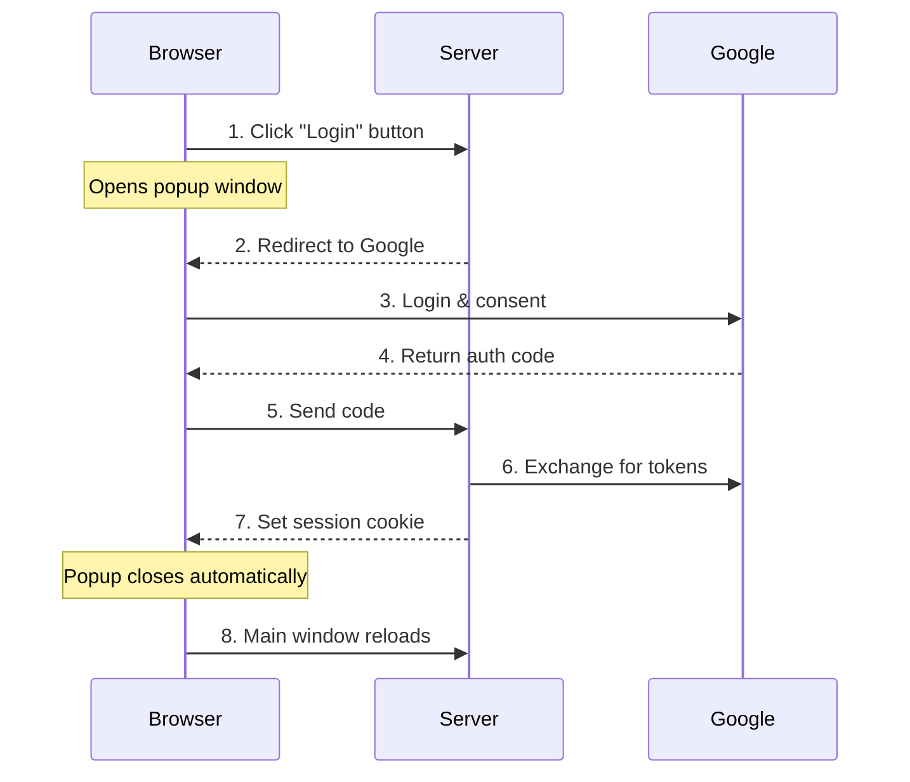
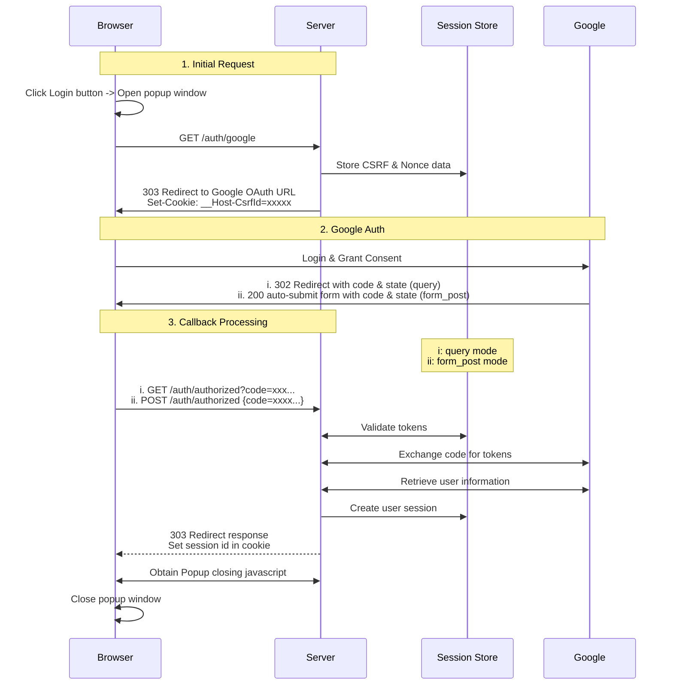
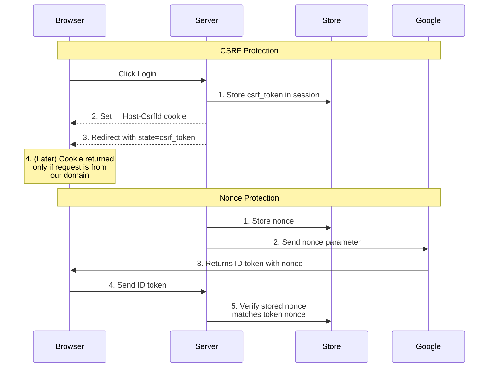
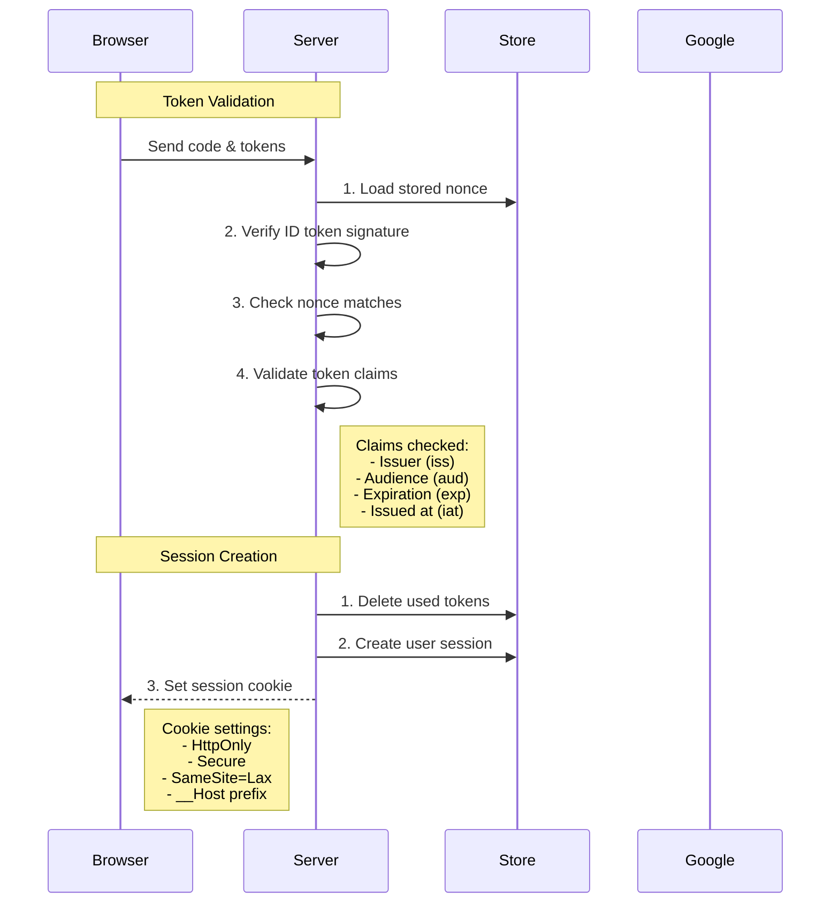

# Implementing Google OAuth2 with Rust and Axum

- [Implementing Google OAuth2 with Rust and Axum](#implementing-google-oauth2-with-rust-and-axum)
  - [Introduction](#introduction)
  - [OAuth2 and OpenID Connect Overview](#oauth2-and-openid-connect-overview)
  - [Basic Authentication Flow](#basic-authentication-flow)
  - [Identifying Authenticated Access](#identifying-authenticated-access)
  - [OAuth2 Parameters](#oauth2-parameters)
  - [Implementation Details](#implementation-details)
    - [Precise Authentication Flow](#precise-authentication-flow)
    - [Route Overview and Structure](#route-overview-and-structure)
    - [Main Page and Authentication Interface](#main-page-and-authentication-interface)
    - [Starting Authentication](#starting-authentication)
    - [Handling OAuth2 Callback](#handling-oauth2-callback)
      - [Form Post Mode](#form-post-mode)
      - [Query Mode](#query-mode)
    - [Session Management](#session-management)
  - [Security Considerations](#security-considerations)
    - [CSRF Protection](#csrf-protection)
    - [Nonce Validation](#nonce-validation)
    - [Cookie Security](#cookie-security)
    - [Response Mode Security](#response-mode-security)
  - [Why Use a Popup Window?](#why-use-a-popup-window)
  - [Conclusion](#conclusion)

## Introduction

Modern web applications frequently rely on OAuth2 authentication to provide secure user access. As part of my journey learning this technology, I've implemented a login system for an Axum web application using Google OAuth2. This post details that implementation, exploring both the theoretical foundations and practical considerations in building a secure authentication system.

Throughout this guide, I'll use simplified code snippets to explain key concepts clearly. The complete implementation is available in my [GitHub repository](https://github.com/ktaka-ccmp/axum-google-oauth2) for reference as we explore the details.

## OAuth2 and OpenID Connect Overview

Authentication in modern web applications involves two closely related standards: OAuth2 and OpenID Connect (OIDC). Understanding their relationship is crucial to implementing secure authentication.

OAuth2 serves as the foundation, providing an authorization framework that lets users grant applications access to their resources without sharing credentials directly. Instead, applications receive access tokens to interact with protected resources. The authorization code flow, which we'll implement, is the most common and secure approach.

OpenID Connect builds upon OAuth2 by adding a standardized authentication layer. While OAuth2 handles authorization ("what can this app access?"), OIDC handles authentication ("who is this user?"). OIDC introduces the ID token, a JWT (JSON Web Token) containing verified user identity information, allowing applications to authenticate users while obtaining resource access permissions in a single flow.

## Basic Authentication Flow

Let's examine how our implementation handles the authentication process:



When a user initiates login by clicking the login button, our application opens a popup window and redirects to Google's authentication page. After successful authentication, Google provides an authorization code, which our server exchanges for access and ID tokens. We then create a session, set a cookie to identify the authenticated user, and close the popup window, refreshing the main window to reflect the authenticated state.

## Identifying Authenticated Access

Session cookies form the backbone of our authentication system, enabling the server to identify authenticated users across requests. When our server sets a session cookie during the login process, subsequent requests from the browser include this cookie automatically, allowing us to retrieve the associated session data from our backend storage.

For secure session management, we implement several crucial cookie security features. We configure cookies with the HttpOnly flag to prevent client-side script access, the Secure flag to ensure transmission only over HTTPS, and appropriate SameSite settings to protect against cross-site request forgery (CSRF) attacks. These settings work together to maintain a secure authentication state across all browser tabs, even after the login popup window closes.

## OAuth2 Parameters

OAuth2 and OpenID Connect define several parameters that control the authentication process. Understanding these parameters is essential for implementing secure authentication. Let's explore the key parameters and their recommended configurations.

The response_type parameter determines what the authorization server returns. We use the code response type, which provides an authorization code that can be securely exchanged for tokens on our server. The response_mode parameter controls how this response is delivered - either through form_post for enhanced security or query parameters for simpler debugging.

Through the scope parameter, we specify exactly what information we need. Our implementation requests openid, email, and profile scopes to access basic user information while maintaining clear boundaries of access. Additional parameters like client_id and redirect_uri ensure secure communication between our application and Google's authentication servers.

For maximum security, we recommend using form_post response mode with the code response type and carefully selected scopes. This configuration ensures sensitive tokens remain protected during transmission while providing the necessary user information for authentication.

## Implementation Details

Our implementation follows a step-by-step process to authenticate users securely. Let's examine how each part works together to create a complete authentication system.

### Precise Authentication Flow

The authentication process involves careful coordination between the browser, our server, Google, and our session store. Here's a detailed look at the flow:



### Route Overview and Structure

Our application organizes its functionality through several key endpoints, each handling a specific part of the authentication process:

```rust
let app = Router::new()
    .route("/", get(index))
    .route("/auth/google", get(google_auth))
    .route("/auth/authorized", get(get_authorized).post(post_authorized))
    .route("/popup_close", get(popup_close))
    .route("/logout", get(logout))
    .route("/protected", get(protected));
```

The root endpoint ("/") serves as our main page, presenting either a login button for anonymous users or a welcome message for authenticated users. The "/auth/google" endpoint initiates the OAuth2 flow, while "/auth/authorized" handles Google's authentication response. Additional endpoints manage session completion and user logout.

### Main Page and Authentication Interface

Our main page adapts its content based on the user's authentication status, providing a seamless user experience. For unauthenticated users, we display a login button that triggers our popup-based authentication flow:

```rust
async fn index(user: Option<User>) -> impl IntoResponse {
    match user {
        Some(u) => {
            let message = format!("Hey {}! You're logged in!", u.name);
            let template = IndexTemplateUser { message: &message };
            (StatusCode::OK, Html(template.render().unwrap())).into_response()
        }
        None => {
            let message = "You're not logged in.\nClick the Login button below.".to_string();
            let template = IndexTemplateAnon { message: &message };
            (StatusCode::OK, Html(template.render().unwrap())).into_response()
        }
    }
}
```

### Starting Authentication

The authentication flow begins when a user clicks the login button. Our `/auth/google` endpoint handles this initial request, setting up necessary security measures and redirecting to Google's authentication page. Here's how the process works:

```rust
async fn google_auth(
    State(params): State<OAuth2Params>,
    State(store): State<MemoryStore>,
    headers: HeaderMap,
) -> Result<impl IntoResponse, AppError> {
    let expires_at = Utc::now() + Duration::seconds(CSRF_COOKIE_MAX_AGE);
    let user_agent = headers.get(axum::http::header::USER_AGENT)...

    // Generate and store security tokens
    let (csrf_token, csrf_id) =
        generate_store_token("csrf_data", expires_at, Some(user_agent) ....
    let (nonce_token, nonce_id) =
        generate_store_token("nonce_data", expires_at, None ....
        
    let encoded_state = encode_state(csrf_token, nonce_id);

    // Construct authorization URL
    let auth_url = format!(
        "{}?{}&client_id={}&redirect_uri={}&state={}&nonce={}",
        OAUTH2_AUTH_URL,
        OAUTH2_QUERY_STRING,
        params.client_id,
        params.redirect_uri,
        encoded_state,
        nonce_token
    );

    // Set security cookie and redirect
    let mut headers = HeaderMap::new();
    header_set_cookie(
        &mut headers,
        CSRF_COOKIE_NAME.to_string(),
        csrf_id,
        expires_at,
        CSRF_COOKIE_MAX_AGE,
    )?;

    Ok((headers, Redirect::to(&auth_url)))
}
```

This process generates necessary security tokens, stores them securely, and initiates the OAuth2 flow by redirecting to Google's authorization endpoint. The URL includes carefully configured parameters that determine how the authentication process will proceed.

### Handling OAuth2 Callback

After Google authenticates the user, it sends the response back to our application. We support two response modes, each with its own security characteristics:

#### Form Post Mode

In this recommended mode, Google returns the authorization code and state in a POST request body:

```rust
async fn post_authorized(
    State(state): State<AppState>,
    Form(form): Form<AuthResponse>,
) -> Result<impl IntoResponse, AppError> {
    validate_origin(&headers, &state.oauth2_params.auth_url).await?;
    authorized(&form, state).await
}
```

This approach offers enhanced security by keeping sensitive parameters out of URLs and browser histories. While it doesn't benefit from CSRF cookie protection due to browser SameSite behavior, it relies on other security measures like nonce validation and origin checking.

#### Query Mode

The alternative approach receives parameters through URL query strings:

```rust
async fn get_authorized(
    Query(query): Query<AuthResponse>,
    State(state): State<AppState>,
    TypedHeader(cookies): TypedHeader<headers::Cookie>,
) -> Result<impl IntoResponse, AppError> {
    csrf_checks(cookies.clone(), &state.store, &query, headers).await?;
    authorized(&query, state).await
}
```

Both modes share a common processing pipeline that handles token exchange and session creation:

```rust
async fn authorized(auth_response: &AuthResponse, state: AppState) -> Result<impl IntoResponse, AppError> {
    let (access_token, id_token) = exchange_code_for_token(...).await?;
    let user_data = fetch_user_data_from_google(access_token).await?;
    verify_nonce(auth_response, idinfo, &state.store).await?;
    
    let session_id = create_and_store_session(user_data, ...).await?;
    Ok((set_cookie_header(session_id), Redirect::to("/popup_close")))
}
```

### Session Management

Our session management system ensures secure user authentication across requests. When a user successfully authenticates, we create a session containing their information:

```rust
async fn create_and_store_session(
    user_data: User,
    store: &MemoryStore,
    expires_at: DateTime<Utc>,
) -> Result<String, AppError> {
    let mut session = Session::new();
    session.insert("user", &user_data)?;
    session.set_expiry(expires_at);
    let session_id = store.store_session(session).await?;
    Ok(session_id)
}
```

For protected routes, we automatically verify the user's authentication status through our User extractor:

```rust
#[async_trait]
impl<S> FromRequestParts<S> for User
where
    MemoryStore: FromRef<S>,
    S: Send + Sync,
{
    async fn from_request_parts(parts: &mut Parts, state: &S) -> Result<Self, Self::Rejection> {
        let store = MemoryStore::from_ref(state);
        let session_cookie = get_session_cookie(parts)?;
        let user = load_user_from_session(store, session_cookie).await?;
        Ok(user)
    }
}
```

## Security Considerations

Security lies at the heart of our authentication implementation. Let's examine the key security measures that protect our authentication flow:



### CSRF Protection

Cross-Site Request Forgery (CSRF) protection forms our first line of defense against unauthorized requests. During the initial authentication request, we generate a unique CSRF token and store it in two places: our session store and the state parameter sent to Google. When Google redirects back to our application, we verify that these tokens match, ensuring the request originates from our legitimate authentication flow.

For example, if an attacker attempts to forge an authentication request:

1. They cannot access our CSRF cookie due to browser security restrictions
2. Any attempt to modify the state parameter will fail validation
3. Requests from malicious sites won't include our secure cookie

### Nonce Validation

The nonce (Number used ONCE) mechanism provides cryptographic verification of our authentication flow. We generate a unique nonce for each authentication attempt, which Google includes in the signed ID token. This process ensures that:



Each authentication response corresponds to a specific request, preventing replay attacks and token reuse. The nonce validation process verifies both the token's authenticity and its timeliness.

### Cookie Security

Our implementation employs multiple cookie security features to protect user sessions. The `__Host-` prefix enforces strict security requirements:

- HTTPS must be used
- Cookies are bound to the specific host
- Path must be set to root
- No access from subdomains is allowed

Additionally, we set comprehensive security flags for all cookies:

```rust
"{name}={value}; SameSite=Lax; Secure; HttpOnly; Path=/; Max-Age={max_age}"
```

These settings ensure cookies remain protected from various attack vectors while maintaining necessary functionality.

### Response Mode Security

Our implementation supports two response modes, each with distinct security characteristics:

Form Post Mode (Recommended):

- Authorization code travels in POST body, hidden from URLs and logs
- Immune to Referer header leakage
- Protected by origin validation and nonce verification
- Requires careful implementation of security measures

Query Mode:

- Simpler implementation for debugging
- Full CSRF protection available
- Authorization code exposed in URLs
- Higher risk of information leakage

## Why Use a Popup Window?

Our choice of a popup window for authentication offers several advantages:

From a user experience perspective, the main page remains loaded and visible throughout the authentication process. Users don't experience jarring full-page reloads or lose their context. The smooth transition from login to authenticated state enhances the overall application flow.

Technically, popup windows simplify state management and work seamlessly with both response modes. The clear separation between authentication flow and main application state reduces complexity and potential security issues. When authentication completes, the popup closes automatically, and the main window updates to reflect the new authenticated state.

## Conclusion

Our implementation demonstrates a secure, user-friendly approach to OAuth2 authentication in Rust using Axum. By combining:

- Comprehensive security measures
- Smooth user experience
- Session-based authentication
- Proper token handling

We've created a robust authentication system suitable for modern web applications.

For production deployment, remember to:

1. Configure HTTPS properly
2. Set up Google OAuth credentials correctly
3. Implement rate limiting
4. Use a production-grade session store
5. Regularly update security settings

The complete implementation, available at [GitHub repository](https://github.com/ktaka-ccmp/axum-google-oauth2), provides a foundation for building secure authentication systems in Rust web applications.
