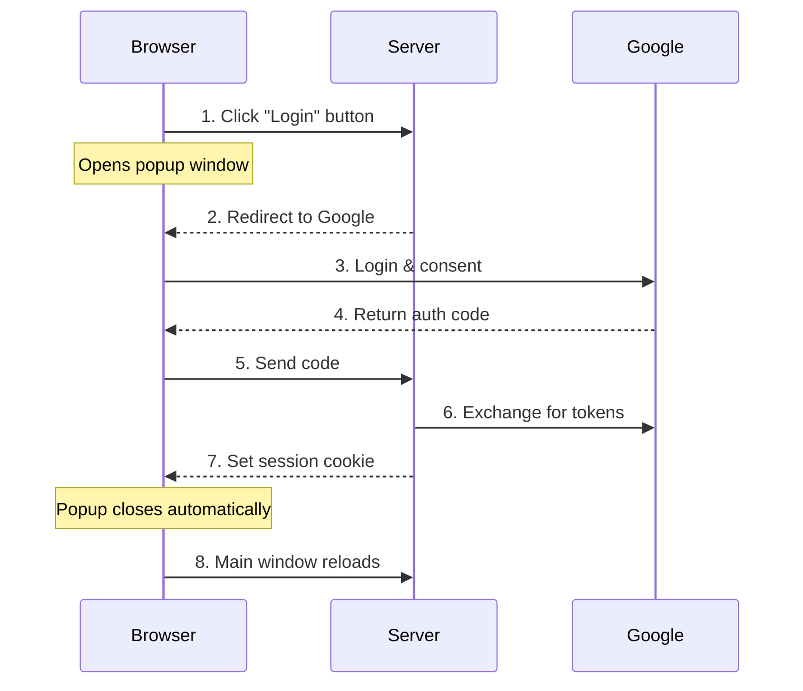
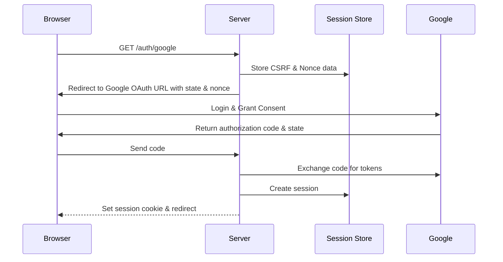

# Implementing Google OAuth2 with Rust and Axum

- [Implementing Google OAuth2 with Rust and Axum](#implementing-google-oauth2-with-rust-and-axum)
  - [Introduction](#introduction)
  - [OAuth2 and OpenID Connect Overview](#oauth2-and-openid-connect-overview)
  - [Basic Authentication Flow](#basic-authentication-flow)
  - [Identifying Authenticated Access](#identifying-authenticated-access)
  - [OAuth2 Parameters](#oauth2-parameters)
  - [Implementation Details](#implementation-details)
    - [Precise Authentication Flow](#precise-authentication-flow)
    - [Route Overview and Structure](#route-overview-and-structure)
    - [Starting Authentication](#starting-authentication)
    - [Handling OAuth2 Callback](#handling-oauth2-callback)
    - [Session Management](#session-management)
  - [Security Considerations](#security-considerations)
  - [Why Use a Popup Window?](#why-use-a-popup-window)
  - [Conclusion](#conclusion)

## Introduction

Modern web applications frequently rely on OAuth2 authentication to provide secure user access. As someone who has been learning and experimenting with this technology, I wanted to share my experience building a login system for an Axum web application using Google OAuth2. This post reflects the lessons I learned along the way and aims to guide others who might be tackling similar challenges.

Throughout this guide, I'll break down the concepts and implementation in a way that I hope feels approachable. The complete implementation is available in my [GitHub repository](https://github.com/ktaka-ccmp/axum-google-oauth2), which you can refer to for additional details.

## OAuth2 and OpenID Connect Overview

Authentication in modern web applications involves two closely related standards: OAuth2 and OpenID Connect (OIDC). Understanding their relationship is crucial for implementing secure authentication.

OAuth2 serves as the foundation, providing an authorization framework that allows users to grant applications access to their resources without sharing credentials directly. Applications receive access tokens to interact with protected resources. The authorization code flow, which I implemented here, is the most common and secure approach.

OpenID Connect builds on OAuth2 by adding a standardized authentication layer. While OAuth2 focuses on authorization ("what can this app access?"), OIDC handles authentication ("who is this user?"). OIDC introduces the ID token, a JWT (JSON Web Token) containing verified user identity information. This allows applications to authenticate users while obtaining resource access permissions in a single flow.

## Basic Authentication Flow

Here's an overview of the authentication process my implementation follows:



When a user initiates login by clicking the login button, the application opens a popup window and redirects to Google's authentication page. After successful authentication, Google provides an authorization code, which the server exchanges for access and ID tokens. The server then creates a session, sets a cookie to identify the authenticated user, and closes the popup window, refreshing the main window to reflect the authenticated state.

## Identifying Authenticated Access

Session cookies enable the server to identify authenticated users across requests. When the server sets a session cookie during login, subsequent requests from the browser include this cookie automatically, allowing the application to retrieve associated session data.

To ensure secure session management, I configured the cookies with the HttpOnly flag (preventing client-side script access), the Secure flag (ensuring transmission over HTTPS), and appropriate SameSite settings (to protect against CSRF attacks). These settings help maintain a secure authentication state across browser tabs, even after the login popup window closes.

## OAuth2 Parameters

OAuth2 and OpenID Connect define several parameters that control the authentication process. Understanding these parameters was essential for my implementation. Here's a brief overview:

- **response\_type**: Determines what the authorization server returns. I used the `code` response type to securely exchange authorization codes for tokens on the server.
- **response\_mode**: Controls how the response is delivered. I explored both `form_post` (enhanced security) and `query` (simpler debugging) modes.
- **scope**: Specifies the requested information. My implementation used `openid`, `email`, and `profile` scopes to access basic user information.
- **client\_id** and **redirect\_uri**: Ensure secure communication between the application and Google's authentication servers.

Using these parameters effectively ensured a secure and functional implementation.

## Implementation Details

### Precise Authentication Flow

The authentication process involves careful coordination between the browser, server, Google, and session store. Here's how it unfolds:



### Route Overview and Structure

The application organizes its functionality through several key endpoints:

```rust
let app = Router::new()
    .route("/", get(index))
    .route("/auth/google", get(google_auth))
    .route("/auth/authorized", get(get_authorized).post(post_authorized))
    .route("/popup_close", get(popup_close))
    .route("/logout", get(logout))
    .route("/protected", get(protected));
```

### Starting Authentication

The authentication flow begins when a user clicks the login button. Here's how the `/auth/google` endpoint handles this:

```rust
async fn google_auth(
    State(params): State<OAuth2Params>,
    State(store): State<MemoryStore>,
    headers: HeaderMap,
) -> Result<impl IntoResponse, AppError> {
    let csrf_token = generate_csrf_token();
    let redirect_uri = format!("{}/auth/authorized", params.base_url);

    let auth_url = format!(
        "{}?response_type=code&client_id={}&redirect_uri={}&state={}&scope=openid email profile",
        GOOGLE_AUTH_URL, params.client_id, redirect_uri, csrf_token
    );

    Ok(Redirect::to(&auth_url))
}
```

### Handling OAuth2 Callback

After authentication, the server processes the callback from Google. Here’s how it validates the response and exchanges the code for tokens:

```rust
async fn post_authorized(
    State(state): State<AppState>,
    Form(form): Form<AuthResponse>,
) -> Result<impl IntoResponse, AppError> {
    validate_csrf(&form.state)?;
    let tokens = exchange_code_for_tokens(&form.code).await?;
    let user_data = fetch_user_info(&tokens.id_token).await?;
    create_session(user_data).await?;
    Ok(Redirect::to("/"))
}
```

### Session Management

Session management ensures secure authentication across requests. Here's how sessions are created:

```rust
async fn create_session(user: User) -> Result<(), AppError> {
    let session = Session::new(user);
    store_session(session).await
}
```

## Security Considerations

Implementing this system taught me the importance of robust security measures. Here are some key strategies I adopted:

- **CSRF Protection**: Used unique tokens to prevent unauthorized requests.
- **Nonce Validation**: Verified tokens to ensure they weren’t reused or tampered with.
- **Cookie Security**: Configured cookies to maximize safety while maintaining functionality.

## Why Use a Popup Window?

Using a popup window for authentication keeps the main page intact and simplifies state management. This approach reduces complexity while offering a seamless user experience.

## Conclusion

This project taught me how intricate and rewarding it can be to design a secure, user-friendly authentication system. Implementing Google OAuth2 with Axum was not only a valuable learning experience but also an opportunity to explore critical aspects of web security and session management.

By incorporating OAuth2's authorization code flow and adhering to security best practices such as CSRF protection, nonce validation, and secure cookie configuration, I was able to build a robust and scalable solution. The use of a popup window further enhanced the user experience, ensuring a seamless transition between authentication and the main application.

This implementation, however, is just a starting point. There are areas for improvement and exploration, such as integrating PKCE (Proof Key for Code Exchange) for added security, transitioning to a production-grade session store, or expanding the application to handle additional OAuth2 providers.

I hope this guide serves as a helpful resource for others embarking on similar projects. Whether you're a seasoned developer or new to OAuth2, I encourage you to adapt and build upon these ideas. If you have suggestions, feedback, or improvements, feel free to explore the [GitHub repository](https://github.com/ktaka-ccmp/axum-google-oauth2) or share your thoughts with me. Together, we can continue learning and refining our craft as engineers.
