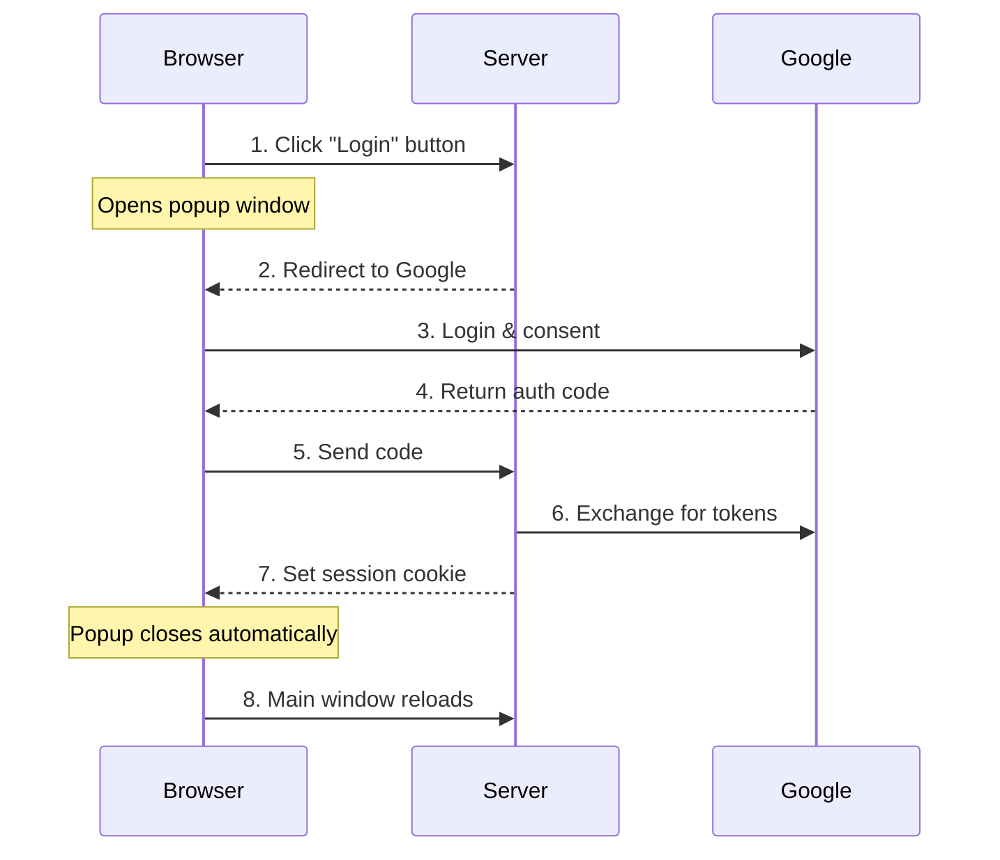

# Implementing Google OAuth2 with Rust and Axum: A Practical Guide

- [Implementing Google OAuth2 with Rust and Axum: A Practical Guide](#implementing-google-oauth2-with-rust-and-axum-a-practical-guide)
- [Implementing Google OAuth2 with Rust and Axum: A Practical Guide](#implementing-google-oauth2-with-rust-and-axum-a-practical-guide-1)
  - [Introduction](#introduction)
    - [Project Setup](#project-setup)
  - [Basic Flow](#basic-flow)
    - [Template Implementation](#template-implementation)


# Implementing Google OAuth2 with Rust and Axum: A Practical Guide

## Introduction

OAuth2 authentication is a crucial component of modern web applications. In this post, we'll build a secure Google OAuth2 implementation using Rust and the Axum web framework. We'll focus on creating a smooth user experience with popup windows while maintaining robust security.

### Project Setup

First, let's set up our project with the necessary dependencies in `Cargo.toml`:

```toml
[package]
name = "axum-google-oauth2"
version = "0.1.0"
edition = "2021"

[dependencies]
askama = { version = "0.12.1", features = ["serde-json", "with-axum"] }
askama_axum = { version = "0.4.0", features = ["serde-json"] }
async-session = "3.0.0"
axum = "0.7.5"
axum-extra = { version = "0.9.3", features = ["typed-header"] }
axum-server = { version = "0.7.1", features = ["tls-rustls"] }
chrono = "0.4.38"
serde = { version = "1.0.210", features = ["derive"] }
# ... other dependencies
```

Project structure:
```
src/
├── main.rs           # Main application code
├── idtoken.rs        # ID token validation
└── templates/
    ├── index_user.j2 # Template for authenticated users
    └── index_anon.j2 # Template for anonymous users
```

## Basic Flow

Let's understand how our authentication flow works:



### Template Implementation

For anonymous users (`index_anon.j2`):
```html
<!DOCTYPE html>
<html lang="en">
<head>
    <meta charset="UTF-8">
    <meta name="viewport" content="width=device-width, initial-scale=1.0">
    <title>Index Page</title>
</head>
<body>
    <div>
        <h1>Welcome to the Index Page</h1>
        <p>{{message}}</p>
    </div>
    <div>
        <button onclick="openPopup()">Login</button>
        <script>
            let popupWindow;
            let isReloading = false;

            function openPopup() {
                popupWindow = window.open(
                    `/auth/google`,
                    "PopupWindow",
                    "width=700,height=800,left=1000,top=-1000,resizable=yes,scrollbars=yes"
                );

                const checkInterval = setInterval(() => {
                    if (popupWindow.closed) {
                        clearInterval(checkInterval);
                        handlePopupClosed();
                    }
                }, 100);
            }

            function handlePopupClosed() {
                if (isReloading) return;
                isReloading = true;
                setTimeout(() => {
                    window.location.reload();
                }, 100);
            }

            window.addEventListener('unload', () => {
                if (popupWindow && !popupWindow.closed) {
                    popupWindow.close();
                }
            });
        </script>
    </div>
</body>
</html>
```

[Continue with next sections?]

Would you like me to continue with:
1. How login works (session management)
2. Detailed authentication flow
3. Security implementations
4. Code explanations

Each section will include relevant code snippets and diagrams.
