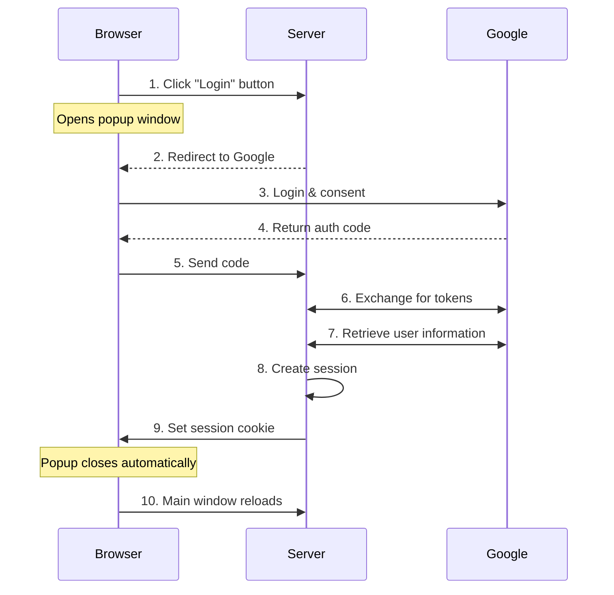
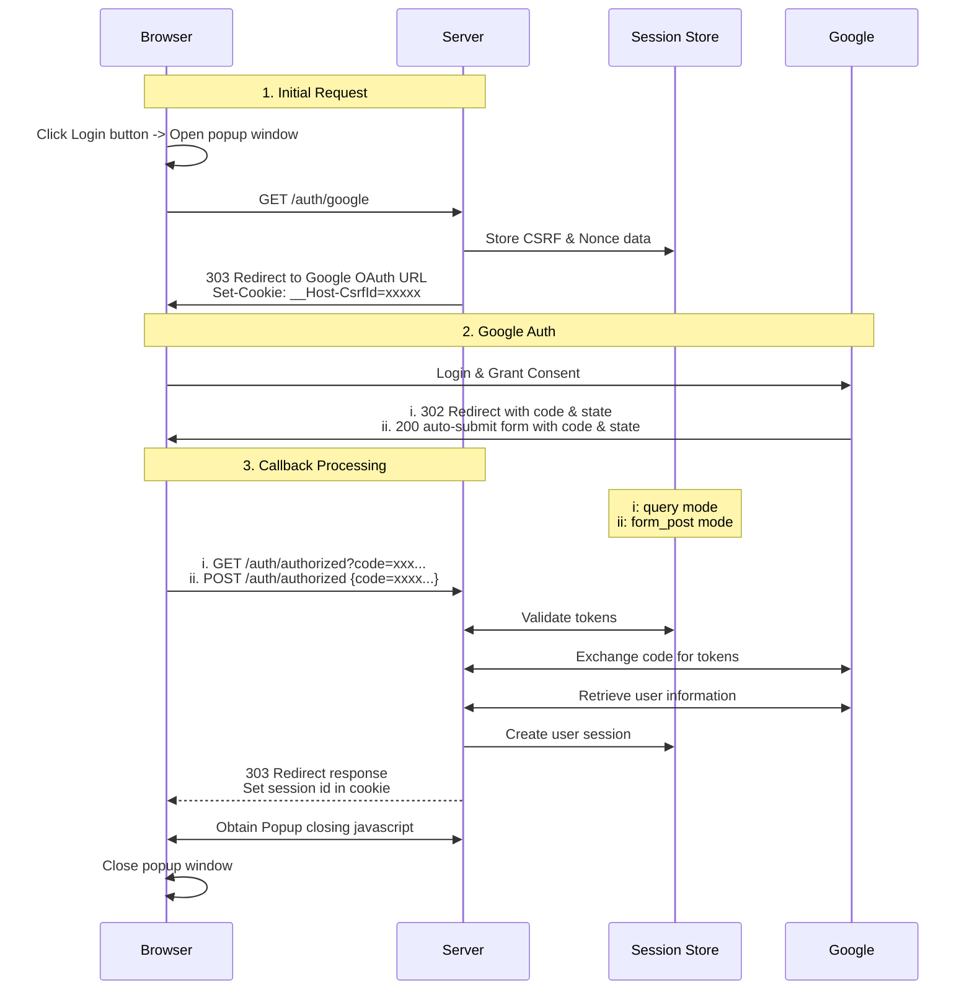
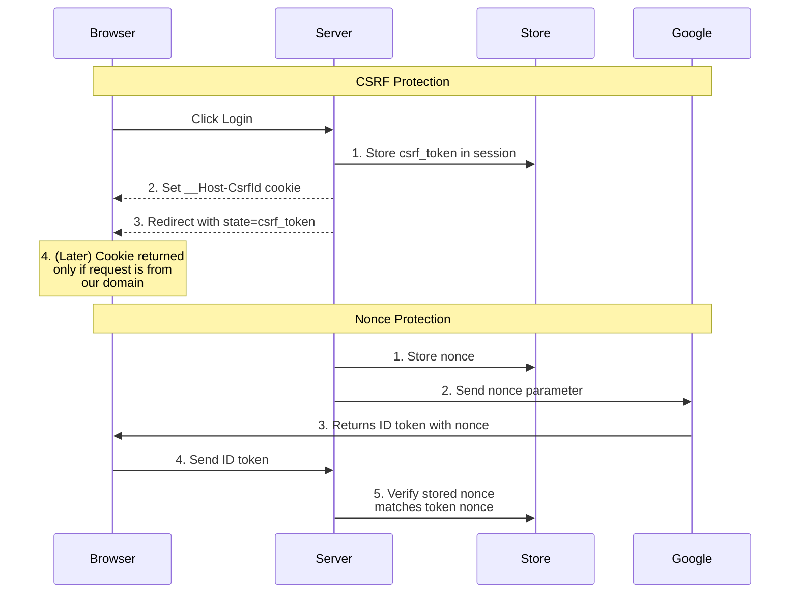

# Implementing Google OAuth2 with Rust and Axum

- [Implementing Google OAuth2 with Rust and Axum](#implementing-google-oauth2-with-rust-and-axum)
  - [Introduction](#introduction)
  - [OAuth2 and OpenID Connect Overview](#oauth2-and-openid-connect-overview)
  - [Basic Authentication Flow](#basic-authentication-flow)
  - [Identifying Authenticated Access](#identifying-authenticated-access)
  - [OAuth2 Parameters](#oauth2-parameters)
  - [Implementation Details](#implementation-details)
    - [Precise Authentication Flow](#precise-authentication-flow)
    - [Route Overview and Structure](#route-overview-and-structure)
    - [Main Page and Authentication Interface](#main-page-and-authentication-interface)
    - [Starting Authentication](#starting-authentication)
    - [Handling OAuth2 Callback](#handling-oauth2-callback)
      - [Form Post Mode](#form-post-mode)
      - [Query Mode](#query-mode)
    - [Session Management](#session-management)
  - [Security Considerations](#security-considerations)
    - [CSRF Protection](#csrf-protection)
    - [Why is csrf\_check skipped for post\_form?](#why-is-csrf_check-skipped-for-post_form)
    - [Nonce Validation](#nonce-validation)
    - [Cookie Security](#cookie-security)
    - [Response Mode Security](#response-mode-security)
  - [Why Use a Popup Window?](#why-use-a-popup-window)
  - [Conclusion](#conclusion)

## Introduction

Modern web applications often rely on OAuth2 for secure user authentication. As part of a recent exploration into Rust and Axum, I implemented a login system that integrates Google OAuth2. In this post, I’ll walk through the details of the implementation, covering both the theoretical aspects and practical steps involved in building a secure authentication system.

To keep things concise, I’ve included simplified code snippets for key components. The full implementation is available in my [GitHub repository](https://github.com/ktaka-ccmp/axum-google-oauth2).

## OAuth2 and OpenID Connect Overview

OAuth2 and OpenID Connect (OIDC) are key to modern authentication systems, and understanding how they fit together can make implementing secure authentication easier.

OAuth2 serves as a foundation, allowing users to grant applications access to their resources without sharing credentials. Applications interact with these resources through access tokens. For this implementation, I used the authorization code flow, a secure and widely adopted approach, to retrieve user information from the identity provider.

OIDC builds on OAuth2, adding a standardized layer for authentication. While OAuth2 focuses on "what can this app access?", OIDC answers "who is this user?" It introduces the ID token, a JSON Web Token (JWT) that contains verified user identity information. This makes it possible to authenticate users while managing access permissions in a single, unified flow.

In a nutshell, OAuth2 becomes more secure when extended with the ID token under the OIDC standard.

## Basic Authentication Flow

This implementation follows a well-defined sequence for authentication:



The process begins when a user clicks the login button, which opens a popup and redirects to Google’s authentication page. After a successful login, Google returns an authorization code that the server exchanges for tokens. The server retrieves the user information, creates a session, and sets it as a cookie in the response to the browser, completing the authentication flow. The user is subsequently identified by this cookie in all future requests.

## Identifying Authenticated Access

Session cookies play a central role in maintaining authenticated access. Once the server sets a session cookie during login, it is automatically included in future browser requests. To ensure secure session management, I used several measures:

- **HttpOnly flag**: Prevents client-side script access to cookies.
- **Secure flag**: Ensures cookies are only transmitted over HTTPS.
- **SameSite settings**: Protects against CSRF attacks.

These settings work together to maintain secure authentication states, even across multiple tabs.

## OAuth2 Parameters

OAuth2 and OIDC define several parameters critical to the authentication process. Here’s how I approached configuring some of the key parameters:

- **`response_type`**: Set to `code`, as it securely delivers an authorization code.
- **`response_mode`**: Used `form_post` for better security by avoiding sensitive data in URLs.
- **`scope`**: Requested `openid`, `email`, and `profile` for user identity and basic information.

These parameters are essential for controlling the authentication flow and ensuring security.

## Implementation Details

Here’s how the implementation comes together, starting with the authentication flow.

### Precise Authentication Flow

The flow involves interactions between the browser, server, Google, and session store.

The session store is responsible for managing the login session and storing security tokens, including the CSRF token and the nonce token.



This diagram captures the flow of data and interactions at each step.

### Route Overview and Structure

Routes are organized to handle specific parts of the flow:

```rust
let app = Router::new()
    .route("/", get(index))
    .route("/auth/google", get(google_auth))
    .route("/auth/authorized", get(get_authorized).post(post_authorized))
    .route("/popup_close", get(popup_close))
    .route("/logout", get(logout))
    .route("/protected", get(protected));
```

These routes handle everything from initiating authentication to managing sessions and user logout.

### Main Page and Authentication Interface

The main page dynamically adapts based on the user's authentication status. For anonymous users, a login button is displayed, while authenticated users are greeted with a personalized message. This functionality is implemented as follows:

```rust
async fn index(user: Option<User>) -> impl IntoResponse {
    match user {
        Some(u) => {
            let message = format!("Hey {}! You're logged in!", u.name);
            let template = IndexTemplateUser { message: &message };
            (StatusCode::OK, Html(template.render().unwrap())).into_response()
        }
        None => {
            let message = "You're not logged in.\nClick the Login button below.".to_string();
            let template = IndexTemplateAnon { message: &message };
            (StatusCode::OK, Html(template.render().unwrap())).into_response()
        }
    }
}
```

This design ensures a seamless user experience, adapting content dynamically based on whether the user is logged in.

### Starting Authentication

The `/auth/google` endpoint initiates the authentication process. It sets up necessary security tokens and redirects the user to Google’s authentication page with all required parameters:

```rust
async fn google_auth(
    State(params): State<OAuth2Params>,
    State(store): State<MemoryStore>,
    headers: HeaderMap,
) -> Result<impl IntoResponse, AppError> {
    let expires_at = Utc::now() + Duration::seconds(CSRF_COOKIE_MAX_AGE);
    let user_agent = headers.get(axum::http::header::USER_AGENT);

    // Generate and store security tokens
    let (csrf_token, csrf_id) =
        generate_store_token("csrf_data", expires_at, Some(user_agent) ...);
    let (nonce_token, nonce_id) =
        generate_store_token("nonce_data", expires_at, None ...);

    let encoded_state = encode_state(csrf_token, nonce_id);

    // Construct authorization URL
    let auth_url = format!(
        "{}?{}&client_id={}&redirect_uri={}&state={}&nonce={}",
        OAUTH2_AUTH_URL,
        OAUTH2_QUERY_STRING,
        params.client_id,
        params.redirect_uri,
        encoded_state,
        nonce_token
    );

    // OAUTH2_AUTH_URL and OAUTH2_QUERY_STRING are defined elsewhere as:
    // static OAUTH2_AUTH_URL: &str = "https://accounts.google.com/o/oauth2/v2/auth";
    // static OAUTH2_QUERY_STRING: &str = "response_type=code&scope=openid+email+profile\
    // &response_mode=form_post&access_type=online&prompt=consent";

    // Set security cookie and redirect
    let mut headers = HeaderMap::new();
    header_set_cookie(
        &mut headers,
        CSRF_COOKIE_NAME.to_string(),
        csrf_id,
        expires_at,
        CSRF_COOKIE_MAX_AGE,
    )?;

    // Returning a response with the Set-Cookie header ensures that the browser sends the security tokens set in cookies with future requests.
    Ok((headers, Redirect::to(&auth_url)))
}
```

This step ensures security by generating CSRF and nonce tokens while redirecting users to Google for authentication.

### Handling OAuth2 Callback

After the user completes authentication, Google sends a callback to our application. The `/auth/authorized` endpoint processes this response, supporting both form_post and query modes.

#### Form Post Mode

This mode is recommended for its enhanced security. Here, Google returns the authorization code and state as part of a POST request body:

```rust
async fn post_authorized(
    State(state): State<AppState>,
    Form(form): Form<AuthResponse>,
) -> Result<impl IntoResponse, AppError> {
    validate_origin(&headers, &state.oauth2_params.auth_url).await?;
    authorized(&form, state).await
}
```

This approach avoids exposing sensitive data in URLs and browser histories.

#### Query Mode

In query mode, Google includes the authorization code and state as query parameters in the callback URL:

```rust
async fn get_authorized(
    Query(query): Query<AuthResponse>,
    State(state): State<AppState>,
    TypedHeader(cookies): TypedHeader<headers::Cookie>,
) -> Result<impl IntoResponse, AppError> {
    csrf_checks(cookies.clone(), &state.store, &query, headers).await?;
    authorized(&query, state).await
}
```

Both modes follow a common processing pipeline to validate tokens, exchange the authorization code for tokens, and create user sessions:

```rust
async fn authorized(auth_response: &AuthResponse, state: AppState) -> Result<impl IntoResponse, AppError> {
    let (access_token, id_token) = exchange_code_for_token(...).await?;
    let user_data = fetch_user_data_from_google(access_token).await?;
    verify_nonce(auth_response, idinfo, &state.store).await?;

    let session_id = create_and_store_session(user_data, ...).await?;
    Ok((set_cookie_header(session_id), Redirect::to("/popup_close")))
}
```

### Session Management

Once the user is authenticated, a session is created and stored securely. The session management system ensures that users remain logged in across requests:

```rust
async fn create_and_store_session(
    user_data: User,
    store: &MemoryStore,
    expires_at: DateTime<Utc>,
) -> Result<String, AppError> {
    let mut session = Session::new();
    session.insert("user", &user_data)?;
    session.set_expiry(expires_at);
    let session_id = store.store_session(session).await?;
    Ok(session_id)
}
```

To protect sensitive routes, the `User` extractor automatically verifies the session cookie and retrieves user data:

```rust
#[async_trait]
impl<S> FromRequestParts<S> for User
where
    MemoryStore: FromRef<S>,
    S: Send + Sync,
{
    async fn from_request_parts(parts: &mut Parts, state: &S) -> Result<Self, Self::Rejection> {
        let store = MemoryStore::from_ref(state);
        let session_cookie = get_session_cookie(parts)?;
        let user = load_user_from_session(store, session_cookie).await?;
        Ok(user)
    }
}
```

## Security Considerations

Security forms a critical aspect of this implementation. Here’s a breakdown of the measures employed:



### CSRF Protection

CSRF tokens ensure that authentication requests originate from legitimate users. The system generates a unique CSRF token, stores it in both the session and state parameter, and validates it during the callback.

### Why is csrf_check skipped for post_form?

### Nonce Validation

The nonce mechanism provides additional protection against replay attacks. A unique nonce is generated for each authentication attempt, included in the ID token, and validated upon receipt.

### Cookie Security

Cookies are secured with several measures:

- The `HttpOnly` flag prevents client-side access.
- The `Secure` flag enforces HTTPS-only transmission.
- The `__Host-` prefix restricts cookies to a specific host.

### Response Mode Security

Both form_post and query response modes are supported, with form_post recommended for its ability to keep sensitive data out of URLs.


## Why Use a Popup Window?

A popup-based flow keeps the main page responsive during the authentication process and simplifies state management. Once authentication completes, the popup closes automatically, and the main page updates to reflect the authenticated state. Since the browser shares cookie headers across different tabs, the login state is maintained until the cookie expires or is overwritten.

## Conclusion

This implementation combines robust security practices, seamless user experience, and the flexibility of Axum to create a functional OAuth2 authentication system. The complete implementation can be found in the [GitHub repository](https://github.com/ktaka-ccmp/axum-google-oauth2). Feel free to explore it and share any feedback or improvements!
