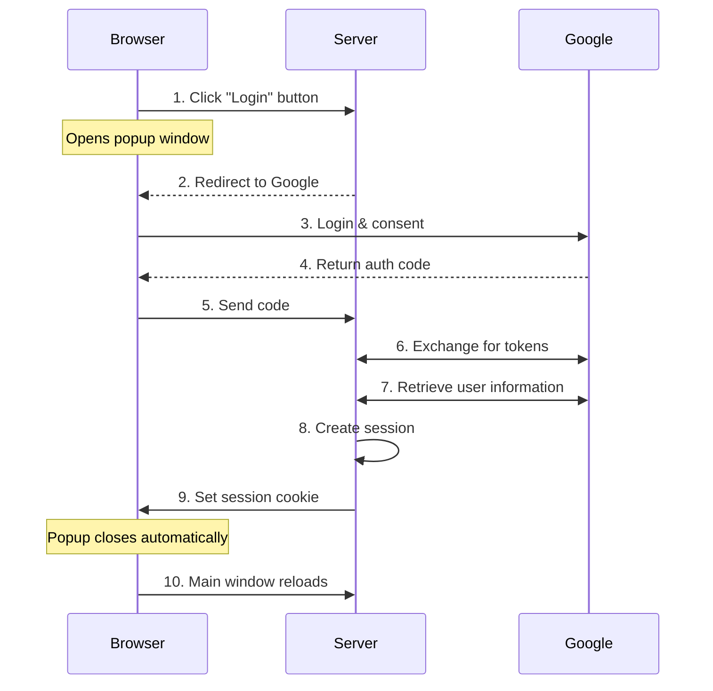
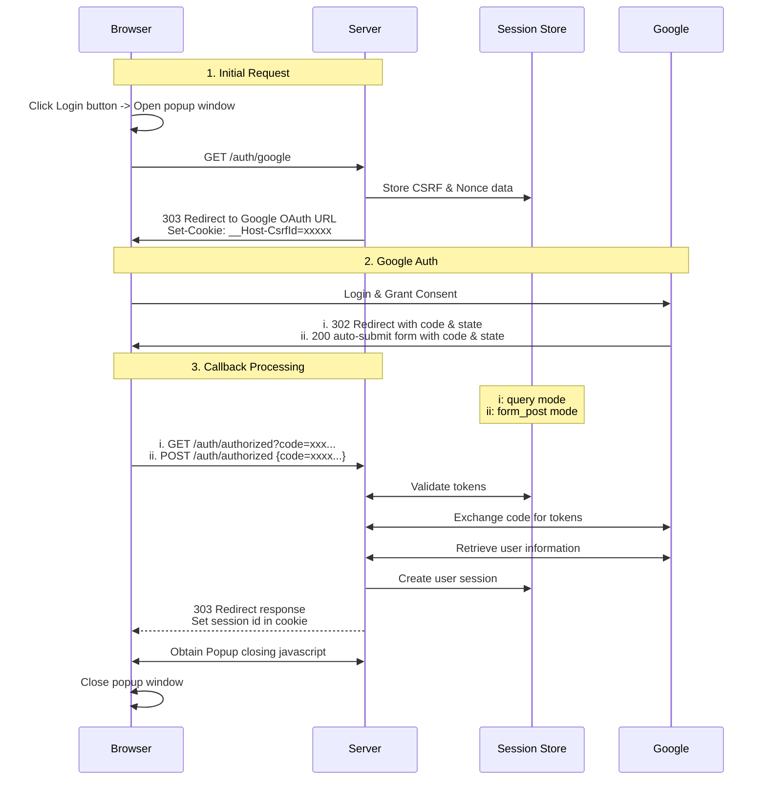
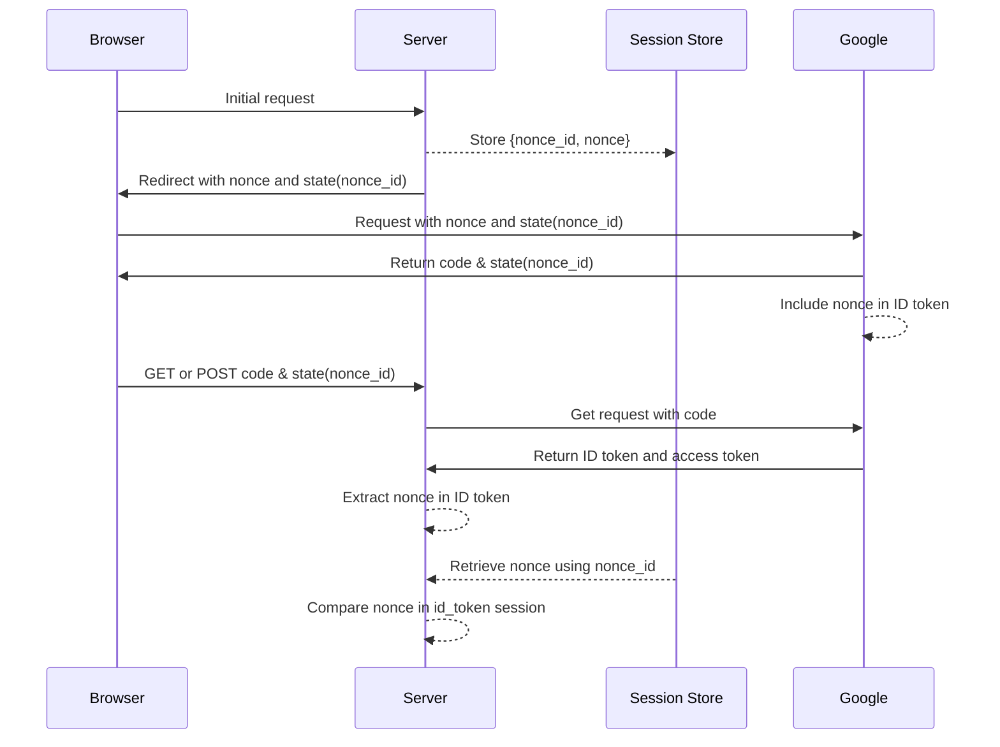
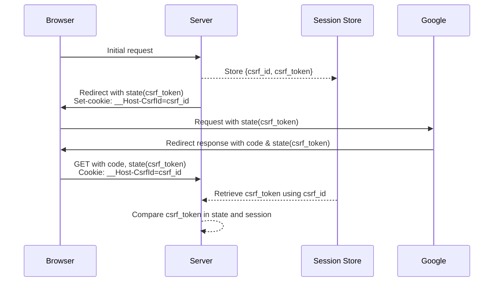

# Implementing Google OAuth2 with Rust and Axum

- [Implementing Google OAuth2 with Rust and Axum](#implementing-google-oauth2-with-rust-and-axum)
  - [Introduction](#introduction)
  - [OAuth2 and OpenID Connect Overview](#oauth2-and-openid-connect-overview)
  - [Basic Authentication Flow](#basic-authentication-flow)
    - [Why Use a Popup Window?](#why-use-a-popup-window)
  - [Identifying Authenticated Access](#identifying-authenticated-access)
  - [OAuth2 Parameters](#oauth2-parameters)
  - [Implementation Details](#implementation-details)
    - [Precise Authentication Flow](#precise-authentication-flow)
    - [Route Overview and Structure](#route-overview-and-structure)
    - [Main Page and Authentication Interface](#main-page-and-authentication-interface)
    - [Starting Authentication](#starting-authentication)
    - [Handling OAuth2 Callback](#handling-oauth2-callback)
      - [Form Post Mode](#form-post-mode)
      - [Query Mode](#query-mode)
    - [Session Management](#session-management)
  - [Security Considerations](#security-considerations)
    - [Nonce Validation](#nonce-validation)
    - [CSRF Protection](#csrf-protection)
    - [Security Mechanism Comparison](#security-mechanism-comparison)
    - [Cookie Security](#cookie-security)
    - [Response Mode Security](#response-mode-security)
    - [Why use code flow](#why-use-code-flow)
    - [ID token claims checks against user info](#id-token-claims-checks-against-user-info)
  - [Conclusion](#conclusion)

## Introduction

Modern web applications often rely on OAuth2 for secure user authentication. As part of a recent exploration into Rust and Axum, I implemented a login system that integrates Google OAuth2. In this post, I’ll walk through the details of the implementation, covering both the theoretical aspects and practical steps involved in building a secure authentication system.

To keep things concise, I’ve included simplified code snippets for key components. The full implementation is available in my [GitHub repository](https://github.com/ktaka-ccmp/axum-google-oauth2).

## OAuth2 and OpenID Connect Overview

OAuth2 and OpenID Connect (OIDC) are key to modern authentication systems, and understanding how they fit together can make implementing secure authentication easier.

OAuth2 serves as a foundation, allowing users to grant applications access to their resources without sharing credentials. Applications interact with these resources through access tokens. For this implementation, I used the authorization code flow, a secure and widely adopted approach, to retrieve user information from the identity provider.

OIDC builds on OAuth2, adding a standardized layer for authentication. While OAuth2 focuses on "what can this app access?", OIDC answers "who is this user?" It introduces the ID token, a JSON Web Token (JWT) that contains verified user identity information. This makes it possible to authenticate users while managing access permissions in a single, unified flow.

In a nutshell, OAuth2 becomes more secure when extended with the ID token under the OIDC standard.

## Basic Authentication Flow

This implementation follows a well-defined sequence for authentication:



The process begins when a user clicks the login button, which opens a popup and redirects to Google’s authentication page. After a successful login, Google returns an authorization code that the server exchanges for tokens. The server retrieves the user information, creates a session, and sets it as a cookie in the response to the browser, completing the authentication flow. The user is subsequently identified by this cookie in all future requests.

### Why Use a Popup Window?

A popup-based flow keeps the main page responsive during the authentication process and simplifies state management. Once authentication completes, the popup closes automatically, and the main page updates to reflect the authenticated state. Since the browser shares cookie headers across different tabs, the login state is maintained until the cookie expires or is overwritten.

## Identifying Authenticated Access

Session cookies play a central role in maintaining authenticated access. Once the server sets a session cookie during login, it is automatically included in future browser requests. To ensure secure session management, I used several measures:

- **HttpOnly flag**: Prevents client-side script access to cookies.
- **Secure flag**: Ensures cookies are only transmitted over HTTPS.
- **SameSite settings**: Protects against CSRF attacks.

These settings work together to maintain secure authentication states, even across multiple tabs.

## OAuth2 Parameters

OAuth2 and OIDC define several parameters critical to the authentication process. Here’s how I approached configuring some of the key parameters:

- **`response_type`**: Set to `code`, as it securely delivers an authorization code.
- **`response_mode`**: Used `form_post` for better security by avoiding sensitive data in URLs.
- **`scope`**: Requested `openid`, `email`, and `profile` for user identity and basic information.

These parameters are essential for controlling the authentication flow and ensuring security.

## Implementation Details

Here’s how the implementation comes together, starting with the authentication flow.

### Precise Authentication Flow

The flow involves interactions between the browser, server, Google, and session store.

The session store is responsible for managing the login session and storing security tokens, including the CSRF token and the nonce token.



This diagram captures the flow of data and interactions at each step.

### Route Overview and Structure

Routes are organized to handle specific parts of the flow:

```rust
let app = Router::new()
    .route("/", get(index))
    .route("/auth/google", get(google_auth))
    .route("/auth/authorized", get(get_authorized).post(post_authorized))
    .route("/popup_close", get(popup_close))
    .route("/logout", get(logout))
    .route("/protected", get(protected));
```

These routes handle everything from initiating authentication to managing sessions and user logout.

### Main Page and Authentication Interface

The main page dynamically adapts based on the user's authentication status. For anonymous users, a login button is displayed, while authenticated users are greeted with a personalized message. This functionality is implemented as follows:

```rust
async fn index(user: Option<User>) -> impl IntoResponse {
    match user {
        Some(u) => {
            let message = format!("Hey {}! You're logged in!", u.name);
            let template = IndexTemplateUser { message: &message };
            (StatusCode::OK, Html(template.render().unwrap())).into_response()
        }
        None => {
            let message = "You're not logged in.\nClick the Login button below.".to_string();
            let template = IndexTemplateAnon { message: &message };
            (StatusCode::OK, Html(template.render().unwrap())).into_response()
        }
    }
}
```

This design ensures a seamless user experience, adapting content dynamically based on whether the user is logged in.

### Starting Authentication

The authentication flow begins when a user clicks the login button. The /auth/google endpoint handles this initial request, setting up necessary security measures and redirecting to Google's authentication page. Here's how the process works:

```rust
async fn google_auth(
    State(params): State<OAuth2Params>,
    State(store): State<MemoryStore>,
    headers: HeaderMap,
) -> Result<impl IntoResponse, AppError> {
    let expires_at = Utc::now() + Duration::seconds(CSRF_COOKIE_MAX_AGE);
    let user_agent = headers.get(axum::http::header::USER_AGENT);

    // Generate and store security tokens
    let (csrf_token, csrf_id) =
        generate_store_token("csrf_session", expires_at, Some(user_agent) ...);
    let (nonce_token, nonce_id) =
        generate_store_token("nonce_session", expires_at, None ...);

    let encoded_state = encode_state(csrf_token, nonce_id);

    // Construct authorization URL
    let auth_url = format!(
        "{}?{}&client_id={}&redirect_uri={}&state={}&nonce={}",
        OAUTH2_AUTH_URL,
        OAUTH2_QUERY_STRING,
        params.client_id,
        params.redirect_uri,
        encoded_state,
        nonce_token
    );

    // OAUTH2_AUTH_URL and OAUTH2_QUERY_STRING are defined elsewhere as:
    // static OAUTH2_AUTH_URL: &str = "https://accounts.google.com/o/oauth2/v2/auth";
    // static OAUTH2_QUERY_STRING: &str = "response_type=code&scope=openid+email+profile\
    // &response_mode=form_post&access_type=online&prompt=consent";

    // Set security cookie and redirect
    let mut headers = HeaderMap::new();
    header_set_cookie(
        &mut headers,
        CSRF_COOKIE_NAME.to_string(),
        csrf_id,
        expires_at,
        CSRF_COOKIE_MAX_AGE,
    )?;

    // Returning a response with the Set-Cookie header ensures that the browser sends the security tokens set in cookies with future requests.
    Ok((headers, Redirect::to(&auth_url)))
}
```

This process generates necessary security tokens, stores them securely, and initiates the OAuth2 flow by redirecting to Google's authorization endpoint. The URL is constructed with carefully chosen parameters. These parameters determine how the authentication process will proceed.

### Handling OAuth2 Callback

After Google authenticates the user, it sends the response back to our application. The `/auth/authorized` endpoint processes this response, supporting both form_post and query modes.

#### Form Post Mode

This mode is recommended for its enhanced security. Here, Google returns the authorization code and state as body of the response, then a javascript code automatically send them as a POST body to the callback endpoint:

```rust
async fn post_authorized(
    State(state): State<AppState>,
    Form(form): Form<AuthResponse>,
) -> Result<impl IntoResponse, AppError> {
    validate_origin(&headers, &state.oauth2_params.auth_url).await?;
    authorized(&form, state).await
}
```

This approach avoids exposing sensitive data in URLs and browser histories.

#### Query Mode

In query mode, Google includes the authorization code and state as query parameters in the redirect URL, which is processed by the callback function:

```rust
async fn get_authorized(
    Query(query): Query<AuthResponse>,
    State(state): State<AppState>,
    TypedHeader(cookies): TypedHeader<headers::Cookie>,
) -> Result<impl IntoResponse, AppError> {
    csrf_checks(cookies.clone(), &state.store, &query, headers).await?;
    authorized(&query, state).await
}
```

Both modes follow a common processing pipeline to validate tokens, exchange the authorization code for tokens, and create user sessions:

```rust
async fn authorized(auth_response: &AuthResponse, state: AppState) -> Result<impl IntoResponse, AppError> {
    let (access_token, id_token) = exchange_code_for_token(...).await?;
    let user_data = fetch_user_data_from_google(access_token).await?;
    verify_nonce(auth_response, idinfo, &state.store).await?;

    let session_id = create_and_store_session(user_data, ...).await?;
    Ok((set_cookie_header(session_id), Redirect::to("/popup_close")))
}
```

### Session Management

Once the user is authenticated, a session is created and stored securely. The session management system ensures that users remain logged in across requests:

```rust
async fn create_and_store_session(
    user_data: User,
    store: &MemoryStore,
    expires_at: DateTime<Utc>,
) -> Result<String, AppError> {
    let mut session = Session::new();
    session.insert("user", &user_data)?;
    session.set_expiry(expires_at);
    let session_id = store.store_session(session).await?;
    Ok(session_id)
}
```

To protect sensitive routes, the function arguments include `user: User`. The `User` extractor automatically verifies the session cookie and retrieves the user data for subsequent requests:

```rust
// The "user: User" argument ensures access to authenticated user data.
async fn protected(user: User) -> impl IntoResponse {
    format!("Welcome, {}!", user.name)
}

#[async_trait]
impl<S> FromRequestParts<S> for User
where
    MemoryStore: FromRef<S>,
    S: Send + Sync,
{
    async fn from_request_parts(parts: &mut Parts, state: &S) -> Result<Self, Self::Rejection> {
        let store = MemoryStore::from_ref(state);
        let session_cookie = get_session_cookie(parts)?;
        let user = load_user_from_session(store, session_cookie).await?;
        Ok(user)
    }
}
```

## Security Considerations

Our authentication implementation relies on several security mechanisms working together. Since we use ID token claims for authentication, these mechanisms focus on protecting the authentication process and verifying token authenticity.

### Nonce Validation

The nonce mechanism is crucial for verifying that the ID token we'll use for authentication was issued specifically for this request.

Nonce validation confirms the ID token’s authenticity by comparing two values:

1. **Nonce in the ID token:**  Included by Google in the signed token.
1. **Nonce from the session store:**  Retrieved using the `nonce_id` from the state parameter.

This prevents replay attacks and ensures the token is tied to the current authentication request.



### CSRF Protection

CSRF protection varies by response mode, with different mechanisms ensuring request authenticity.

**Query Mode Flow:**
This mode uses cookie-based CSRF validation to verify the request origin.



**Form Post Mode:**
Browser security handles CSRF protection differently here:

- Google sends the callback as a POST request from its domain.
- The browser blocks the `__Host-CsrfId` cookie in cross-origin POST requests.
- Security relies on:
  - **Origin validation:**  Verifies the request originates from Google.
  - **Nonce verification:**  Confirms token authenticity.

### Security Mechanism Comparison

| Security Element | What's Compared | Source 1 (Session store key) | Source 2 | Purpose |
| --- | --- | --- | --- | --- |
| Nonce | nonce_token | nonce_id in state parameter  | Embedded in ID token | Verifies ID token is specific to this authentication request |
| CSRF Token | csrf_token | csrf_id in cookie | state parameter | Ensures callback originates from the same browser session |

### Cookie Security

All cookies use comprehensive security settings:

```rust
"{name}={value}; SameSite=Lax; Secure; HttpOnly; Path=/; Max-Age={max_age}"
```

- **`__Host-` prefix:**  Enforces HTTPS and domain-specific restrictions.
- **`HttpOnly:`**  Prevents JavaScript access to cookies.
- **`Secure:`**  Ensures transmission occurs only over HTTPS.
- **`SameSite=Lax:`**  Guards against CSRF while allowing same-origin navigation.

These settings ensure cookies are protected from common attack vectors.

### Response Mode Security

**Form Post Mode (Recommended)**

- Authorization code is included in the POST body, keeping it hidden from URLs and logs.
- Security relies on **origin validation**  and **nonce verification** .
- The most secure option for production use.

**Query Mode**

- Authorization code is visible in the URL, making it easier to debug but more prone to exposure (e.g., logs, bookmarks).
- Offers full CSRF protection but carries a higher risk of leakage in environments where URLs are recorded.

### Why use code flow

We use authorization code flow instead of implicit flow (response_type=id_token) because it offers:

- Secure token delivery via back-channel server-to-server communication
- Support for token refresh without new authentication
- Better compatibility across OAuth2 providers
- Industry best practice for security

While we only use the ID token for authentication, the code flow's security benefits justify the additional complexity.

### ID token claims checks against user info

The ID token contains cryptographically signed claims sufficient for authentication. While the userinfo endpoint provides similar data:

- Both come from the same trusted source (Google)
- Cross-checking offers no additional security
- ID token claims are designed for authentication
- Userinfo endpoint is optional for supplementary data

We rely on ID token claims for authentication and consider userinfo data supplementary.

## Conclusion

This implementation combines robust security practices, seamless user experience, and the flexibility of Axum to create a functional OAuth2 authentication system. The complete implementation can be found in the [GitHub repository](https://github.com/ktaka-ccmp/axum-google-oauth2). Feel free to explore it and share any feedback or improvements!
