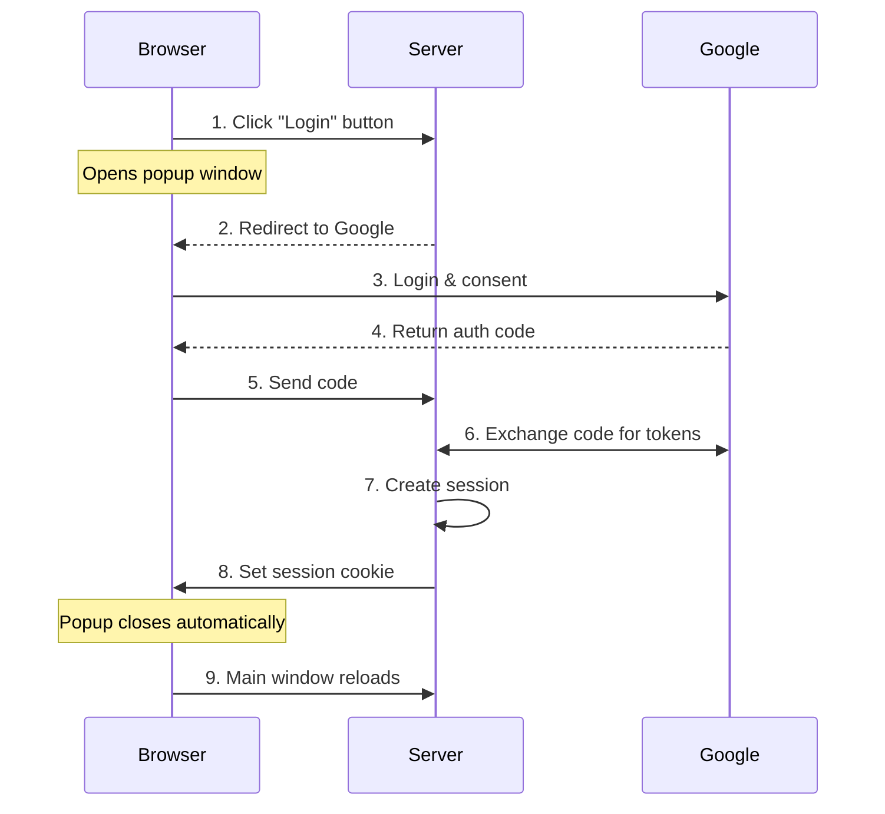
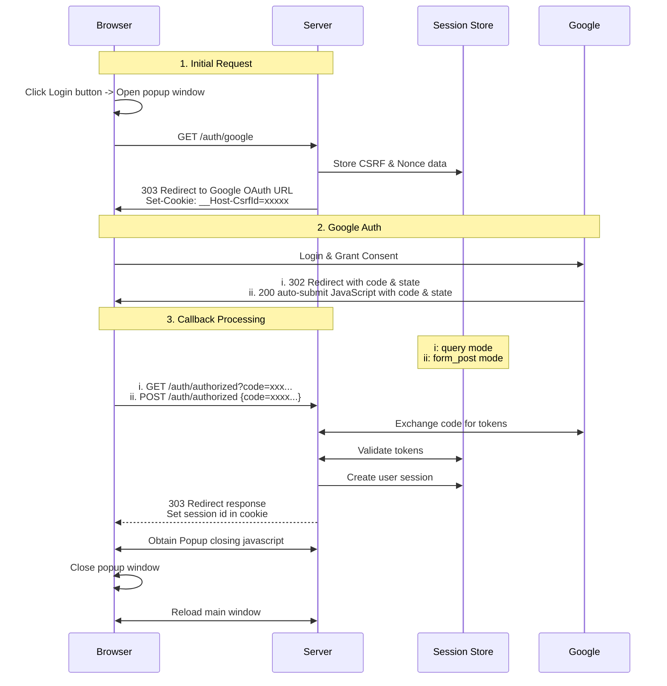
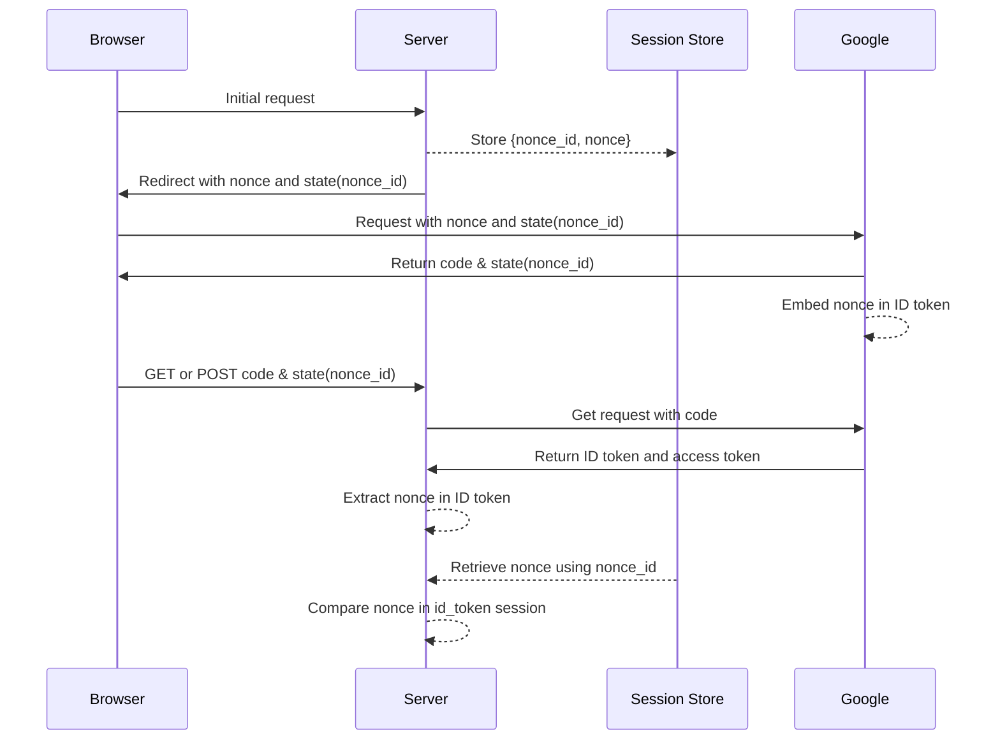
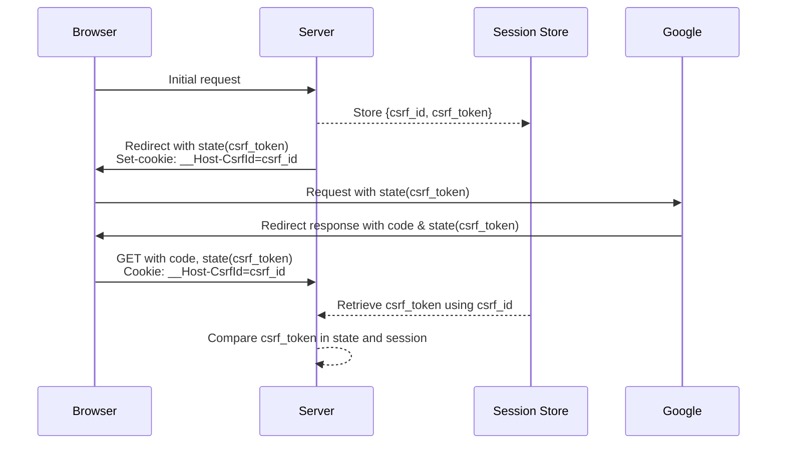

<!-- Implementing Google OAuth2/OIDC with Axum -->

- [Introduction](#introduction)
- [Overview](#overview)
  - [What Are OAuth2 and OpenID Connect?](#what-are-oauth2-and-openid-connect)
  - [How Authentication Works: Key Concepts](#how-authentication-works-key-concepts)
- [Implementation Details](#implementation-details)
  - [Authentication Flow](#authentication-flow)
  - [Route Structure](#route-structure)
  - [Main Page Behavior](#main-page-behavior)
  - [Initiating the OAuth2 Flow](#initiating-the-oauth2-flow)
  - [Handling OAuth2 Callback](#handling-oauth2-callback)
  - [Managing User Sessions](#managing-user-sessions)
- [Security Considerations](#security-considerations)
  - [Nonce Validation](#nonce-validation)
  - [CSRF Protection](#csrf-protection)
  - [Cookie Security](#cookie-security)
  - [Response Mode Security](#response-mode-security)
  - [Authentication with Authorization Code Flow](#authentication-with-authorization-code-flow)
  - [ID Token Validation](#id-token-validation)
- [Conclusion](#conclusion)

## Introduction

Modern web applications often rely on OAuth2/OIDC for secure user authentication. As part of a recent exploration into Rust and Axum, I implemented a login system that integrates Google OAuth2. In this post, I’ll walk through the details of the implementation, covering both the theoretical aspects and practical steps involved in building a secure authentication system.

To keep things concise, I’ve included simplified code snippets for key components. The full implementation is available in my [GitHub repository](https://github.com/ktaka-ccmp/axum-google-oauth2).

    <video src="https://github.com/ktaka-ccmp/ktaka.blog.ccmp.jp/raw/refs/heads/master/2024/Axum-Google-OAuth2-Login/image/blog-20241206-01.mp4" controls="true"></video>

## Overview

### What Are OAuth2 and OpenID Connect?

OAuth2 and OpenID Connect (OIDC) are key to modern authentication systems, and understanding how they fit together can make implementing secure authentication easier.

OAuth2 serves as a foundation, allowing users to grant applications access to their resources without sharing credentials. Applications interact with these resources through access tokens. For this implementation, I used the authorization code flow, a secure and widely adopted approach, to retrieve user information from the identity provider.

OIDC builds on OAuth2, adding a standardized layer for authentication. While OAuth2 focuses on "what can this app access?", OIDC answers "who is this user?" It introduces the ID token, a JSON Web Token (JWT) that contains verified user identity information. This makes it possible to authenticate users while managing access permissions in a single, unified flow.

In a nutshell, OAuth2 becomes more secure when extended with the ID token under the OIDC standard.

### How Authentication Works: Key Concepts

#### Basic Authentication Flow

This implementation follows a well-defined sequence for authentication:



The process begins when a user clicks the login button, which opens a popup and redirects to Google’s authentication page. After a successful login, Google returns an authorization code that the server exchanges for tokens. The server verifies ID token, creates a user session, and sets a session cookie in the response to the browser, completing the authentication flow. The user is subsequently identified by this cookie in all future requests.

#### How Session Cookies Work

Session cookies play a central role in maintaining authenticated access. Once the server sets a session cookie during login, it is automatically included in future browser requests. To ensure secure session management, I used several measures:

- **HttpOnly flag**: Prevents client-side script access to cookies.
- **Secure flag**: Ensures cookies are only transmitted over HTTPS.
- **SameSite settings**: Protects against CSRF attacks.
- **`__Host-` prefix:**  Enforces HTTPS and host-specific restrictions.

These settings work together to maintain secure authentication states, even across multiple tabs.

#### OAuth2 Parameters

OAuth2 and OIDC define several parameters critical to the authentication process. Here’s how I approached configuring some of the key parameters:

- **`response_type`**: Set to `code`, as it securely delivers an authorization code.
- **`response_mode`**: Used `form_post` for better security by avoiding sensitive data in URLs.
- **`scope`**: Requested `openid`, `email`, and `profile` for user identity and basic information.

These parameters are essential for controlling the authentication flow and ensuring security.

## Implementation Details

The following sections break down the implementation into key components, explaining how the OAuth2 authentication flow integrates with session management and security mechanisms.

### Authentication Flow

Our implementation uses a popup window for authentication to keep the main page responsive. This approach:

- Handles the auth flow in a separate window
- Maintains login state using shared cookies across the windows
- Updates the main page automatically when complete

The flow coordinates between four components: browser, server, Google, and session store. The session store manages login sessions and security tokens (CSRF and nonce).



This diagram captures the flow of data and interactions at each step.

### Route Structure

The application defines routes to manage each step of the authentication and session flow:

```rust
let app = Router::new()
    .route("/", get(index))
    .route("/auth/google", get(google_auth))
    .route("/auth/authorized", get(get_authorized).post(post_authorized))
    .route("/popup_close", get(popup_close))
    .route("/logout", get(logout))
    .route("/protected", get(protected));
```

### Main Page Behavior

The main page dynamically adjusts its content based on the user's authentication status:

```rust
async fn index(user: Option<User>) -> impl IntoResponse {
    match user {
        Some(u) => {
            let message = format!("Hey {}! You're logged in!", u.name);
            let template = IndexTemplateUser { message: &message };
            (StatusCode::OK, Html(template.render().unwrap())).into_response()
        }
        None => {
            let message = "You're not logged in.\nClick the Login button below.".to_string();
            let template = IndexTemplateAnon { message: &message };
            (StatusCode::OK, Html(template.render().unwrap())).into_response()
        }
    }
}
```

- For authenticated users: Displays a personalized greeting.
- For anonymous users: Displays a login button to trigger the popup-based authentication flow.

### Initiating the OAuth2 Flow

The `/auth/google` endpoint initiates the OAuth2 flow:

1. Generates security tokens (CSRF and nonce).
2. Stores these tokens in the session.
3. Redirects the browser to Google’s authentication page.

```rust
async fn google_auth(
    State(params): State<OAuth2Params>,
    State(store): State<MemoryStore>,
    headers: HeaderMap,
) -> Result<impl IntoResponse, AppError> {
    // Generate and store security tokens
    let (csrf_token, csrf_id) = generate_store_token("csrf_session", expires_at, Some(user_agent));
    let (nonce_token, nonce_id) = generate_store_token("nonce_session", expires_at, None);

    // Combine tokens into a state parameter
    let encoded_state = encode_state(csrf_token, nonce_id);

    // Construct the Google OAuth2 URL with required parameters
    let auth_url = format!(
        "{}?{}&client_id={}&redirect_uri={}&state={}&nonce={}",
        OAUTH2_AUTH_URL,         // e.g., https://accounts.google.com/o/oauth2/v2/auth
        OAUTH2_QUERY_STRING,     // e.g., response_type=code&scope=openid+email+profile...
        params.client_id,
        params.redirect_uri,
        encoded_state,
        nonce_token
    );

    // Set security cookie and prepare the redirect response
    let mut headers = HeaderMap::new();
    header_set_cookie(&mut headers, CSRF_COOKIE_NAME, csrf_id, expires_at)?;

    Ok((headers, Redirect::to(&auth_url)))
}
```

#### State Parameter

The state parameter combines:

- CSRF token: Protects against cross-site request forgery.
- Nonce ID: Validates the ID token’s authenticity.
- Base64URL encoding: Embeds multiple parameters in a URL safe single parameter.

```rust
fn encode_state(csrf_token: String, nonce_id: String) -> String {
    let state_params = StateParams { csrf_token, nonce_id };
    URL_SAFE.encode(serde_json::json!(state_params).to_string())
}
```

Google preserves and returns this state parameter unchanged, enabling security validations in the callback.

### Handling OAuth2 Callback

After the user authenticates with Google, the application must process the callback to complete the authentication process. This includes exchanging the authorization code for tokens and validating their authenticity.

Google returns the user’s authentication data via the `/auth/authorized` endpoint. This endpoint supports two modes:

#### Form Post Mode(Recommended)

Google returns the authorization code and state to the browser. A Google-provided javascript sends them to the endpoint as POST body. They are processed by:

```rust
async fn post_authorized(
    State(state): State<AppState>,
    Form(form): Form<AuthResponse>,
) -> Result<impl IntoResponse, AppError> {
    validate_origin(&headers, &state.oauth2_params.auth_url).await?;
    authorized(&form, state).await
}
```

#### Query Mode

Google returns a redirect response with the authorization code and state as URL query parameters. They are processed by:

```rust
async fn get_authorized(
    Query(query): Query<AuthResponse>,
    State(state): State<AppState>,
    TypedHeader(cookies): TypedHeader<headers::Cookie>,
) -> Result<impl IntoResponse, AppError> {
    csrf_checks(cookies.clone(), &state.store, &query, headers).await?;
    authorized(&query, state).await
}
```

Both callback modes eventually process the authentication response through the authorized function. This function exchanges the code for tokens, verifies their authenticity, and establishes a user session.

```rust
async fn authorized(auth_response: &AuthResponse, state: AppState) -> Result<impl IntoResponse, AppError> {
    let (access_token, id_token) = exchange_code_for_token(...).await?;

    let user_data = user_from_verified_idtoken(id_token, &state, auth_response).await?;

    // Optional check for user data from userinfo endpoint
    let user_data_userinfo = fetch_user_data_from_google(access_token).await?;
    if user_data.id != user_data_userinfo.id {
        return Err(anyhow::anyhow!("ID mismatch").into());
    }

    let session_id = create_and_store_session(user_data, ...).await?;
    Ok((set_cookie_header(session_id), Redirect::to("/popup_close")))
}
```

### Managing User Sessions

Sessions ensure secure, consistent authentication across requests. Upon successful login, a session is created and securely stored:

```rust
async fn create_and_store_session(
    user_data: User,
    store: &MemoryStore,
    expires_at: DateTime<Utc>,
) -> Result<String, AppError> {
    let mut session = Session::new();
    session.insert("user", &user_data)?;
    session.set_expiry(expires_at);
    let session_id = store.store_session(session).await?;
    Ok(session_id)
}
```

To protect sensitive routes, the function arguments include `user: User`. The `User` extractor automatically verifies the session cookie and retrieves the user data for subsequent requests:

```rust
// The "user: User" argument ensures access to authenticated user data.
async fn protected(user: User) -> impl IntoResponse {
    format!("Welcome, {}!", user.name)
}

// The User extractor
// Extract cookie from the request, and retrieve user data from the session store
#[async_trait]
impl<S> FromRequestParts<S> for User
where
    MemoryStore: FromRef<S>,
    S: Send + Sync,
{
    async fn from_request_parts(parts: &mut Parts, state: &S) -> Result<Self, Self::Rejection> {
        let store = MemoryStore::from_ref(state);
        let session_cookie = get_session_cookie(parts)?;
        let user = load_user_from_session(store, session_cookie).await?;
        Ok(user)
    }
}
```

## Security Considerations

Our authentication implementation relies on several security mechanisms working together. Since we use ID token claims for authentication, these mechanisms focus on protecting the authentication process and verifying token authenticity.

### Nonce Validation

The nonce mechanism is crucial for verifying that the ID token we'll use for authentication was issued specifically for this request.

Nonce validation confirms the ID token’s authenticity by comparing two values:

1. **Nonce in the ID token:**  Embedded by Google in the signed token.
1. **Nonce from the session store:**  Retrieved using the `nonce_id` from the state parameter.

This prevents replay attacks and ensures the token is tied to the current authentication request.



### CSRF Protection

Cross-Site Request Forgery (CSRF) protection ensures that authentication callbacks come from legitimate auth flows initiated by our application. Without it, malicious sites could trick authenticated users into unwanted auth requests.

The security mechanism differs between response modes due to how browsers handle redirects versus direct POST requests:

**Query Mode Flow:**

This mode requires cookie-based CSRF validation because the callback comes as a browser redirect, which could originate from any site. The CSRF token ensures the request chain started with our application:



**Form Post Mode:**

In this mode, we can't use CSRF cookie validation because:

- The callback comes as a cross-origin POST request from Google's domain
- Browser security blocks our `__Host-CsrfId` cookie from being sent with such requests

Instead, we rely on two security measures:

- **Nonce validation:** Confirms the ID token was issued for our specific auth request
- **Origin validation:** Ensures the POST request comes from Google's domain

This combination ensures that only Google can respond to our original authentication request, preventing any malicious sites from initiating or hijacking the authentication flow.

### Cookie Security

All cookies use comprehensive security settings:

```rust
"{name}={value}; SameSite=Lax; Secure; HttpOnly; Path=/; Max-Age={max_age}"
```

- **`HttpOnly:`**  Prevents JavaScript access to cookies.
- **`Secure:`**  Ensures transmission occurs only over HTTPS.
- **`SameSite=Lax:`**  Guards against CSRF while allowing same-origin navigation.
- **`__Host-` prefix:**  Enforces HTTPS and host-specific restrictions.

These settings ensure cookies are protected from common attack vectors.

### Response Mode Security

**Form Post Mode (Recommended)**

- Authorization code is included in the POST body, keeping it hidden from URLs and logs.
- Security relies on **origin validation**  and **nonce verification** .
- The most secure option for production use.

**Query Mode**

- Authorization code is visible in the URL, making it easier to debug but more prone to exposure (e.g., logs, bookmarks).
- Offers full CSRF protection but carries a higher risk of leakage in environments where URLs are recorded.

### Authentication with Authorization Code Flow

The authorization code flow (`response_type=code`) offers key security advantages:

- **Secure Token Exchange:** Tokens are obtained through secure server-to-server communication
- **Security Best Practice:** Recommended approach for production applications

### ID Token Validation

The ID token, a cryptographically signed JWT, provides secure authentication through its claims:

- `aud`: Ensures token was issued for our application
- `iss`: Verifies Google as the token issuer
- `exp` and `iat`: Prevent token reuse and replay attacks
- `nonce`: Binds token to our specific auth request

While Google's userinfo endpoint provides similar data, we rely on ID token validation because:

- Claims are cryptographically secured by Google's signature
- Validation is faster than additional userinfo requests
- Userinfo endpoint is better suited for fetching optional profile data

## Conclusion

In this implementation, I've walked through building a secure OAuth2/OIDC authentication system with Axum. While implementing auth can be complex, breaking it down into manageable components helped create a system that's both secure and maintainable. The code demonstrates practical patterns for token validation, CSRF protection, and session management that you might find useful in your own projects.

I've posted the complete implementation on [GitHub](https://github.com/ktaka-ccmp/axum-google-oauth2). Take a look if you're interested in the implementation details - I'm particularly curious about your thoughts on the security measures and session handling approach. If you spot any potential improvements or have questions about specific design choices, I'd love to hear your feedback!
