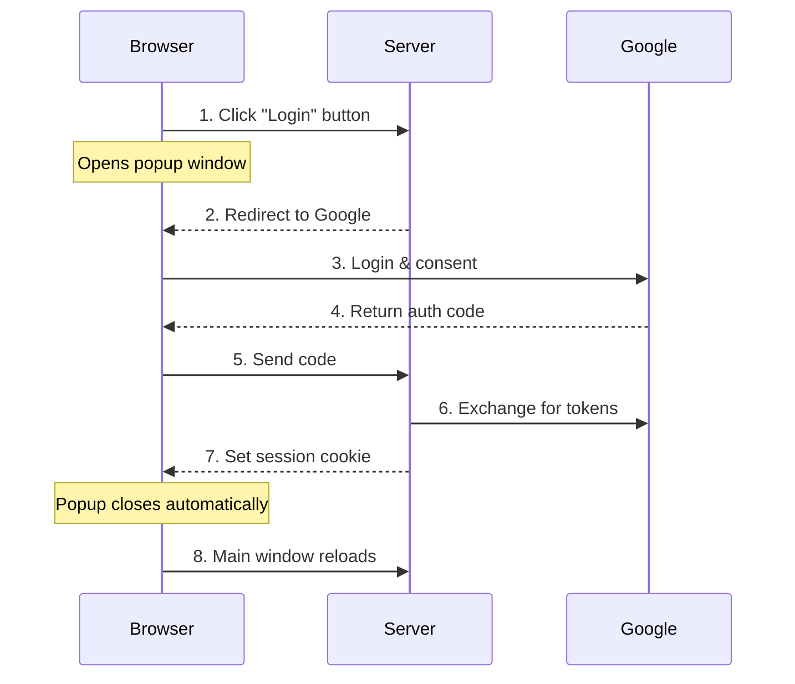
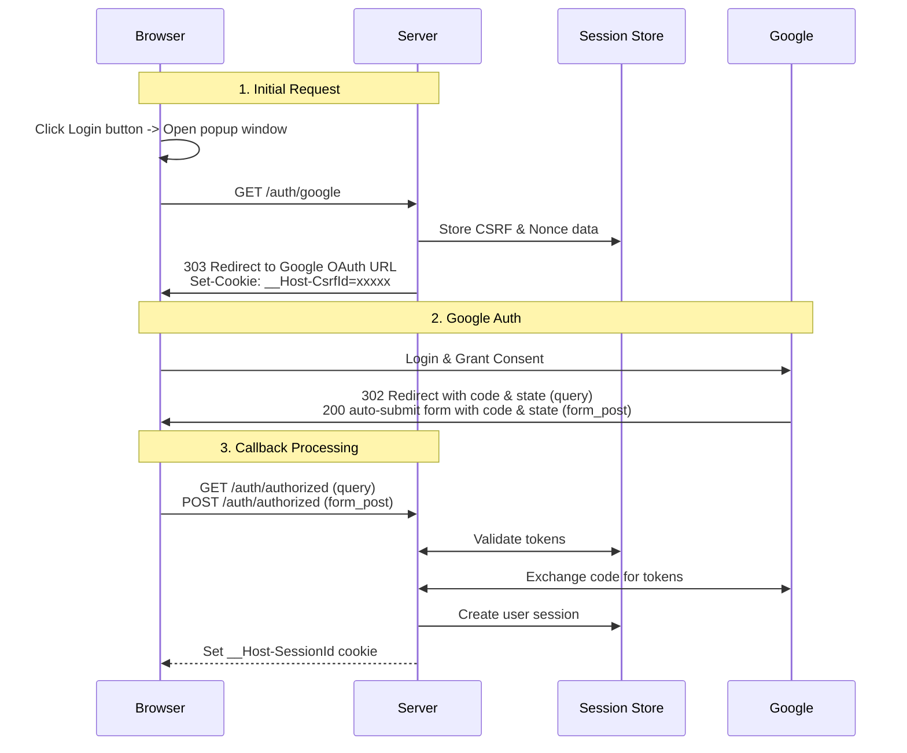
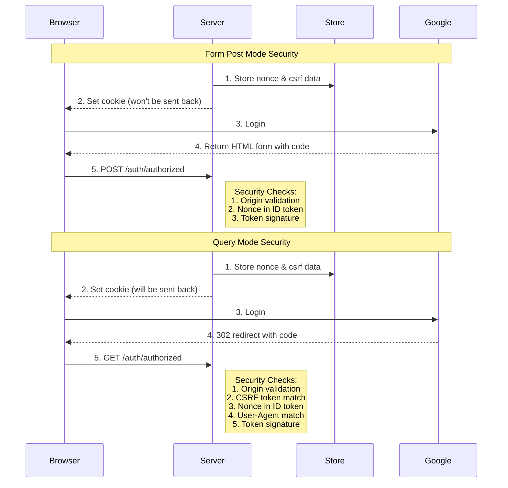
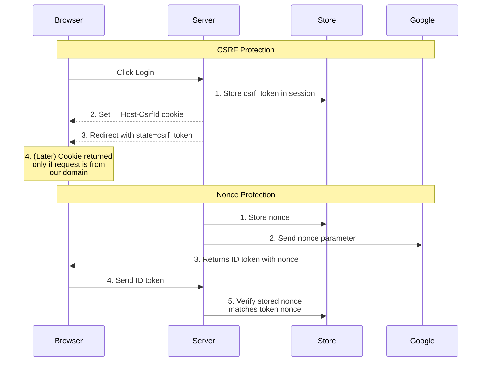
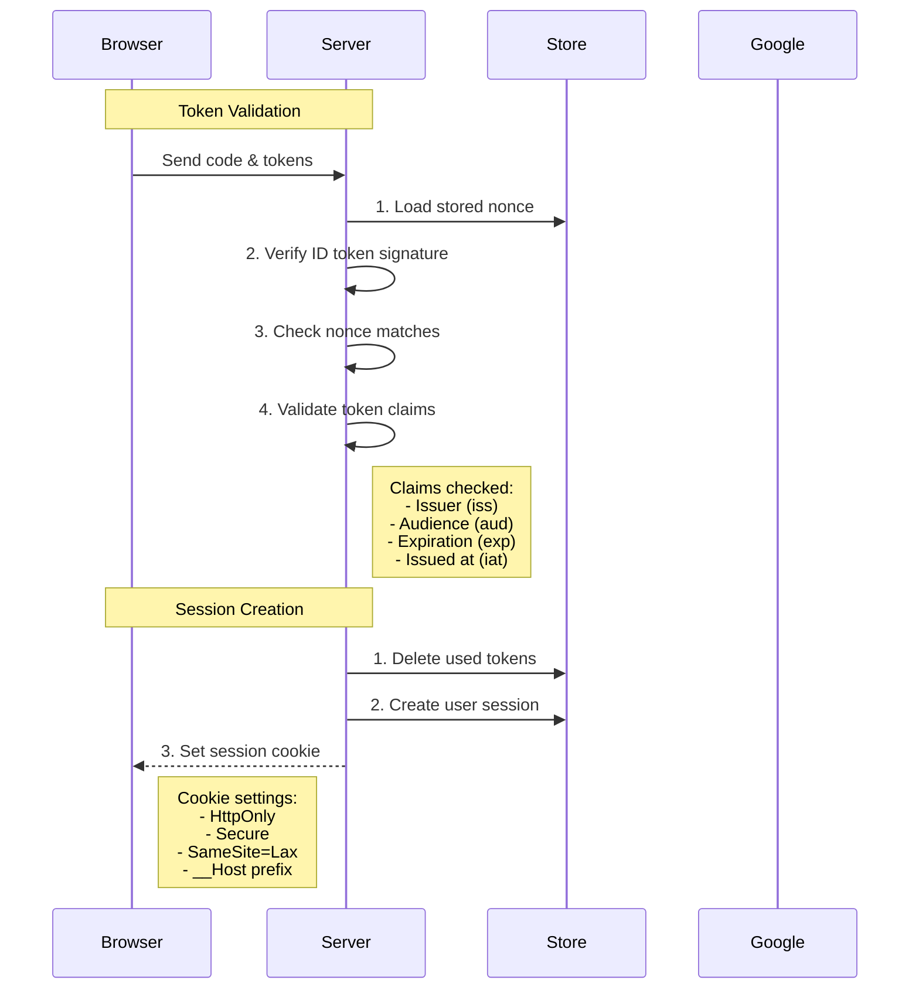

# Implementing Google OAuth2 with Rust and Axum

- [Implementing Google OAuth2 with Rust and Axum](#implementing-google-oauth2-with-rust-and-axum)
  - [Introduction](#introduction)
  - [Overview of OAuth2 Authentication](#overview-of-oauth2-authentication)
    - [Basic Authentication Flow](#basic-authentication-flow)
    - [Identify Authenticated Access](#identify-authenticated-access)
    - [OAuth2 Basic](#oauth2-basic)
  - [Detail of OAuth2 Authentication Implementations](#detail-of-oauth2-authentication-implementations)
    - [More precise Authentication Flow](#more-precise-authentication-flow)
    - [Route Handlers](#route-handlers)
    - [Main Page and Authentication UI](#main-page-and-authentication-ui)
    - [Starting Authentication](#starting-authentication)
    - [Handling OAuth2 Callback](#handling-oauth2-callback)
      - [Response Modes](#response-modes)
      - [Common Processing](#common-processing)
    - [Completing Authentication](#completing-authentication)
    - [Session Management](#session-management)
      - [Logout Process](#logout-process)
      - [Protected Resource Access](#protected-resource-access)
    - [How Login Works](#how-login-works)
  - [Security Considerations](#security-considerations)
    - [1. CSRF Protection](#1-csrf-protection)
    - [2. Nonce Validation](#2-nonce-validation)
    - [3. Cookie Security](#3-cookie-security)
    - [Form Post vs Query Mode](#form-post-vs-query-mode)
  - [Why Use a Popup Window?](#why-use-a-popup-window)
  - [Conclusion](#conclusion)

## Introduction

OAuth2 authentication is a crucial component of modern web applications.
Recently, I have been learning this technology and have implemented a login system for an Axum web application using Google OAuth2 as a study project.
In this post, I will explain my implementation in detail and discuss some technical considerations I made.
I use simplified code snippets for ease of explanation.
The complete code for this implementation is available at https://github.com/ktaka-ccmp/axum-google-oauth2.
Feel free to reference it as I explain the implementation details.

## Overview of OAuth2 Authentication


### Basic Authentication Flow

Let's roughly understand how our authentication flow works:



When a user clicks the login button:

1. A popup window opens, redirecting to Google's authentication page
2. After successful authentication, Google returns an authorization code
3. Our server exchanges this code for access and ID tokens
4. We create a session and set a cookie to identify the authenticated user
5. The popup closes automatically and the main window refreshes

Now that we understand the basic flow, let's see how the application keeps track of authenticated users.

### Identify Authenticated Access

The session cookie is essential for identifying authenticated users. When an HTTP request includes a cookie that can retrieve session information stored on the backend server, the request can be considered as originating from an authenticated user. The server may then provide information related to the user.

- Cookies are shared across the tabs of a browser, so the session cookie is valid for all tabs after the popup window closed
- For security, session cookies should be configured with attributes such as HttpOnly, Secure, and SameSite to mitigate common vulnerabilities like cross-site scripting (XSS) and cross-site request forgery (CSRF).

Identify Authenticated Access
To determine whether a user is authenticated, the server relies on a session cookie. This cookie, set during the login process, allows the server to retrieve session information stored in the backend. If valid session data is found, the request is recognized as coming from an authenticated user, and the server can respond with user-specific information or resources.

Key considerations for session cookies in authentication:

Shared Across Tabs: Once set, the session cookie applies across all browser tabs, maintaining authentication even after the login popup window closes.
Security Best Practices: Session cookies should be configured with:
HttpOnly: Prevents client-side scripts from accessing the cookie.
Secure: Ensures the cookie is transmitted only over HTTPS.
SameSite: Restricts the cookie to same-site requests, reducing the risk of CSRF attacks.
By securely managing session cookies, the application ensures consistent and safe identification of authenticated users.

### OAuth2 Basic

OAuth2 major parameters

- response_type: code, token, id_token
- response_mode: query, fragment, form_post
- scope: openid, email, profile, etc...
- client_id
- client_secret
- redirect_uri
- nonce
- state

The `response_type` determines what is returned from the authorization endpoint. The `response_mode` determines how these values are returned. To improve security, only the `code` value is recommended for the `response_type`. For the `response_mode`, both `form_post` and `query` are recommended, with `form_post` being more secure.

The `code` is used to obtain an `access token`, `refresh token`, and `id token` from the token endpoint.

The `scope` determines what is authorized for the access token. When `email` and `profile` are specified, user info with email address can be obtained. By specifying `openid`, an `id_token` is returned along with the access token from the token endpoint.

- query: redirect to https://redirect_uri?code=xxxx
- form_post: POST https://redirect_uri, code=xxxx as body

- fragment: redirect to https://redirect_uri#id_token=xxxx

We use the following parameters, since they are considered most secure.

Most secure:
response_mode=form_post
response_type=code
scope=openid+email+profile

2nd most secure:
response_mode=query
response_type=code
scope=openid+email+profile


## Detail of OAuth2 Authentication Implementations

### More precise Authentication Flow

Let's break down each step of the authentication process in detail:



1. By clicking the

### Route Handlers

Our application's routes are organized as follows:

```rust
let app = Router::new()
    .route("/", get(index))
    .route("/auth/google", get(google_auth))
    .route("/auth/authorized", get(get_authorized).post(post_authorized))
    .route("/popup_close", get(popup_close))
    .route("/logout", get(logout))
    .route("/protected", get(protected));
```

Our application has the following endpoints:

1. "/": Index page
   - Shows login button for anonymous users
   - Shows logout button and welcome message for authenticated users
   - When login button is clicked, opens popup window to "/auth/google"

2. "/auth/google"
   - Starting point of Google authentication
   - Generates security tokens
   - Redirects to Google's sign-in page

3. "/auth/authorized"
   - Callback endpoint where Google sends authentication result
   - Receives and validates authentication code
   - Creates user session if authentication successful
   - Sets session cookie in browser

4. "/popup_close"
   - Simple page that automatically closes after successful login
   - Triggers main page reload through JavaScript

5. "/logout"
   - Removes user session
   - Clears session cookie
   - Redirects back to index page

6. "/protected"
   - Example of authenticated-only page
   - Shows user information if authenticated
   - Redirects to index if not authenticated

### Main Page and Authentication UI

The main page serves different content based on the user's authentication status, and handles the login flow through a popup window.

```rust
async fn index(user: Option<User>) -> impl IntoResponse {
    match user {
        // For authenticated users
        Some(u) => {
            let message = format!("Hey {}! You're logged in!", u.name);
            let template = IndexTemplateUser { message: &message };
            (StatusCode::OK, Html(template.render().unwrap())).into_response()
        }
        // For anonymous users
        None => {
            let message = "You're not logged in.\nClick the Login button below.".to_string();
            let template = IndexTemplateAnon { message: &message };
            (StatusCode::OK, Html(template.render().unwrap())).into_response()
        }
    }
}
```

Template for anonymous users

- When the Login button is clicked, it will open a popup window with /auth/google endpoint.
- When the popup is closed, it will reload the parent window.

```html
<html lang="en">

<body>
    <div>
        <h1>Welcome to the Index Page</h1>
        <p>{{message}}</p>
    </div>
    <div>
        <button onclick="openPopup()">Login</button>
        <script>
            // Open popup window for OAuth authentication
            function openPopup() {
                popupWindow = window.open(
                    `/auth/google`,
                    "PopupWindow",
                    "width=700,height=800,left=1000,top=-1000,resizable=yes,scrollbars=yes"
                );

                // If the popup is closed, reload the parent window.
                const checkInterval = setInterval(() => {
                    if (popupWindow.closed) {
                        clearInterval(checkInterval);
                        window.location.reload();
                    }
                }, 100);  // Check every 100ms
            }
        </script>
    </div>
</body>
</html>
```

Template for authenticated users

- When the Logout button is clicked, it will access /logout endpoint

```html
<html lang="en">
<body>
    <div>
        <h1>Welcome to the Index Page</h1>
        <p>{{message}}</p>
        <p>You may now access <a href="/protected">/protected</a>.</p>
    </div>

    <div>
        <button onclick="Logout()">Logout</button>
        <script>
            function Logout() {
                window.location.href = "/logout";
            }
        </script>
    </div>
</body>
</html>
```

### Starting Authentication

This is where the OAuth2 flow begins. We generate necessary security tokens and redirect the user to Google's authentication page.

- For improved security
  - Generate and store nonce and csrf
  - Set csrf_id in cookie
  - Encode and embed nonce_id and csrf_token in the state parameter
  - Set nonce in the nonce parameter
- Populate authentication URL and headers, then redirect to the URL

```rust
async fn google_auth(
    State(params): State<OAuth2Params>,
    State(store): State<MemoryStore>,
    headers: HeaderMap,
) -> Result<impl IntoResponse, AppError> {
    let expires_at = Utc::now() + Duration::seconds(CSRF_COOKIE_MAX_AGE);
    let user_agent = headers.get(axum::http::header::USER_AGENT)...

    let (csrf_token, csrf_id) =
        generate_store_token("csrf_data", expires_at, Some(user_agent) ....
    let (nonce_token, nonce_id) =
        generate_store_token("nonce_data", expires_at, None ....
        
    let encoded_state = encode_state(csrf_token, nonce_id);

    let auth_url = format!(
        "{}?{}&client_id={}&redirect_uri={}&state={}&nonce={}",
        OAUTH2_AUTH_URL,
        OAUTH2_QUERY_STRING,
        params.client_id,
        params.redirect_uri,
        encoded_state,
        nonce_token
    );

    let mut headers = HeaderMap::new();
    header_set_cookie(
        &mut headers,
        CSRF_COOKIE_NAME.to_string(),
        csrf_id,
        expires_at,
        CSRF_COOKIE_MAX_AGE,
    )?;

    Ok((headers, Redirect::to(&auth_url)))
}
```

The following is an example URL of Google's authentication endpoint:

> <https://accounts.google.com/o/oauth2/v2/auth\>
> ?response_type=code&scope=openid+email+profile\\
> &response_mode=form_post&access_type=online&prompt=consent\\
> &client_id=xxxxxxx\\
> &redirect_uri=https://my_host_name/auth/authorized\\
> &state=yyyyyyy&nonce=zzzzzzzz

The query parameters in the URL determine behavior of the OAuth2 flow.

### Handling OAuth2 Callback

This is where we process Google's authentication response. The response can come in two different modes:

#### Response Modes

1. Form Post Mode (Default):

```rust
// Receive auth code via POST body
async fn post_authorized(
    State(state): State<AppState>,
    Form(form): Form<AuthResponse>,
) -> Result<impl IntoResponse, AppError> {
    // Basic validation
    validate_origin(&headers, &state.oauth2_params.auth_url).await?;
    authorized(&form, state).await
}
```

- Code sent in POST body
- More secure as parameters aren't in URL
- Cookie not sent due to SameSite=Lax
- Relies on nonce validation for security

2. Query Mode:

```rust
// Receive auth code via URL parameters
async fn get_authorized(
    Query(query): Query<AuthResponse>,
    State(state): State<AppState>,
    TypedHeader(cookies): TypedHeader<headers::Cookie>,
) -> Result<impl IntoResponse, AppError> {
    // Full CSRF validation
    csrf_checks(cookies.clone(), &state.store, &query, headers).await?;
    authorized(&query, state).await
}
```

- Code sent in URL parameters
- Cookie sent with GET request
- Enables CSRF token validation
- Less secure due to URL exposure

#### Common Processing

Both modes share the same core authentication flow:

```rust
async fn authorized(auth_response: &AuthResponse, state: AppState) -> Result<impl IntoResponse, AppError> {
    // 1. Exchange code for tokens
    let (access_token, id_token) = exchange_code_for_token(...).await?;

    // 2. Verify tokens and get user info
    let user_data = fetch_user_data_from_google(access_token).await?;
    verify_nonce(auth_response, idinfo, &state.store).await?;

    // 3. Create user session
    let session_id = create_and_store_session(user_data, ...).await?;

    // 4. Set session cookie and redirect
    Ok((set_cookie_header(session_id), Redirect::to("/popup_close")))
}
```

The following diagram illustrates the security differences between form post and query modes:



- Process the authorization code returned from Google
- Receive the code as a query parameter(query mode) or URL-encoded body parameter(form post mode).
- Exchange the code for an access token and an ID token from the Google token endpoint
- Retrieve user information from Google
- Create user session & set set-cookie header with session_id
- Redirect to /auth/popup_close, to close the popup window

### Completing Authentication

After successful authentication, we need to close the popup window and refresh the main page.

- This endpoint lets the popup close after 0.5 seconds

```rust
async fn popup_close() -> impl IntoResponse {
    let html = r#"
<html lang="en">
<head>
    <script>
        window.onload = function() {
            setTimeout(function() {
                window.close();
            }, 500); // 500 milliseconds = 0.5 seconds
        }
    </script>
</head>
<body>
    <h2>Login Successful</h2>
</body>
</html>
"#
    .to_string();

    Response::builder()
        .header("Content-Type", "text/html")
        .body(html)
        .unwrap()
}
```

### Session Management

These endpoints handle user session creation and cleanup.

#### Logout Process

- This endpoint is accessed when the logout button is clicked.
- Remove session_id cookie
- Delete a session associated with the session_id

```rust
async fn logout(
    State(store): State<MemoryStore>,
    TypedHeader(cookies): TypedHeader<headers::Cookie>,
) -> Result<impl IntoResponse, AppError> {

    let mut headers = HeaderMap::new();
    header_set_cookie(
        &mut headers,
        SESSION_COOKIE_NAME.to_string(),
        "value".to_string(),
        Utc::now() - Duration::seconds(86400),
        -86400,
    )?;

    delete_session_from_store(cookies, SESSION_COOKIE_NAME.to_string(), &store).await?;

    Ok((headers, Redirect::to("/")))
}
```

#### Protected Resource Access

As explained in ["How Login Works"](#how-login-works), protected routes require valid session cookies.

Having covered the implementation details, let's examine important security considerations...

### How Login Works

The session cookie is essential for identifying authenticated users.
When a function associated with a route includes "user: User" in its arguments, the user object is retrieved from the session store using the session cookie provided in the request header.
The following implementation demonstrates this behavior for the "/protected" endpoint:

```rust
// Example of a protected route.
// The "user: User" argument is populated by the from_request_parts() function.
async fn protected(user: User) -> impl IntoResponse {
    format!("Welcome, {}!", user.name)
}

// User struct representing authenticated user data
#[derive(Debug, Serialize, Deserialize)]
struct User {
    email: String,
    name: String,
    // ... other fields
}

struct AuthRedirect;

impl IntoResponse for AuthRedirect {
    fn into_response(self) -> Response {
        Redirect::temporary("/").into_response()
    }
}

// Retrieve user from session store using session cookie
#[async_trait]
impl<S> FromRequestParts<S> for User
where
    MemoryStore: FromRef<S>,
    S: Send + Sync,
{
    // If anything goes wrong or no session is found, redirect to the auth page
    type Rejection = AuthRedirect;

    async fn from_request_parts(parts: &mut Parts, state: &S) -> Result<Self, Self::Rejection> {
        let store = MemoryStore::from_ref(state);
        let cookies = parts
            .extract::<TypedHeader<headers::Cookie>>()
            .await
            .map_err(|_| AuthRedirect)?;

        // Get session from cookie
        let session_cookie = cookies.get(SESSION_COOKIE_NAME).ok_or(AuthRedirect)?;
        let session = store
            .load_session(session_cookie.to_string())
            .await
            .map_err(|_| AuthRedirect)?;

        // Get user data from session
        let session = session.ok_or(AuthRedirect)?;
        let user = session.get::<User>("user").ok_or(AuthRedirect)?;
        Ok(user)
    }
}
```

Any route can be protected by including "user: User" in the arguments of its associated function.
When a user accesses such a route, the from_request_parts() function is called to retrieve the User object.
This function performs the following steps:

1. Retrieves the session_cookie.
1. Loads session data from the session store using the session_cookie.
1. Extracts the user data from the session.
1. If any step fails, the user is redirected to the login page.

With this understanding of session-based authentication, we can dive deeper into how each step of the authentication process works.


## Security Considerations

I'll elaborate on the security considerations with clearer explanations and diagrams.





Our implementation includes several important security measures. Let's understand each one:

### 1. CSRF Protection

Cross-Site Request Forgery (CSRF) protection prevents attackers from tricking users into making unwanted requests. Our protection works in two ways:

a) During Initial Request:

- Generate random csrf_token
- Store it in server session
- Set cookie with session ID
- Include csrf_token in state parameter

b) During Callback:

- Compare state parameter's csrf_token with stored token
- Validate that cookie comes from our domain
- Check user agent matches

Example of how CSRF protects:

1. Attacker tries to forge request → No access to our cookie
2. Attacker tries to modify state → Won't match stored token
3. Request from different site → Cookie won't be sent

### 2. Nonce Validation

Nonce (Number used ONCE) prevents replay attacks. Here's how:

a) How it works:

- Server generates random nonce
- Sends it to Google during authentication
- Google includes nonce in ID token
- Server verifies nonce matches

b) Why it's important:

- Ensures response is for current authentication attempt
- Prevents reuse of old tokens
- Adds cryptographic verification through Google's signature

### 3. Cookie Security

We use several cookie security features:

a) __Host- Prefix:

- Forces HTTPS usage
- Makes cookie host-only
- Requires Path=/
- Cannot be set from subdomains

b) Cookie Flags:

```rust
"{name}={value}; SameSite=Lax; Secure; HttpOnly; Path=/; Max-Age={max_age}"
```

- SameSite=Lax: Protects against CSRF
- Secure: Requires HTTPS
- HttpOnly: Prevents JavaScript access
- Path=/: Scopes to whole domain
- Max-Age: Ensures expiration

### Form Post vs Query Mode

Two ways to receive authentication response:

1. Form Post Mode (Recommended):

- Advantages:
  - Code in POST body
  - Not visible in URLs
  - No browser history exposure
  - No Referer header leaks
- Trade-offs:
  - More complex implementation
  - Needs extra security measures

2. Query Mode:

- Advantages:
  - Simpler implementation
  - Easier debugging
- Disadvantages:
  - Code exposed in URL
  - Visible in logs
  - Potential security risks

## Why Use a Popup Window?

The popup window approach offers several advantages:

1. Better User Experience:

- Main page stays loaded
- No full page redirects
- Smooth transition after login

2. Technical Benefits:

- Simpler state management
- Works with both response modes
- Clean separation of auth flow
- Automatic cleanup on main window close

## Conclusion

This implementation provides:

- Secure Google OAuth2 authentication
- Smooth user experience
- Comprehensive security measures
- Session-based authentication

Remember to:

- Use HTTPS in production
- Configure Google OAuth credentials properly
- Consider rate limiting
- Use a production-grade session store

The complete implementation is available at [https://github.com/ktaka-ccmp/axum-google-oauth2](https://github.com/ktaka-ccmp/axum-google-oauth2).

For local development and testing, follow the setup instructions in the repository's README.
