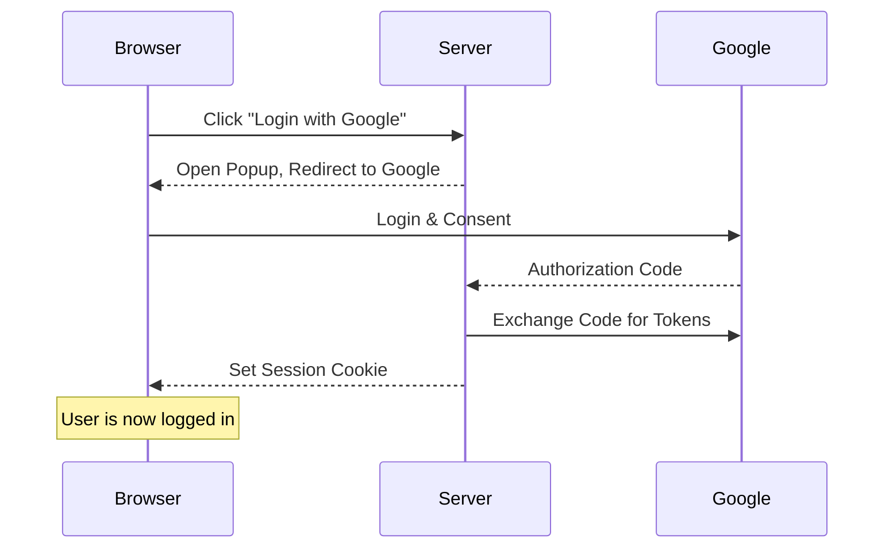
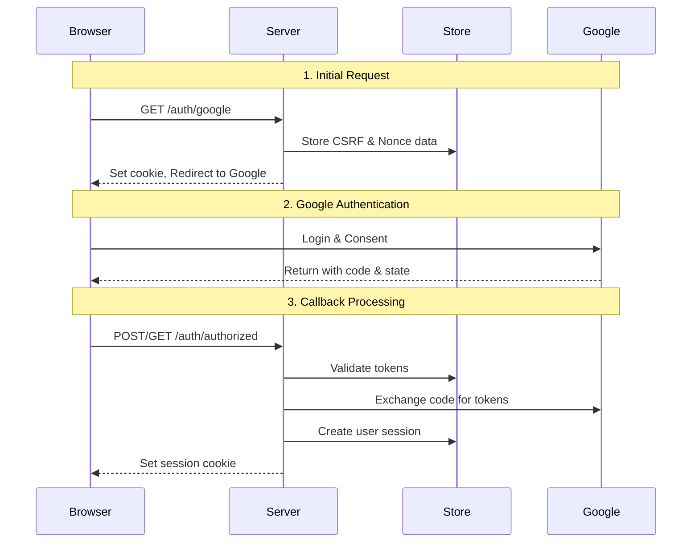

# Implementing Google OAuth2 with Rust and Axum: A Practical Guide

- [Implementing Google OAuth2 with Rust and Axum: A Practical Guide](#implementing-google-oauth2-with-rust-and-axum-a-practical-guide)
  - [Introduction](#introduction)
  - [Basic Flow](#basic-flow)
  - [How Login Works](#how-login-works)
  - [Detailed Authentication Flow](#detailed-authentication-flow)
    - [Key Components in Code](#key-components-in-code)
  - [Security Considerations](#security-considerations)
    - [Form Post vs Query Mode](#form-post-vs-query-mode)
    - [Why Popup Window?](#why-popup-window)
  - [Conclusion](#conclusion)

## Introduction

This post explains how to implement Google OAuth2 authentication in a Rust web application using the Axum framework. We'll build a secure authentication system that:

- Uses popup windows for a smooth user experience
- Implements proper security measures
- Handles sessions effectively

## Basic Flow

Let's start with a high-level overview of the authentication flow:



When a user clicks the login button:

1. Our server initiates Google OAuth2 flow
2. User authenticates with Google in a popup window
3. Google redirects back with an authorization code
4. Our server exchanges this code for tokens
5. We create a user session and set a cookie

## How Login Works

The core of our authentication system uses session cookies. Here's a simplified view:

```rust
// User struct representing authenticated user data
#[derive(Debug, Serialize, Deserialize)]
struct User {
    email: String,
    name: String,
    // ... other fields
}

// Protected route example
async fn protected(user: User) -> impl IntoResponse {
    format!("Welcome, {}!", user.name)
}

// Middleware that checks for valid session
#[async_trait]
impl<S> FromRequestParts<S> for User
where
    MemoryStore: FromRef<S>,
    S: Send + Sync,
{
    type Rejection = AuthRedirect;

    async fn from_request_parts(parts: &mut Parts, state: &S) -> Result<Self, Self::Rejection> {
        let store = MemoryStore::from_ref(state);
        let cookies = parts.extract::<TypedHeader<headers::Cookie>>().await?;
        
        // Get session from cookie
        let session_cookie = cookies.get(COOKIE_NAME).ok_or(AuthRedirect)?;
        let session = store.load_session(session_cookie.to_string()).await?;
        
        // Get user data from session
        let user = session.get::<User>("user").ok_or(AuthRedirect)?;
        Ok(user)
    }
}
```

Each authenticated request must include a valid session cookie. Our middleware automatically:
- Extracts the session cookie
- Validates the session
- Loads user data
- Rejects unauthenticated requests

## Detailed Authentication Flow

Let's break down each step of the authentication process:



### Key Components in Code

1. Route Setup:
```rust
let app = Router::new()
    .route("/", get(index))
    .route("/auth/google", get(google_auth))
    .route("/auth/authorized", get(get_authorized).post(post_authorized))
    .route("/protected", get(protected))
```

2. Popup Window Implementation:
```html
<!-- Template for login button -->
<button onclick="openLoginPopup()">Login with Google</button>

<script>
function openLoginPopup() {
    window.open('/auth/google', 'Login', 
        'width=500,height=600');
}
</script>

<!-- Popup close page -->
<!DOCTYPE html>
<html>
<script>
    window.onload = function() {
        setTimeout(function() {
            window.close();
        }, 500);
    }
</script>
<body>
    <h2>Login Successful</h2>
    <h2>This window will close automatically...</h2>
</body>
</html>
```

3. Callback Handler:
```rust
async fn authorized(
    auth_response: &AuthResponse,
    state: AppState,
) -> Result<impl IntoResponse, AppError> {
    // Exchange code for tokens
    let (access_token, id_token) = 
        exchange_code_for_token(state.oauth2_params, auth_response.code.clone()).await?;

    // Verify ID token and get user data
    let user_data = fetch_user_data_from_google(access_token).await?;
    let idinfo = verify_idtoken(id_token, state.oauth2_params.client_id).await?;

    // Validate nonce
    verify_nonce(auth_response, idinfo, &state.store).await?;

    // Create session
    let session_id = create_and_store_session(user_data, &state.store).await?;
    
    // Set session cookie and redirect
    let mut headers = HeaderMap::new();
    header_set_cookie(&mut headers, COOKIE_NAME, session_id, ...)?;
    Ok((headers, Redirect::to("/popup_close")))
}
```

## Security Considerations

Our implementation includes several security measures:

1. CSRF Protection:
```rust
struct CsrfData {
    csrf_token: String,
    expires_at: DateTime<Utc>,
    user_agent: String,
}

async fn csrf_checks(
    cookies: headers::Cookie,
    store: &MemoryStore,
    query: &AuthResponse,
    headers: HeaderMap,
) -> Result<(), AppError> {
    let csrf_id = cookies.get(CSRF_COOKIE_NAME)?;
    let session = store.load_session(csrf_id.to_string()).await?;
    let csrf_data: CsrfData = session.get("csrf_data")?;

    // Compare tokens and validate
    if state_in_response.csrf_token != csrf_data.csrf_token {
        return Err(anyhow::anyhow!("CSRF token mismatch").into());
    }
    // ... more validations
}
```

2. Nonce Validation:
```rust
struct NonceData {
    nonce: String,
    expires_at: DateTime<Utc>,
}

async fn verify_nonce(
    auth_response: &AuthResponse,
    idinfo: IdInfo,
    store: &MemoryStore,
) -> Result<(), AppError> {
    let session = store.load_session(state_in_response.nonce_id).await?;
    let nonce_data: NonceData = session.get("nonce_data")?;

    if idinfo.nonce != Some(nonce_data.nonce) {
        return Err(anyhow::anyhow!("Nonce mismatch").into());
    }

    // Delete nonce after use
    store.destroy_session(session).await?;
    Ok(())
}
```

3. Cookie Security:
- Using `__Host-` prefix for cookies
- Setting SameSite=Lax
- Always using Secure and HttpOnly flags

### Form Post vs Query Mode

OAuth2 callback can use either:

1. Form Post Mode:
- Pros:
  - Parameters in POST body
  - Not exposed in URLs
  - No Referer header leakage
- Cons:
  - No CSRF cookie in cross-origin POST

2. Query Mode:
- Pros:
  - Full CSRF protection
  - Simpler implementation
- Cons:
  - Parameters exposed in URLs
  - Potential logging exposure

We recommend Form Post mode because protecting sensitive tokens outweighs the benefits of additional CSRF protection.

### Why Popup Window?

We use a popup window because it:
1. Provides better UX - main page stays loaded
2. Avoids state management complexity
3. Works well with both form-post and query modes
4. Cleanly separates auth flow from main application

## Conclusion

This implementation provides:
- Secure Google OAuth2 authentication
- Clean user experience with popup windows
- Proper security measures
- Session-based authentication

Key security features:
- CSRF protection
- Nonce validation
- Secure cookie handling
- Token verification

The complete code is available [link to your repository].

Remember to:
- Use HTTPS in production
- Properly configure Google OAuth credentials
- Consider rate limiting
- Use a production-grade session store

---

Would you like me to:
1. Add more detail to any section?
2. Include more code examples?
3. Create additional diagrams?
4. Focus on specific security aspects?
