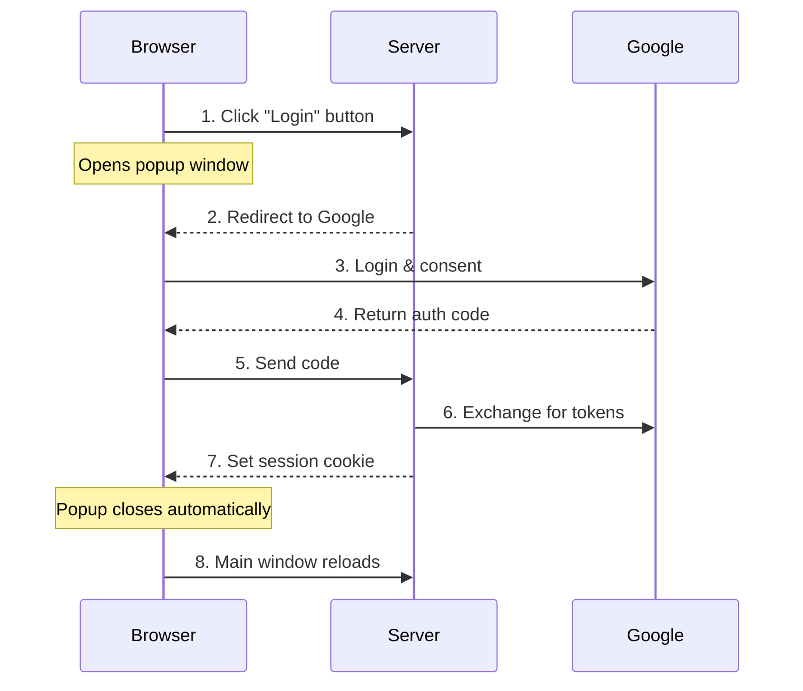
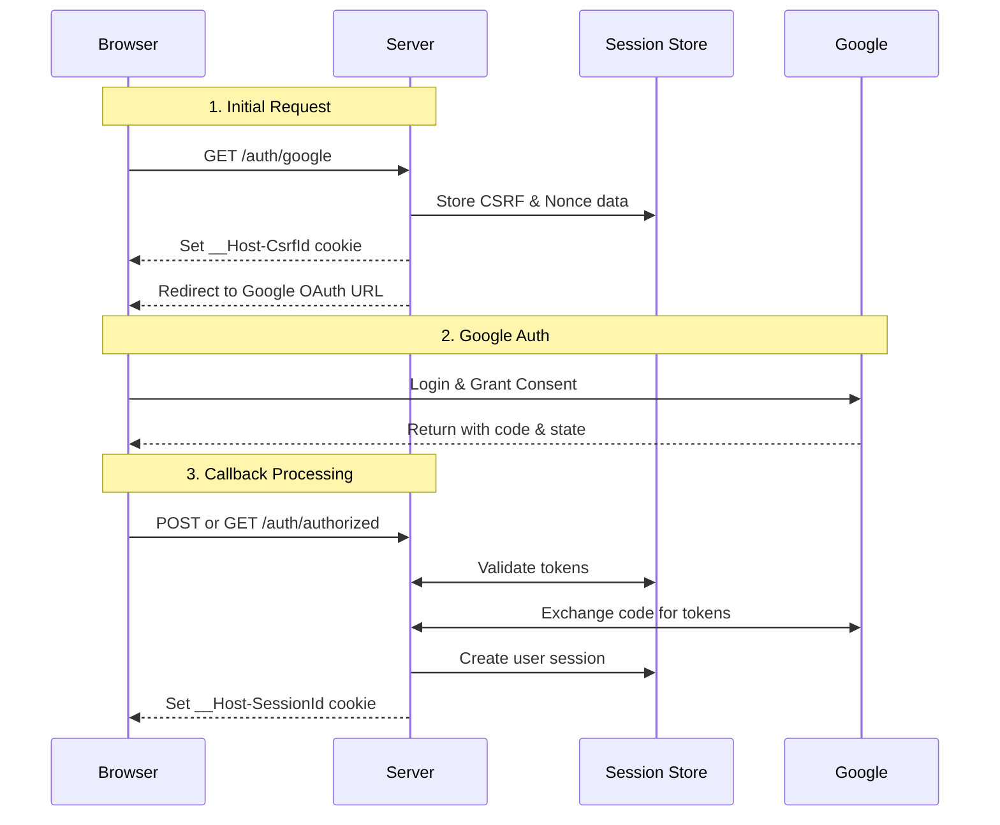

# Implementing Google OAuth2 with Rust and Axum

- [Implementing Google OAuth2 with Rust and Axum](#implementing-google-oauth2-with-rust-and-axum)
  - [Introduction](#introduction)
  - [Basic Flow](#basic-flow)
  - [How Login Works](#how-login-works)
  - [Detailed Authentication Flow](#detailed-authentication-flow)
    - [Route Handlers](#route-handlers)
    - [/ endpoint](#-endpoint)
    - [/auth/google](#authgoogle)
    - [/auth/authorized](#authauthorized)
    - [/auth/popup\_close](#authpopup_close)
    - [/logout](#logout)
    - [/protected](#protected)
  - [Security Considerations](#security-considerations)
    - [1. CSRF Protection](#1-csrf-protection)
    - [2. Nonce Validation](#2-nonce-validation)
    - [3. Secure Cookies](#3-secure-cookies)
    - [Form Post vs Query Mode](#form-post-vs-query-mode)
    - [Why Use a Popup Window?](#why-use-a-popup-window)
  - [Conclusion](#conclusion)

## Introduction

OAuth2 authentication is a crucial component of modern web applications. Recently, I have been learning this technology and implemented a login system for the Axum web application using Google OAuth2 for a study.
In this post, I will explain my implementation in detail and discuss some technical considerations. I use simplified code snippets for ease of explanation.
The complete code for this implementation is available at [https://github.com/ktaka-ccmp/axum-google-oauth2](https://github.com/ktaka-ccmp/axum-google-oauth2). Feel free to reference it as I go through the implementation details.

## Basic Flow

Let's understand how our authentication flow works:



When a user clicks the login button:

1. A popup window opens, redirecting to Google's authentication page
2. After successful authentication, Google returns an authorization code
3. Our server exchanges this code for access and ID tokens
4. We create a session and set a cookie
5. The popup closes automatically and the main window refreshes

## How Login Works

The existence of the session cookie is the key to distinguishing authenticated users. When the function associated with a route needs a "user," it is retrieved from the session store using the session cookie in the request header. I will explain this behavior using an implementation for the "/protected" endpoint.

Here's the implementation:

```rust
// Protected route example.
// Calls the from_request_parts(), since we need the user
async fn protected(user: User) -> impl IntoResponse {
    format!("Welcome, {}!", user.name)
}

// User struct representing authenticated user data
#[derive(Debug, Serialize, Deserialize)]
struct User {
    email: String,
    name: String,
    // ... other fields
}

struct AuthRedirect;

impl IntoResponse for AuthRedirect {
    fn into_response(self) -> Response {
        Redirect::temporary("/").into_response()
    }
}

// Retrieve user from session store using session cookie
#[async_trait]
impl<S> FromRequestParts<S> for User
where
    MemoryStore: FromRef<S>,
    S: Send + Sync,
{
    // If anything goes wrong or no session is found, redirect to the auth page
    type Rejection = AuthRedirect;

    async fn from_request_parts(parts: &mut Parts, state: &S) -> Result<Self, Self::Rejection> {
        let store = MemoryStore::from_ref(state);
        let cookies = parts
            .extract::<TypedHeader<headers::Cookie>>()
            .await
            .map_err(|_| AuthRedirect)?;

        // Get session from cookie
        let session_cookie = cookies.get(SESSION_COOKIE_NAME).ok_or(AuthRedirect)?;
        let session = store
            .load_session(session_cookie.to_string())
            .await
            .map_err(|_| AuthRedirect)?;

        // Get user data from session
        let session = session.ok_or(AuthRedirect)?;
        let user = session.get::<User>("user").ok_or(AuthRedirect)?;
        Ok(user)
    }
}
```

When a user accesses any protected route, a function from_request_parts() is called to retrieve the User, which does the following:

1. get session_cookie
2. load session data from the session store using session_cookie
3. retrieve user data from the session
4. if anything goes wrong, it will redirect to the login page

## Detailed Authentication Flow

Let's break down each step of the authentication process in detail:



### Route Handlers

Our application's routes are organized as follows:

```rust
let app = Router::new()
    .route("/", get(index))
    .route("/auth/google", get(google_auth))
    .route("/auth/authorized", get(get_authorized).post(post_authorized))
    .route("/popup_close", get(popup_close))
    .route("/logout", get(logout))
    .route("/protected", get(protected));
```

### / endpoint

- returns pages with different templates depending on authentication status

```rust
async fn index(user: Option<User>) -> impl IntoResponse {
    match user {
        // For authenticated users
        Some(u) => {
            let message = format!("Hey {}! You're logged in!", u.name);
            let template = IndexTemplateUser { message: &message };
            (StatusCode::OK, Html(template.render().unwrap())).into_response()
        }
        // For anonymous users
        None => {
            let message = "You're not logged in.\nClick the Login button below.".to_string();
            let template = IndexTemplateAnon { message: &message };
            (StatusCode::OK, Html(template.render().unwrap())).into_response()
        }
    }
}
```

Template for anonymous users

- When the Login button is clicked, it will open a popup window with /auth/google endpoint.
- When the popup is closed, it will reload the parent window.

```html
<html lang="en">

<body>
    <div>
        <h1>Welcome to the Index Page</h1>
        <p>{{message}}</p>
    </div>
    <div>
        <button onclick="openPopup()">Login</button>
        <script>
            // Open popup window for OAuth authentication
            function openPopup() {
                popupWindow = window.open(
                    `/auth/google`,
                    "PopupWindow",
                    "width=700,height=800,left=1000,top=-1000,resizable=yes,scrollbars=yes"
                );

                // If the popup is closed, reload the parent window.
                const checkInterval = setInterval(() => {
                    if (popupWindow.closed) {
                        clearInterval(checkInterval);
                        window.location.reload();
                    }
                }, 100);  // Check every 100ms
            }
        </script>
    </div>
</body>
</html>
```

Template for authenticated users

- When the Logout button is clicked, it will access /logout endpoint

```html
<html lang="en">
<body>
    <div>
        <h1>Welcome to the Index Page</h1>
        <p>{{message}}</p>
        <p>You may now access <a href="/protected">/protected</a>.</p>
    </div>

    <div>
        <button onclick="Logout()">Logout</button>
        <script>
            function Logout() {
                window.location.href = "/logout";
            }
        </script>
    </div>
</body>
</html>
```

### /auth/google

- For improved security
  - Generate and store nonce and csrf
  - Set csrf_id in cookie
  - Encode and embed nonce_id and csrf_token in the state parameter
  - Set nonce in the nonce parameter
- Populate authentication URL and headers, then redirect to the URL

```rust
async fn google_auth(
    State(params): State<OAuth2Params>,
    State(store): State<MemoryStore>,
    headers: HeaderMap,
) -> Result<impl IntoResponse, AppError> {
    let expires_at = Utc::now() + Duration::seconds(CSRF_COOKIE_MAX_AGE);
    let user_agent = headers.get(axum::http::header::USER_AGENT)...

    let (csrf_token, csrf_id) =
        generate_store_token("csrf_data", expires_at, Some(user_agent) ....
    let (nonce_token, nonce_id) =
        generate_store_token("nonce_data", expires_at, None ....
        
    let encoded_state = encode_state(csrf_token, nonce_id);

    let auth_url = format!(
        "{}?{}&client_id={}&redirect_uri={}&state={}&nonce={}",
        OAUTH2_AUTH_URL,
        OAUTH2_QUERY_STRING,
        params.client_id,
        params.redirect_uri,
        encoded_state,
        nonce_token
    );

    let mut headers = HeaderMap::new();
    header_set_cookie(
        &mut headers,
        CSRF_COOKIE_NAME.to_string(),
        csrf_id,
        expires_at,
        CSRF_COOKIE_MAX_AGE,
    )?;

    Ok((headers, Redirect::to(&auth_url)))
}
```

The following is an example URL of Google's authentication endpoint:

> <https://accounts.google.com/o/oauth2/v2/auth\>
> ?response_type=code&scope=openid+email+profile\\
> &response_mode=form_post&access_type=online&prompt=consent\\
> &client_id=xxxxxxx\\
> &redirect_uri=https://my_host_name/auth/authorized\\
> &state=yyyyyyy&nonce=zzzzzzzz

The query parameters in the URL determine behavior of the OAuth2 flow.

### /auth/authorized

- Process the authorization code returned from Google
- Receive the code as a query parameter(query mode) or URL-encoded body parameter(form post mode).
- Exchange the code for an access token and an ID token from the Google token endpoint
- Retrieve user information from Google
- Create user session & set set-cookie header with session_id
- Redirect to /auth/popup_close, to close the popup window

```rust
// For form post mode. Acquire authorization code in form param, then call main authorized function
async fn post_authorized(
    State(state): State<AppState>,
    Form(form): Form<AuthResponse>,
    ...
) -> Result<impl IntoResponse, AppError> {
    ...
    authorized(&form, state).await
}

// For query mode.  Acquire authorization code in query param, then call main authorized function 
async fn get_authorized(
    Query(query): Query<AuthResponse>,
    State(state): State<AppState>,
    ...
) -> Result<impl IntoResponse, AppError> {
    ...
    authorized(&query, state).await
}

// Main authorized function 
async fn authorized(
    auth_response: &AuthResponse,
    state: AppState,
) -> Result<impl IntoResponse, AppError> {

    // Exchange the code for access token and id token
    let (access_token, id_token) =
        exchange_code_for_token(state.oauth2_params.clone(), auth_response.code.clone()).await?;

    // Fetch user data from Google
    let user_data = fetch_user_data_from_google(access_token).await?;

    // Some verification here...

    let max_age = SESSION_COOKIE_MAX_AGE;
    let expires_at = Utc::now() + Duration::seconds(max_age);

    // Store session to session store, then obtain session_id as a key
    let session_id = create_and_store_session(user_data, &state.store, expires_at).await?;

    // Format headers(to include set-cookie)
    let mut headers = HeaderMap::new();
    header_set_cookie(
        &mut headers,
        SESSION_COOKIE_NAME.to_string(),
        session_id,
        max_age,
    )?;

    // Redirect to "/popup_close" with header including set-cookie:...
    Ok((headers, Redirect::to("/popup_close")))
}

fn header_set_cookie(
    headers: &mut HeaderMap,
    name: String,
    value: String,
    max_age: i64,
) -> Result<&HeaderMap, AppError> {
    let cookie =
        format!("{name}={value}; SameSite=Lax; Secure; HttpOnly; Path=/; Max-Age={max_age}");

    headers.append(
        SET_COOKIE,
        cookie.parse().context("failed to parse cookie")?,
    );
    Ok(headers)
}
```

### /auth/popup_close

- This endpoint lets the popup close after 0.5 seconds

```rust
async fn popup_close() -> impl IntoResponse {
    let html = r#"
<html lang="en">
<head>
    <script>
        window.onload = function() {
            setTimeout(function() {
                window.close();
            }, 500); // 500 milliseconds = 0.5 seconds
        }
    </script>
</head>
<body>
    <h2>Login Successful</h2>
</body>
</html>
"#
    .to_string();

    Response::builder()
        .header("Content-Type", "text/html")
        .body(html)
        .unwrap()
}
```

### /logout

- This endpoint is accessed when the logout button is clicked.
- Remove session_id cookie
- Delete a session associated with the session_id

```rust
async fn logout(
    State(store): State<MemoryStore>,
    TypedHeader(cookies): TypedHeader<headers::Cookie>,
) -> Result<impl IntoResponse, AppError> {

    let mut headers = HeaderMap::new();
    header_set_cookie(
        &mut headers,
        SESSION_COOKIE_NAME.to_string(),
        "value".to_string(),
        Utc::now() - Duration::seconds(86400),
        -86400,
    )?;

    delete_session_from_store(cookies, SESSION_COOKIE_NAME.to_string(), &store).await?;

    Ok((headers, Redirect::to("/")))
}
```

### /protected

An example page for protected pages, which is already explained in ["How Login Works"](#how-login-works).


- "/": Index page. When the login button in this page is clicked, it will open popup with URL, "/auth/google".
- "/auth/google":  This route is accessed when the login button is clicked. Server and then redirect to the Google OAuth endpoint.
- "/auth/authorized": Callback endpoint to receive authentication code from Google.
-

(To Claude: Fix this please.)

When a user opens https://my_host_name/, they find login button in the page.
When the login button is clicked in the index page, the popup with url=https://my_host_name/auth/google will open.

The popup window implementation provides a smooth user experience:

```html
<button onclick="openPopup()">Login</button>

<script>
    let popupWindow;
    let isReloading = false;

    function openPopup() {
        popupWindow = window.open(
            `/auth/google`,
            "PopupWindow",
            "width=700,height=800,left=1000,top=-1000,resizable=yes,scrollbars=yes"
        );

        const checkInterval = setInterval(() => {
            if (popupWindow.closed) {
                clearInterval(checkInterval);
                handlePopupClosed();
            }
        }, 100);
    }
...
</script>
```


## Security Considerations

Our implementation includes several important security measures:

### 1. CSRF Protection

```rust
struct CsrfData {
    csrf_token: String,
    expires_at: DateTime<Utc>,
    user_agent: String,
}
```

The CSRF token is:

- Generated on initial request
- Stored in server-side session
- Included in the OAuth state parameter
- Validated on callback

### 2. Nonce Validation

```rust
#[derive(Serialize, Deserialize, Debug)]
struct StateParams {
    csrf_token: String,
    nonce_id: String,
}

struct NonceData {
    nonce: String,
    expires_at: DateTime<Utc>,
}
```

Nonces prevent replay attacks by:

- Being stored server-side
- Getting included in ID tokens
- Being validated during callback
- Single-use enforcement

### 3. Secure Cookies

We use `__Host-` prefixed cookies with secure settings:

```rust
let cookie = format!(
    "{name}={value}; SameSite=Lax; Secure; HttpOnly; Path=/; Max-Age={max_age}"
);
```

### Form Post vs Query Mode

OAuth2 callback can use either:

1. Form Post Mode (Recommended):

- Parameters in POST body
- Not exposed in URLs/logs
- No Referer header leakage
- Requires additional security measures

2. Query Mode:

- Parameters in URL
- Simpler CSRF validation
- Potential exposure in logs
- Less secure for sensitive data

We recommend form post mode because protecting sensitive tokens outweighs the benefits of simpler CSRF protection.

### Why Use a Popup Window?

The popup window approach offers several advantages:

1. Better User Experience:

- Main page stays loaded
- No full page redirects
- Smooth transition after login

2. Technical Benefits:

- Simpler state management
- Works with both response modes
- Clean separation of auth flow
- Automatic cleanup on main window close

## Conclusion

This implementation provides:

- Secure Google OAuth2 authentication
- Smooth user experience
- Comprehensive security measures
- Session-based authentication

Remember to:

- Use HTTPS in production
- Configure Google OAuth credentials properly
- Consider rate limiting
- Use a production-grade session store

The complete implementation is available at [https://github.com/ktaka-ccmp/axum-google-oauth2](https://github.com/ktaka-ccmp/axum-google-oauth2).

For local development and testing, follow the setup instructions in the repository's README.
