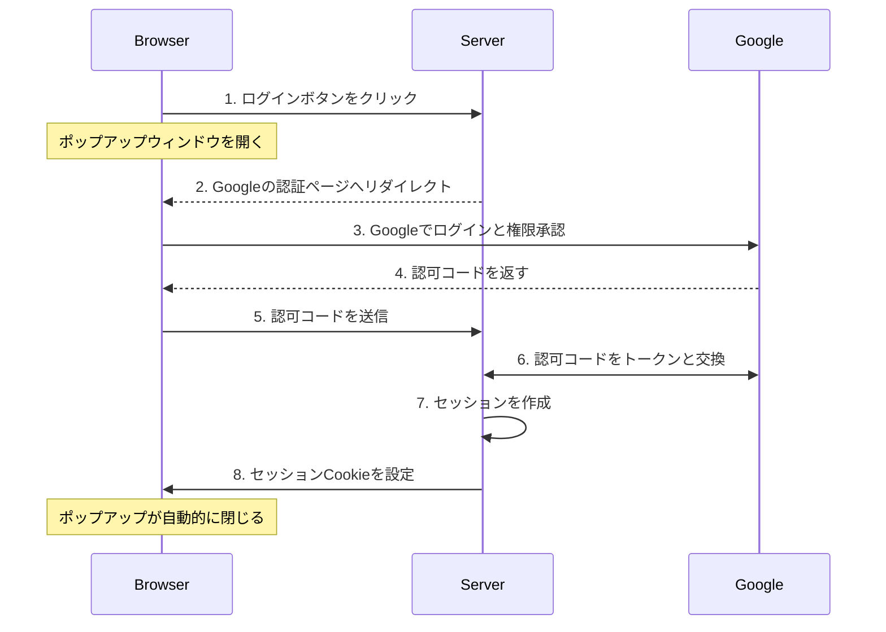
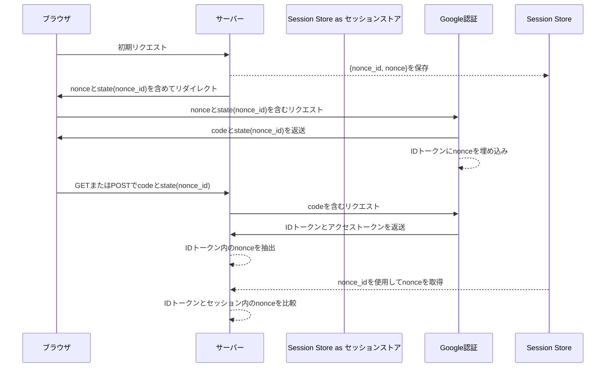
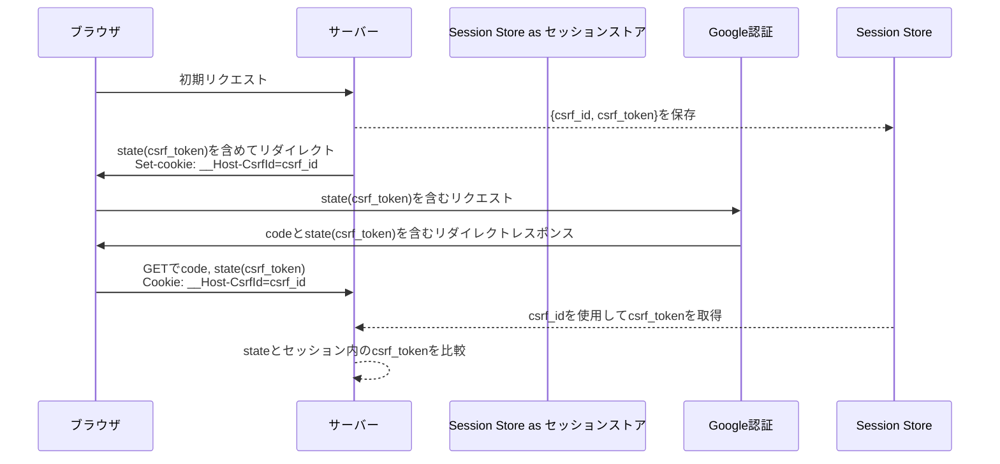

<!-- AxumでGoogle OAuth2/OIDC認証を実装する -->
この記事は[Rust Advent Calendar 2024](https://qiita.com/advent-calendar/2024/rust) シリーズ2の6日目の記事です。

- [はじめに](#はじめに)
- [概要](#概要)
  - [OAuth2とOpenID Connectとは](#oauth2とopenid-connectとは)
  - [認証の仕組み](#認証の仕組み)
- [実装の詳細](#実装の詳細)
  - [認証フローの実装](#認証フローの実装)
  - [アプリケーションの構造](#アプリケーションの構造)
  - [メインページの実装](#メインページの実装)
  - [認証フローの開始](#認証フローの開始)
  - [コールバック処理](#コールバック処理)
  - [セッション管理](#セッション管理)
- [セキュリティ対策の詳細](#セキュリティ対策の詳細)
  - [Nonceによる検証](#nonceによる検証)
  - [CSRF保護](#csrf保護)
  - [Cookieのセキュリティ](#cookieのセキュリティ)
  - [レスポンスモードのセキュリティ](#レスポンスモードのセキュリティ)
  - [認可コードフローによる認証](#認可コードフローによる認証)
  - [IDトークンの検証](#idトークンの検証)
- [おわりに](#おわりに)

## はじめに

RustとAxumを使って、Google OAuth2でのログイン機能を実装しました。OAuth2とOIDCを使った認証は現代のWebアプリケーションでは一般的な方法です。この記事では、安全な認証システムを作るために必要な基礎知識と、具体的な実装方法を説明します。

ソースコードは[GitHubリポジトリ](https://github.com/ktaka-ccmp/axum-google-oauth2)で公開しています。記事中のコードは理解のために簡略化していますので、完全な実装はリポジトリをご覧ください。
(本稿は[英語版](https://ktaka.blog.ccmp.jp/2024/12/axum-google-oauth2oidc-implementation.html)からの翻訳記事です。)

<video width="600" height="600" src="https://github.com/ktaka-ccmp/ktaka.blog.ccmp.jp/raw/refs/heads/master/2024/Axum-Google-OAuth2-Login/image/blog-20241206-02.mp4" controls="true" autoplay loop></video>

## 概要

### OAuth2とOpenID Connectとは

OAuth2とOpenID Connect（OIDC）は、現代のWebアプリケーションの認証を支える重要な技術です。

OAuth2は認証の基盤となる技術で、ユーザーが自分の認証情報を直接渡すことなく、アプリケーションに特定の機能へのアクセス権を与えることができます。アプリケーションはアクセストークン（access token）を使ってこれらの機能を利用します。この実装では、広く使われている安全な方法である認可コードフロー（authorization code flow）を使って、ユーザー情報を取得しています。

OpenID Connect（OIDC）は、OAuth2を拡張して標準的な認証の仕組みを追加したものです。OAuth2が「アプリケーションに何を許可するか」を扱うのに対し、OIDCは「このユーザーは誰か」を確認することを主な目的としています。OIDCでは、ユーザー情報をJSON Web Token（JWT）形式のIDトークン（ID token）として提供します。これにより、ユーザーの認証とアクセス権限の管理を一度に行えます。

つまり、OIDCを使うことで、OAuth2をより安全に使えるようになります。

### 認証の仕組み

#### 基本的な認証フロー

この実装での認証は、以下のような手順で行われます：



認証の流れを詳しく説明します：

1. ユーザーがログインボタンを押すと、ポップアップウィンドウが開きます
2. ポップアップウィンドウがGoogleの認証ページに移動します
3. ユーザーがGoogleアカウントでログインし、アプリケーションへの権限を承認します
4. Googleが認可コード（authorization code）を返します
5. この認可コードを使って、サーバーがトークンを取得します
6. サーバーがIDトークンを検証し、ユーザーセッションを作成します
7. セッションCookieをブラウザに設定して認証を完了します

以降、ユーザーはこのセッションCookieを使って認証済みユーザーとして識別されます。

#### セッションCookieの仕組み

セッションCookieはユーザーの認証状態を維持するために使われます。ログイン時にサーバーが設定したCookieは、その後のすべてのリクエストに自動的に含まれます。セキュリティを確保するため、以下の設定を使用しています：

- **HttpOnly**: JavaScriptからCookieを読み取れないようにし、XSS攻撃から保護します
- **Secure**: HTTPS接続でのみCookieを送信し、通信の安全性を確保します
- **SameSite**: 同じサイトからのリクエストのみCookieを送信可能にし、CSRF攻撃を防ぎます
- **`__Host-`プレフィックス**: CookieをHTTPSと特定のホストに限定し、セキュリティを強化します

#### OAuth2の設定

認証プロセスでは、以下のパラメータを使用します：

```rust
static OAUTH2_QUERY_STRING: &str = "response_type=code\
&scope=openid+email+profile\
&response_mode=form_post\
&access_type=online\
&prompt=consent";
```

これらのパラメータの役割は：

- **`response_type=code`**: 認可コードを使用した安全な認証方式を指定します
- **`scope=openid email profile`**: アプリケーションが必要とするユーザー情報の範囲を指定します
- **`response_mode=form_post`**: 認証情報をURLに露出せず、POSTリクエストで送信します

## 実装の詳細

ここからは、OAuth2認証フローの具体的な実装方法について説明します。認証フロー、セッション管理、セキュリティ機能がどのように連携しているかを見ていきましょう。

### 認証フローの実装

この実装では、ユーザー体験を向上させるため、ポップアップウィンドウで認証を行います：

- メインページは操作可能なまま、別ウィンドウで認証処理を実行
- Cookieを使ってウィンドウ間で認証状態を共有
- 認証完了後、自動的にメインページを更新

システムは以下の4つのコンポーネントで構成されています：

- ブラウザ: ユーザーインターフェースを提供
- サーバー: 認証フローを制御
- Google: 認証サービスを提供
- セッションストア: セッションとセキュリティトークンを管理

[既存のmermaidダイアグラムは維持]

### アプリケーションの構造

認証フローの各段階を処理するため、以下のようなルート構造を実装しています：

```rust
let app = Router::new()
    .route("/", get(index))                    // メインページ
    .route("/auth/google", get(google_auth))   // Google認証の開始
    .route("/auth/authorized", get(get_authorized).post(post_authorized))  // 認証後のコールバック
    .route("/popup_close", get(popup_close))   // ポップアップの終了
    .route("/logout", get(logout))             // ログアウト
    .route("/protected", get(protected));      // 認証必須ページ
```

### メインページの実装

メインページは、ユーザーの認証状態に応じて表示を切り替えます：

```rust
async fn index(user: Option<User>) -> impl IntoResponse {
    match user {
        // 認証済みの場合
        Some(u) => {
            let message = format!("ようこそ、{}さん！", u.name);
            let template = IndexTemplateUser { message: &message };
            (StatusCode::OK, Html(template.render().unwrap())).into_response()
        }
        // 未認証の場合
        None => {
            let message = "ログインボタンをクリックしてください。";
            let template = IndexTemplateAnon { message: &message };
            (StatusCode::OK, Html(template.render().unwrap())).into_response()
        }
    }
}
```

### 認証フローの開始

`/auth/google`エンドポイントでは、以下の3つの処理を行います：

1. セキュリティトークンの生成
2. セッションへの保存
3. Google認証ページへのリダイレクト

```rust
async fn google_auth(
    State(params): State<OAuth2Params>,
    State(store): State<MemoryStore>,
    headers: HeaderMap,
) -> Result<impl IntoResponse, AppError> {
    // セキュリティトークンを生成
    let (csrf_token, csrf_id) = generate_store_token(
        "csrf_session", 
        expires_at, 
        Some(user_agent)
    );
    let (nonce_token, nonce_id) = generate_store_token(
        "nonce_session", 
        expires_at, 
        None
    );

    // Google認証URLの生成
    let encoded_state = encode_state(csrf_token, nonce_id);
    let auth_url = format!(
        "{}?{}&client_id={}&redirect_uri={}&state={}&nonce={}",
        OAUTH2_AUTH_URL,
        OAUTH2_QUERY_STRING,
        params.client_id,
        params.redirect_uri,
        encoded_state,
        nonce_token
    );

    // CSRFトークンをCookieに設定してリダイレクト
    let mut headers = HeaderMap::new();
    header_set_cookie(&mut headers, CSRF_COOKIE_NAME, csrf_id, expires_at)?;

    Ok((headers, Redirect::to(&auth_url)))
}
```

### コールバック処理

Googleからの認証データは、2つの方法で受け取ることができます：

#### フォームポストモード（推奨）

Google提供のJavaScriptがPOSTリクエストで認証データを送信します：

```rust
async fn post_authorized(
    State(state): State<AppState>,
    Form(form): Form<AuthResponse>,
) -> Result<impl IntoResponse, AppError> {
    // リクエスト元の確認
    validate_origin(&headers, &state.oauth2_params.auth_url).await?;
    // 認証データの処理
    authorized(&form, state).await
}
```

#### クエリモード

認証データがURLパラメータとして送信されます：

```rust
async fn get_authorized(
    Query(query): Query<AuthResponse>,
    State(state): State<AppState>,
    TypedHeader(cookies): TypedHeader<headers::Cookie>,
) -> Result<impl IntoResponse, AppError> {
    // CSRFトークンの検証
    csrf_checks(cookies.clone(), &state.store, &query, headers).await?;
    // 認証データの処理
    authorized(&query, state).await
}
```

どちらのモードでも、最終的に`authorized`関数で認証処理を完了します：

```rust
async fn authorized(
    auth_response: &AuthResponse, 
    state: AppState
) -> Result<impl IntoResponse, AppError> {
    // 認可コードをトークンに交換
    let (access_token, id_token) = exchange_code_for_token(...).await?;

    // IDトークンを検証してユーザー情報を取得
    let user_data = user_from_verified_idtoken(
        id_token, 
        &state, 
        auth_response
    ).await?;

    // ユーザー情報の追加確認（オプション）
    let user_data_userinfo = fetch_user_data_from_google(access_token).await?;
    if user_data.id != user_data_userinfo.id {
        return Err(anyhow::anyhow!("IDが一致しません").into());
    }

    // セッションの作成
    let session_id = create_and_store_session(user_data, ...).await?;
    
    Ok((
        set_cookie_header(session_id), 
        Redirect::to("/popup_close")
    ))
}
```

### セッション管理

認証後のユーザー情報は、セッションに保存して管理します：

```rust
async fn create_and_store_session(
    user_data: User,
    store: &MemoryStore,
    expires_at: DateTime<Utc>,
) -> Result<String, AppError> {
    let mut session = Session::new();
    session.insert("user", &user_data)?;      // ユーザー情報を保存
    session.set_expiry(expires_at);           // セッション有効期限を設定
    let session_id = store.store_session(session).await?;
    Ok(session_id)
}
```

認証が必要なページは、`User`エクストラクタを使って保護します：

```rust
// 認証が必要なページの例
async fn protected(user: User) -> impl IntoResponse {
    format!("ようこそ、{}さん！", user.name)
}

// Userエクストラクタの実装
#[async_trait]
impl<S> FromRequestParts<S> for User
where
    MemoryStore: FromRef<S>,
    S: Send + Sync,
{
    async fn from_request_parts(parts: &mut Parts, state: &S) -> Result<Self, Self::Rejection> {
        let store = MemoryStore::from_ref(state);
        let session_cookie = get_session_cookie(parts)?;
        let user = load_user_from_session(store, session_cookie).await?;
        Ok(user)
    }
}
```

## セキュリティ対策の詳細

この実装では、複数のセキュリティメカニズムを組み合わせて認証の安全性を確保しています。IDトークンを用いた認証では、これらのメカニズムが認証プロセスの保護とトークンの正当性の検証に重要な役割を果たします。

### Nonceによる検証

nonceメカニズムは、IDトークンが特定のリクエストのために発行されたものであることを検証するために重要です。

Nonce検証は以下の2つの値を比較することでIDトークンの真正性を確認します：

1. **IDトークン内のnonce:** Googleによって署名されたトークンに埋め込まれます
2. **セッションストアからのnonce:** stateパラメータの`nonce_id`を使用して取得します

これによりリプレイ攻撃を防ぎ、トークンが現在の認証リクエストに紐付けられていることを確認します。



### CSRF保護

クロスサイトリクエストフォージェリ（CSRF）保護は、認証コールバックが我々のアプリケーションから開始された正当な認証フローからのものであることを確保します。これがないと、悪意のあるサイトが認証済みユーザーを望まない認証リクエストに誘導する可能性があります。

セキュリティメカニズムは、ブラウザがリダイレクトと直接のPOSTリクエストをどのように扱うかの違いにより、レスポンスモードによって異なります：

**クエリモードフロー：**

このモードではCookieベースのCSRF検証が必要です。コールバックはブラウザのリダイレクトとして来るため、任意のサイトから発生する可能性があるためです。CSRFトークンは、リクエストチェーンが我々のアプリケーションから開始されたことを確認します：



**フォームポストモード：**

このモードではCSRF Cookie検証を使用できません。理由は：

- コールバックはGoogleのドメインからのクロスオリジンPOSTリクエストとして来る
- ブラウザのセキュリティにより、そのようなリクエストで`__Host-CsrfId` Cookieが送信されることがブロックされる

代わりに、以下の2つのセキュリティ対策に依存します：

- **Nonce検証：** IDトークンが我々の特定の認証リクエストのために発行されたことを確認
- **Origin検証：** POSTリクエストがGoogleのドメインから来ることを確認

この組み合わせにより、Googleのみが我々の元の認証リクエストに応答できることを確保し、悪意のあるサイトが認証フローを開始または乗っ取ることを防ぎます。

### Cookieのセキュリティ

すべてのCookieは包括的なセキュリティ設定を使用します：

```rust
"{name}={value}; SameSite=Lax; Secure; HttpOnly; Path=/; Max-Age={max_age}"
```

- **`HttpOnly:`** JavaScriptからのCookieへのアクセスを防止
- **`Secure:`** HTTPS経由でのみ送信されることを確保
- **`SameSite=Lax:`** 同一オリジンのナビゲーションを許可しながらCSRFを防止
- **`__Host-`プレフィックス:** HTTPSとホスト固有の制限を強制

これらの設定により、Cookieが一般的な攻撃ベクトルから保護されます。

### レスポンスモードのセキュリティ

**フォームポストモード（推奨）**

- 認可コードがPOSTボディに含まれ、URLやログから隠される
- セキュリティは**オリジン検証**と**nonce検証**に依存
- 本番環境での使用に最も安全なオプション

**クエリモード**

- 認可コードがURLに表示され、デバッグは容易だが露出のリスクが高い（ログ、ブックマークなど）
- 完全なCSRF保護を提供するが、URLが記録される環境では漏洩のリスクが高い

### 認可コードフローによる認証

認可コードフロー（`response_type=code`）は重要なセキュリティ上の利点を提供します：

- **セキュアなトークン交換：** トークンはセキュアなサーバー間通信を通じて取得
- **セキュリティのベストプラクティス：** 本番アプリケーションに推奨されるアプローチ

### IDトークンの検証

IDトークンは暗号的に署名されたJWTで、そのクレームを通じてセキュアな認証を提供します：

- `aud`: トークンが我々のアプリケーションのために発行されたことを確認
- `iss`: Googleをトークン発行者として検証
- `exp`と`iat`: トークンの再利用とリプレイ攻撃を防止
- `nonce`: トークンを我々の特定の認証リクエストに紐付け

Googleのuserinfoエンドポイントでも同様のデータが提供されますが、IDトークン検証を採用する理由は：

- クレームがGoogleの署名により暗号的に保護されている
- userinfoリクエストよりも検証が高速
- userinfoエンドポイントはオプションのプロフィールデータの取得に適している

## おわりに

本記事では、Axumを用いたセキュアなOAuth2/OIDC認証システムの構築方法について説明しました。認証の実装は複雑になりがちですが、機能を管理可能なコンポーネントに分割することで、セキュアで保守性の高いシステムを実現することができました。この実装は、トークンの検証、CSRF保護、セッション管理といった実践的なパターンを示しており、ご自身のプロジェクトに応用できるでしょう。

完全な実装コードは[GitHub](https://github.com/ktaka-ccmp/axum-google-oauth2)で公開しています。詳細に興味のある方はぜひご覧ください。特に、セキュリティ対策やセッション管理の設計に関するご意見をお聞かせいただければ幸いです。さらに改善の余地や特定の設計選択についての質問があれば、ぜひフィードバックをお寄せください！
