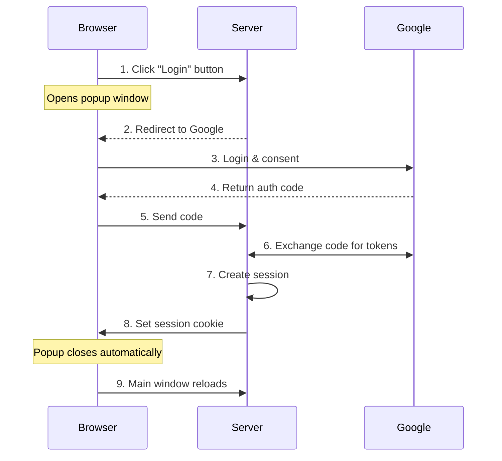
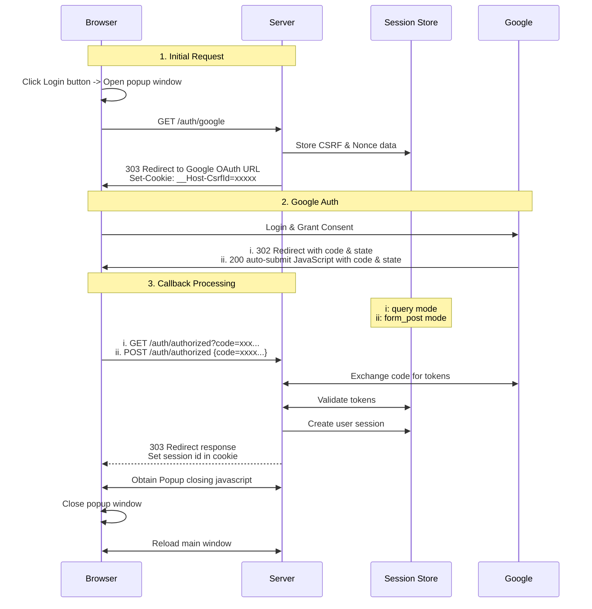
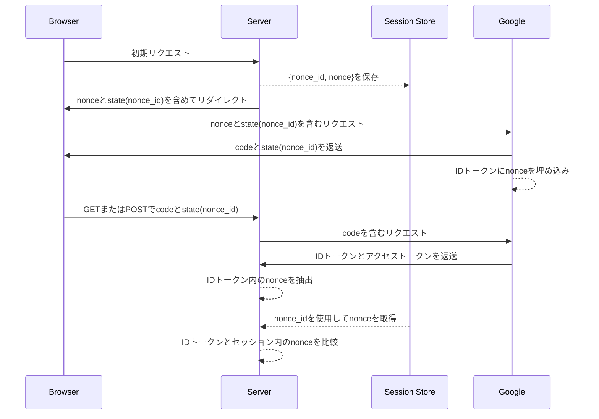
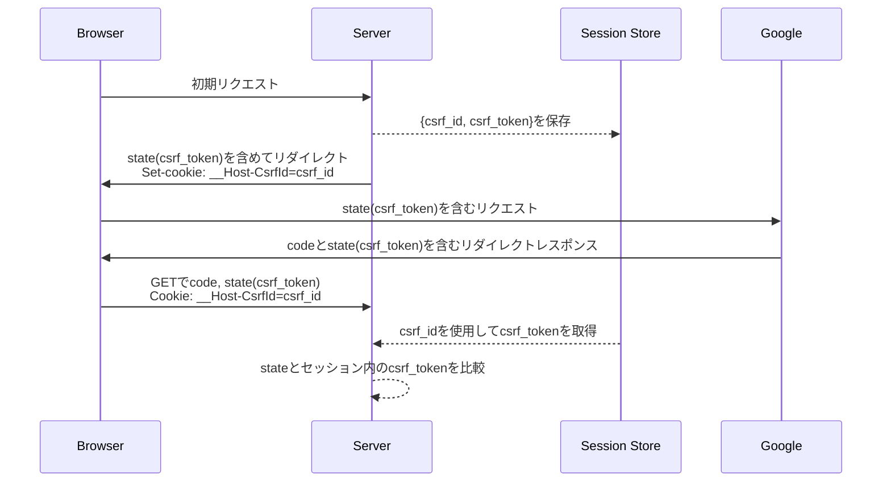

<!-- AxumでGoogle OAuth2/OIDCを実装する -->

- [はじめに](#はじめに)
- [概要](#概要)
  - [OAuth2とOpenID Connectとは](#oauth2とopenid-connectとは)
  - [認証の仕組み：主要な概念](#認証の仕組み主要な概念)
- [実装の詳細](#実装の詳細)
  - [認証フロー](#認証フロー)
  - [ルート構造](#ルート構造)
  - [メインページの動作](#メインページの動作)
  - [OAuth2フローの開始](#oauth2フローの開始)
  - [OAuth2コールバックの処理](#oauth2コールバックの処理)
  - [ユーザーセッションの管理](#ユーザーセッションの管理)
- [セキュリティに関する考慮事項](#セキュリティに関する考慮事項)
  - [Nonceの検証](#nonceの検証)
  - [CSRF保護](#csrf保護)
  - [Cookieのセキュリティ](#cookieのセキュリティ)
  - [レスポンスモードのセキュリティ](#レスポンスモードのセキュリティ)
  - [認可コードフローによる認証](#認可コードフローによる認証)
  - [IDトークンの検証](#idトークンの検証)
- [おわりに](#おわりに)

## はじめに

現代のWebアプリケーションでは、セキュアなユーザー認証のためにOAuth2やOIDCを利用することが一般的です。最近、RustとAxumを学習する中で、Google OAuth2を統合したログインシステムを実装しました。この記事では、セキュアな認証システムを構築する際の理論的な背景と実践的なステップを詳しく解説していきます。

簡潔さを保つため、主要なコンポーネントのコードスニペットは簡略化しています。完全な実装は[GitHubリポジトリ](https://github.com/ktaka-ccmp/axum-google-oauth2)でご確認いただけます。

## 概要

### OAuth2とOpenID Connectとは

OAuth2とOpenID Connect（OIDC）は現代の認証システムの鍵となる技術で、これらの関係を理解することで、セキュアな認証の実装がより容易になります。

OAuth2は基盤として機能し、ユーザーが認証情報を共有することなく、アプリケーションにリソースへのアクセスを許可することを可能にします。アプリケーションはアクセストークン（access token）を通じてこれらのリソースと対話します。この実装では、アイデンティティプロバイダからユーザー情報を取得するために、セキュアで広く採用されているアプローチである認可コードフロー（authorization code flow）を使用しました。

OpenID Connect（OIDC）はOAuth2を拡張し、認証のための標準化された層を追加します。OAuth2が「このアプリは何にアクセスできるか？」に焦点を当てているのに対し、OIDCは「このユーザーは誰か？」という問いに答えます。OIDCは検証済みのユーザー識別情報を含むJSON Web Token（JWT）であるIDトークン（ID token）を導入します。これにより、単一の統合されたフローでユーザーを認証しながらアクセス権限を管理することが可能になります。

簡単に言えば、OAuth2はOIDC標準の下でIDトークンを使用することでより安全になります。

### 認証の仕組み：主要な概念

#### 基本的な認証フロー

この実装は、以下のような明確に定義された認証シーケンスに従います：



このプロセスは、ユーザーがログインボタンをクリックすることから始まり、ポップアップを開いてGoogleの認証ページにリダイレクトします。ログインが成功すると、Googleは認可コード（authorization code）を返し、サーバーはこれをトークンと交換します。サーバーはIDトークンを検証し、ユーザーセッションを作成して、ブラウザへのレスポンスでセッションCookieを設定し、認証フローを完了します。その後、ユーザーはこのCookieによって後続のリクエストで識別されます。

#### セッションCookieの仕組み

セッションCookieは認証済みアクセスの維持に中心的な役割を果たします。サーバーがログイン時にセッションCookieを設定すると、それは後続のブラウザリクエストに自動的に含まれます。セキュアなセッション管理を確保するため、以下の対策を使用しました：

- **HttpOnlyフラグ**: クライアントサイドスクリプトからのCookieへのアクセスを防止
- **Secureフラグ**: CookieがHTTPS経由でのみ送信されることを保証
- **SameSite設定**: CSRF攻撃から保護
- **`__Host-`プレフィックス**: HTTPSとホスト固有の制限を強制

これらの設定が連携して、複数のタブにまたがっても安全な認証状態を維持します。

#### OAuth2パラメータ

OAuth2とOIDCは認証プロセスに不可欠な複数のパラメータを定義しています。主要なパラメータの設定アプローチは以下の通りです：

- **`response_type`**: 認可コードを安全に配信するため`code`に設定
- **`response_mode`**: 機密データをURLに含めないよう`form_post`を使用してセキュリティを強化
- **`scope`**: ユーザーのアイデンティティと基本情報のために`openid`、`email`、`profile`を要求

これらのパラメータは認証フローの制御とセキュリティの確保に不可欠です。

## 実装の詳細

以下のセクションでは、実装を主要なコンポーネントに分解し、OAuth2認証フローがセッション管理とセキュリティメカニズムとどのように統合されているかを説明します。

### 認証フロー

この実装では、メインページのレスポンス性を保つため、認証にポップアップウィンドウを使用します。このアプローチでは：

- 認証フローを別ウィンドウで処理
- ウィンドウ間で共有されるCookieを使用してログイン状態を維持
- 完了時に自動的にメインページを更新

このフローは、ブラウザ、サーバー、Google、セッションストアの4つのコンポーネント間で連携します。セッションストアは、ログインセッションとセキュリティトークン（CSRFとnonce）を管理します。



このダイアグラムは、各ステップでのデータとインタラクションのフローを表しています。

### ルート構造

アプリケーションは、認証とセッションフローの各ステップを管理するためのルートを定義します：

```rust
let app = Router::new()
    .route("/", get(index))
    .route("/auth/google", get(google_auth))
    .route("/auth/authorized", get(get_authorized).post(post_authorized))
    .route("/popup_close", get(popup_close))
    .route("/logout", get(logout))
    .route("/protected", get(protected));
```

### メインページの動作

メインページは、ユーザーの認証状態に基づいて動的にコンテンツを調整します：

```rust
async fn index(user: Option<User>) -> impl IntoResponse {
    match user {
        Some(u) => {
            let message = format!("Hey {}! You're logged in!", u.name);
            let template = IndexTemplateUser { message: &message };
            (StatusCode::OK, Html(template.render().unwrap())).into_response()
        }
        None => {
            let message = "You're not logged in.\nClick the Login button below.".to_string();
            let template = IndexTemplateAnon { message: &message };
            (StatusCode::OK, Html(template.render().unwrap())).into_response()
        }
    }
}
```

- 認証済みユーザー：パーソナライズされた挨拶を表示
- 未認証ユーザー：ポップアップベースの認証フローを開始するログインボタンを表示

### OAuth2フローの開始

`/auth/google`エンドポイントはOAuth2フローを開始します：

1. セキュリティトークン（CSRFとnonce）を生成
2. これらのトークンをセッションに保存
3. ブラウザをGoogleの認証ページにリダイレクト

```rust
async fn google_auth(
    State(params): State<OAuth2Params>,
    State(store): State<MemoryStore>,
    headers: HeaderMap,
) -> Result<impl IntoResponse, AppError> {
    // セキュリティトークンの生成と保存
    let (csrf_token, csrf_id) = generate_store_token("csrf_session", expires_at, Some(user_agent));
    let (nonce_token, nonce_id) = generate_store_token("nonce_session", expires_at, None);

    // トークンをstateパラメータに結合
    let encoded_state = encode_state(csrf_token, nonce_id);

    // 必要なパラメータを含むGoogle OAuth2 URLの構築
    let auth_url = format!(
        "{}?{}&client_id={}&redirect_uri={}&state={}&nonce={}",
        OAUTH2_AUTH_URL,         // e.g., https://accounts.google.com/o/oauth2/v2/auth
        OAUTH2_QUERY_STRING,     // e.g., response_type=code&scope=openid+email+profile...
        params.client_id,
        params.redirect_uri,
        encoded_state,
        nonce_token
    );

    // セキュリティCookieを設定しリダイレクトレスポンスを準備
    let mut headers = HeaderMap::new();
    header_set_cookie(&mut headers, CSRF_COOKIE_NAME, csrf_id, expires_at)?;

    Ok((headers, Redirect::to(&auth_url)))
}
```

#### Stateパラメータ

stateパラメータは以下を組み合わせます：

- CSRFトークン：クロスサイトリクエストフォージェリーから保護
- Nonce ID：IDトークンの真正性を検証
- Base64URLエンコーディング：複数のパラメータを単一のURL安全なパラメータに埋め込み

```rust
fn encode_state(csrf_token: String, nonce_id: String) -> String {
    let state_params = StateParams { csrf_token, nonce_id };
    URL_SAFE.encode(serde_json::json!(state_params).to_string())
}
```

Googleはこのstateパラメータを変更せずに返送し、コールバックでのセキュリティ検証を可能にします。

### OAuth2コールバックの処理

ユーザーがGoogleで認証した後、アプリケーションはコールバックを処理して認証プロセスを完了する必要があります。これには認可コードのトークンへの交換とその真正性の検証が含まれます。

Googleは`/auth/authorized`エンドポイントを通じてユーザーの認証データを返します。このエンドポイントは2つのモードをサポートします：

#### フォームポストモード（推奨）

Googleは認可コードとstateをブラウザに返します。Google提供のJavaScriptがこれらをPOSTボディとしてエンドポイントに送信します。これらは以下のように処理されます：

```rust
async fn post_authorized(
    State(state): State<AppState>,
    Form(form): Form<AuthResponse>,
) -> Result<impl IntoResponse, AppError> {
    validate_origin(&headers, &state.oauth2_params.auth_url).await?;
    authorized(&form, state).await
}
```

#### クエリモード

Googleは認可コードとstateをURLクエリパラメータとして含むリダイレクトレスポンスを返します。これらは以下のように処理されます：

```rust
async fn get_authorized(
    Query(query): Query<AuthResponse>,
    State(state): State<AppState>,
    TypedHeader(cookies): TypedHeader<headers::Cookie>,
) -> Result<impl IntoResponse, AppError> {
    csrf_checks(cookies.clone(), &state.store, &query, headers).await?;
    authorized(&query, state).await
}
```

両方のコールバックモードは最終的に`authorized`関数を通じて認証レスポンスを処理します。この関数はコードをトークンと交換し、その真正性を検証し、ユーザーセッションを確立します：

```rust
async fn authorized(auth_response: &AuthResponse, state: AppState) -> Result<impl IntoResponse, AppError> {
    let (access_token, id_token) = exchange_code_for_token(...).await?;

    let user_data = user_from_verified_idtoken(id_token, &state, auth_response).await?;

    // userinfoエンドポイントからのユーザーデータの任意チェック
    let user_data_userinfo = fetch_user_data_from_google(access_token).await?;
    if user_data.id != user_data_userinfo.id {
        return Err(anyhow::anyhow!("ID mismatch").into());
    }

    let session_id = create_and_store_session(user_data, ...).await?;
    Ok((set_cookie_header(session_id), Redirect::to("/popup_close")))
}
```

### ユーザーセッションの管理

セッションはリクエスト間で安全で一貫した認証を確保します。ログイン成功時に、セッションが作成され安全に保存されます：

```rust
async fn create_and_store_session(
    user_data: User,
    store: &MemoryStore,
    expires_at: DateTime<Utc>,
) -> Result<String, AppError> {
    let mut session = Session::new();
    session.insert("user", &user_data)?;
    session.set_expiry(expires_at);
    let session_id = store.store_session(session).await?;
    Ok(session_id)
}
```

機密性の高いルートを保護するため、関数引数に`user: User`を含めます。`User`エクストラクタは自動的にセッションCookieを検証し、後続のリクエストのためにユーザーデータを取得します：

```rust
// "user: User"引数は認証済みユーザーデータへのアクセスを確保
async fn protected(user: User) -> impl IntoResponse {
    format!("Welcome, {}!", user.name)
}

// Userエクストラクタ
// リクエストからCookieを抽出し、セッションストアからユーザーデータを取得
#[async_trait]
impl<S> FromRequestParts<S> for User
where
    MemoryStore: FromRef<S>,
    S: Send + Sync,
{
    async fn from_request_parts(parts: &mut Parts, state: &S) -> Result<Self, Self::Rejection> {
        let store = MemoryStore::from_ref(state);
        let session_cookie = get_session_cookie(parts)?;
        let user = load_user_from_session(store, session_cookie).await?;
        Ok(user)
    }
}
```

## セキュリティに関する考慮事項

認証の実装は、複数のセキュリティメカニズムが連携して機能することに依存しています。IDトークンのクレームを認証に使用するため、これらのメカニズムは認証プロセスの保護とトークンの真正性の検証に焦点を当てています。

### Nonceの検証

nonceメカニズムは、認証に使用するIDトークンが特定のリクエストのために発行されたものであることを検証する上で重要です。

Nonce検証は、以下の2つの値を比較することでIDトークンの真正性を確認します：

1. **IDトークン内のnonce:** Googleによって署名されたトークンに埋め込まれる
2. **セッションストアからのnonce:** stateパラメータのnonce_idを使用して取得

これによりリプレイ攻撃を防ぎ、トークンが現在の認証リクエストに紐付けられていることを確認します。



### CSRF保護

クロスサイトリクエストフォージェリ（CSRF）保護は、認証コールバックが我々のアプリケーションから開始された正当な認証フローからのものであることを確保します。これがないと、悪意のあるサイトが認証済みユーザーを望まない認証リクエストに誘導する可能性があります。

セキュリティメカニズムは、ブラウザがリダイレクトと直接のPOSTリクエストをどのように扱うかの違いにより、レスポンスモードによって異なります：

**クエリモードフロー：**

このモードではCookieベースのCSRF検証が必要です。コールバックはブラウザのリダイレクトとして来るため、任意のサイトから発生する可能性があるためです。CSRFトークンは、リクエストチェーンが我々のアプリケーションから開始されたことを確認します：



**フォームポストモード：**

このモードではCSRF Cookie検証を使用できません。理由は：

- コールバックはGoogleのドメインからのクロスオリジンPOSTリクエストとして来る
- ブラウザのセキュリティにより、そのようなリクエストで`__Host-CsrfId` Cookieが送信されることがブロックされる

代わりに、以下の2つのセキュリティ対策に依存します：

- **Nonce検証：** IDトークンが我々の特定の認証リクエストのために発行されたことを確認
- **Origin検証：** POSTリクエストがGoogleのドメインから来ることを確認

この組み合わせにより、Googleのみが我々の元の認証リクエストに応答できることを確保し、悪意のあるサイトが認証フローを開始または乗っ取ることを防ぎます。

### Cookieのセキュリティ

すべてのCookieは包括的なセキュリティ設定を使用します：

```rust
"{name}={value}; SameSite=Lax; Secure; HttpOnly; Path=/; Max-Age={max_age}"
```

- **`HttpOnly:`** JavaScriptからのCookieへのアクセスを防止
- **`Secure:`** HTTPS経由でのみ送信されることを確保
- **`SameSite=Lax:`** 同一オリジンのナビゲーションを許可しながらCSRFを防止
- **`__Host-`プレフィックス:** HTTPSとホスト固有の制限を強制

これらの設定により、Cookieが一般的な攻撃ベクトルから保護されます。

### レスポンスモードのセキュリティ

**フォームポストモード（推奨）**

- 認可コードがPOSTボディに含まれ、URLやログから隠される
- セキュリティは**オリジン検証**と**nonce検証**に依存
- 本番環境での使用に最も安全なオプション

**クエリモード**

- 認可コードがURLに表示され、デバッグは容易だが露出のリスクが高い（ログ、ブックマークなど）
- 完全なCSRF保護を提供するが、URLが記録される環境では漏洩のリスクが高い

### 認可コードフローによる認証

認可コードフロー（`response_type=code`）は重要なセキュリティ上の利点を提供します：

- **セキュアなトークン交換：** トークンはセキュアなサーバー間通信を通じて取得
- **セキュリティのベストプラクティス：** 本番アプリケーションに推奨されるアプローチ

### IDトークンの検証

IDトークンは暗号的に署名されたJWTで、そのクレームを通じてセキュアな認証を提供します：

- `aud`: トークンが我々のアプリケーションのために発行されたことを確認
- `iss`: Googleをトークン発行者として検証
- `exp`と`iat`: トークンの再利用とリプレイ攻撃を防止
- `nonce`: トークンを我々の特定の認証リクエストに紐付け

Googleのuserinfoエンドポイントでも同様のデータが提供されますが、IDトークン検証を採用する理由は：

- クレームがGoogleの署名により暗号的に保護されている
- userinfoリクエストよりも検証が高速
- userinfoエンドポイントはオプションのプロフィールデータの取得に適している

## おわりに

この実装では、AxumでのセキュアなOAuth2/OIDC認証システムの構築について説明しました。認証の実装は複雑になり得ますが、管理可能なコンポーネントに分解することで、セキュアで保守可能なシステムを作成することができました。このコードは、トークン検証、CSRF保護、セッション管理のための実践的なパターンを示しており、あなた自身のプロジェクトでも役立つかもしれません。

完全な実装は[GitHub](https://github.com/ktaka-ccmp/axum-google-oauth2)に投稿しています。実装の詳細に興味がある方はぜひご覧ください。特にセキュリティ対策とセッション管理のアプローチについてのご意見をお聞かせいただければ幸いです。改善の可能性や特定の設計選択についての質問があれば、ぜひフィードバックをお寄せください！
