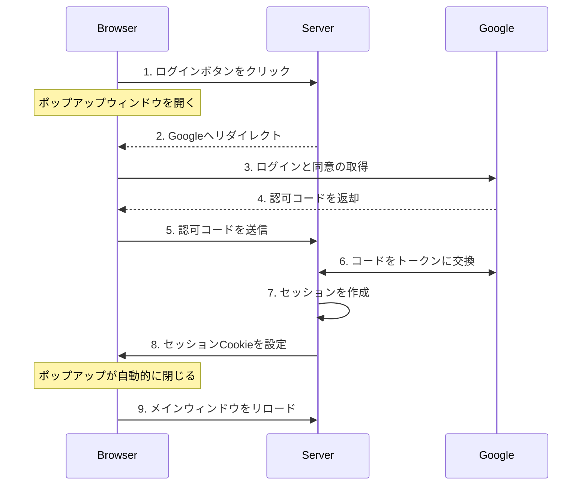
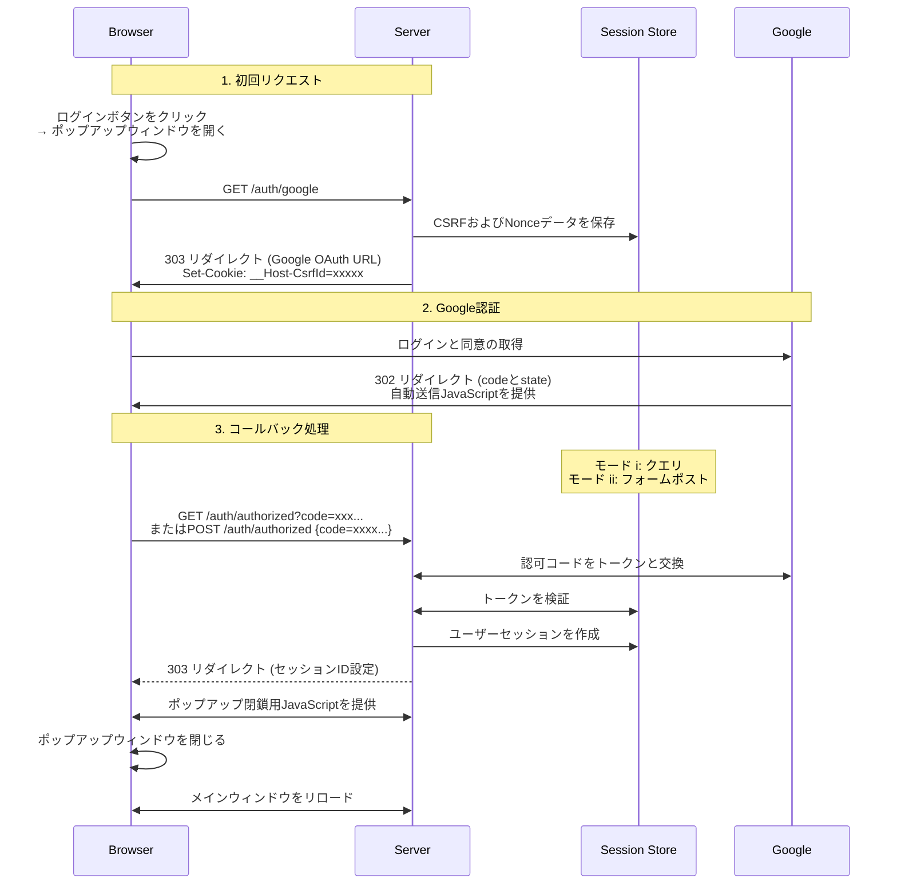
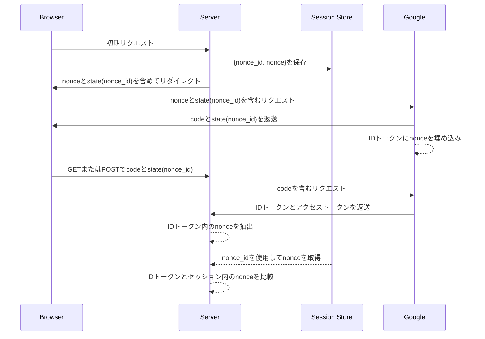
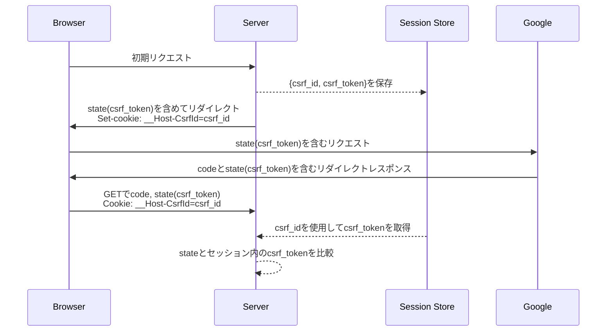

<!-- AxumでGoogle OAuth2/OIDCを実装する -->

- [はじめに](#はじめに)
- [概要](#概要)
  - [OAuth2とOpenID Connectとは](#oauth2とopenid-connectとは)
  - [認証の仕組み：主要な概念](#認証の仕組み主要な概念)
- [実装の詳細](#実装の詳細)
  - [認証フロー](#認証フロー)
  - [ルート構造](#ルート構造)
  - [メインページの動作](#メインページの動作)
  - [OAuth2フローの開始](#oauth2フローの開始)
  - [OAuth2コールバックの処理](#oauth2コールバックの処理)
  - [セッション管理](#セッション管理)
- [セキュリティに関する考慮事項](#セキュリティに関する考慮事項)
  - [Nonceの検証](#nonceの検証)
  - [CSRF保護](#csrf保護)
  - [Cookieのセキュリティ](#cookieのセキュリティ)
  - [レスポンスモードのセキュリティ](#レスポンスモードのセキュリティ)
  - [認可コードフローによる認証](#認可コードフローによる認証)
  - [IDトークンの検証](#idトークンの検証)
- [おわりに](#おわりに)

## はじめに

現代のWebアプリケーションでは、セキュアなユーザー認証のためにOAuth2やOIDCを利用することが一般的です。最近、RustとAxumを学習する中で、Google OAuth2を統合したログインシステムを実装しました。この記事では、セキュアな認証システムを構築する際の理論的な背景と実践的なステップを詳しく解説していきます。

簡潔さを保つため、主要なコンポーネントのコードスニペットは簡略化しています。完全な実装は[GitHubリポジトリ](https://github.com/ktaka-ccmp/axum-google-oauth2)でご確認いただけます。

## 概要

### OAuth2とOpenID Connectとは

OAuth2とOpenID Connect（OIDC）は、現代の認証システムにおいて重要な技術です。これらの仕組みを理解することで、よりセキュアで効率的な認証システムの実装が可能になります。

OAuth2は、ユーザーの認証情報を共有せずに、アプリケーションが特定のリソースへのアクセスを許可するための基盤を提供します。アプリケーションはアクセストークン（access token）を使用してリソースにアクセスします。本実装では、セキュアで広く利用されている認可コードフロー（authorization code flow）を用いて、アイデンティティプロバイダーからユーザー情報を取得しています。

OpenID Connect（OIDC）は、OAuth2を拡張し、認証のための標準化されたレイヤーを追加します。OAuth2が「どのリソースにアクセスできるか？」に焦点を当てるのに対し、OIDCは「このユーザーは誰か？」に焦点を当てます。OIDCは、検証済みのユーザー情報を含むJSON Web Token（JWT）形式のIDトークン（ID token）を導入することで、認証とアクセス制御を統合的に管理することを可能にします。

簡潔に言うと、OIDCを活用することで、OAuth2をより安全かつ効率的に運用できます。

---

### 認証の仕組み：主要な概念

#### 基本的な認証フロー

本実装は、以下のような明確な認証フローに基づいています：



このフローは、ユーザーがログインボタンをクリックしてポップアップウィンドウが開くところから始まります。Googleの認証ページでログインと同意が完了すると、Googleは認可コードを返します。このコードをサーバーがトークンに交換し、IDトークンを検証してセッションを作成します。その後、セッションCookieが設定され、ブラウザを通じて認証が完了します。このCookieにより、後続のリクエストでユーザーが識別されます。

#### セッションCookieの仕組み

セッションCookieは、認証済みアクセスの維持において重要な役割を果たします。以下の対策により、セキュアなセッション管理を実現しています：

- **HttpOnlyフラグ**: クライアントサイドのスクリプトからCookieへのアクセスを防止  
- **Secureフラグ**: CookieがHTTPS経由でのみ送信されることを保証  
- **SameSite設定**: CSRF攻撃から保護  
- **`__Host-`プレフィックス**: HTTPSとホスト固有の制約を強制  

これらの設定により、複数タブやセッションの持続性を考慮しつつ、認証の安全性が強化されています。

#### OAuth2パラメータ

OAuth2とOIDCの認証プロセスには、いくつかの重要なパラメータがあります。本実装では以下の設定を採用しています：

- **`response_type`**: 認可コードの安全な送信のために`code`を指定  
- **`response_mode`**: 機密情報をURLに含めないために`form_post`を使用  
- **`scope`**: ユーザー情報を取得するため`openid`、`email`、`profile`を指定  

これらのパラメータにより、認証フローの安全性と効率性を高めています。

## 実装の詳細

以下では、実装を主要なコンポーネントに分解し、OAuth2認証フローがセッション管理およびセキュリティメカニズムとどのように統合されているかを説明します。

---

### 認証フロー

この実装では、メインページの操作性を維持するため、認証をポップアップウィンドウで処理します。このアプローチの特徴は次の通りです：

- 認証フローを別ウィンドウで処理  
- Cookieを使用してウィンドウ間でログイン状態を共有  
- 認証完了後、メインページを自動更新  

認証フローは、以下の4つのコンポーネント間で連携して進行します：ブラウザ、サーバー、Google、セッションストア。セッションストアはログインセッションとセキュリティトークン（CSRFおよびnonce）の管理を担います。



---

### ルート構造

アプリケーションは、認証とセッションフローの各ステップを管理するために以下のルートを定義します：

```rust
let app = Router::new()
    .route("/", get(index))
    .route("/auth/google", get(google_auth))
    .route("/auth/authorized", get(get_authorized).post(post_authorized))
    .route("/popup_close", get(popup_close))
    .route("/logout", get(logout))
    .route("/protected", get(protected));
```

---

### メインページの動作

メインページは、ユーザーの認証状態に応じて動的にコンテンツを切り替えます：

```rust
async fn index(user: Option<User>) -> impl IntoResponse {
    match user {
        Some(u) => {
            let message = format!("Hey {}! You're logged in!", u.name);
            let template = IndexTemplateUser { message: &message };
            (StatusCode::OK, Html(template.render().unwrap())).into_response()
        }
        None => {
            let message = "You're not logged in.\nClick the Login button below.".to_string();
            let template = IndexTemplateAnon { message: &message };
            (StatusCode::OK, Html(template.render().unwrap())).into_response()
        }
    }
}
```

- **認証済みユーザー**: 個別の挨拶を表示  
- **未認証ユーザー**: ログインボタンを表示し、認証フローを開始  

---

### OAuth2フローの開始

`/auth/google`エンドポイントは、OAuth2認証フローを開始します：

1. セキュリティトークン（CSRFとnonce）の生成  
2. トークンをセッションに保存  
3. Google認証ページへのリダイレクト  

```rust
async fn google_auth(
    State(params): State<OAuth2Params>,
    State(store): State<MemoryStore>,
    headers: HeaderMap,
) -> Result<impl IntoResponse, AppError> {
    let (csrf_token, csrf_id) = generate_store_token("csrf_session", expires_at, Some(user_agent));
    let (nonce_token, nonce_id) = generate_store_token("nonce_session", expires_at, None);

    let encoded_state = encode_state(csrf_token, nonce_id);

    let auth_url = format!(
        "{}?{}&client_id={}&redirect_uri={}&state={}&nonce={}",
        OAUTH2_AUTH_URL,
        OAUTH2_QUERY_STRING,
        params.client_id,
        params.redirect_uri,
        encoded_state,
        nonce_token
    );

    let mut headers = HeaderMap::new();
    header_set_cookie(&mut headers, CSRF_COOKIE_NAME, csrf_id, expires_at)?;

    Ok((headers, Redirect::to(&auth_url)))
}
```

---

### OAuth2コールバックの処理

Googleでの認証完了後、アプリケーションは`/auth/authorized`エンドポイントで認証データを受け取り、次の手順を実行します：

1. **認可コードをトークンに交換**  
2. **トークンの真正性を検証**  
3. **セッションを作成してCookieに保存**  

コールバックは、以下の2つのモードに対応しています：

#### フォームポストモード（推奨）

Google提供のJavaScriptが認可コードとstateをPOSTボディとして送信します：

```rust
async fn post_authorized(
    State(state): State<AppState>,
    Form(form): Form<AuthResponse>,
) -> Result<impl IntoResponse, AppError> {
    validate_origin(&headers, &state.oauth2_params.auth_url).await?;
    authorized(&form, state).await
}
```

#### クエリモード

Googleは認可コードとstateをURLクエリパラメータで返します：

```rust
async fn get_authorized(
    Query(query): Query<AuthResponse>,
    State(state): State<AppState>,
    TypedHeader(cookies): TypedHeader<headers::Cookie>,
) -> Result<impl IntoResponse, AppError> {
    csrf_checks(cookies.clone(), &state.store, &query, headers).await?;
    authorized(&query, state).await
}
```

---

### セッション管理

ログイン後、ユーザーセッションが作成され、安全に保存されます：

```rust
async fn create_and_store_session(
    user_data: User,
    store: &MemoryStore,
    expires_at: DateTime<Utc>,
) -> Result<String, AppError> {
    let mut session = Session::new();
    session.insert("user", &user_data)?;
    session.set_expiry(expires_at);
    let session_id = store.store_session(session).await?;
    Ok(session_id)
}
```

セッションCookieを通じて、機密性の高いルートを保護します：

```rust
async fn protected(user: User) -> impl IntoResponse {
    format!("Welcome, {}!", user.name)
}
```

## セキュリティに関する考慮事項

認証の実装は、複数のセキュリティメカニズムが連携して機能することで成り立っています。特に、IDトークンのクレームを利用した認証では、これらのメカニズムが認証プロセスの保護とトークンの真正性の検証において重要な役割を果たします。

---

### Nonceの検証

Nonceメカニズムは、IDトークンが特定のリクエストに対して発行されたものであることを検証し、不正利用を防ぐために重要です。

Nonce検証では以下の2つの値を比較して、トークンの真正性を確認します：

1. **IDトークン内のnonce:** Googleが署名するトークンに埋め込まれます。
2. **セッションストア内のnonce:** stateパラメータの`nonce_id`を使用して取得されます。

これにより、リプレイ攻撃を防ぎ、トークンが現在の認証リクエストに関連付けられていることを保証します。



---

### CSRF保護

クロスサイトリクエストフォージェリ（CSRF）保護は、認証コールバックが正当な認証フローから発生したものであることを確保します。これがない場合、悪意のあるサイトが認証済みユーザーを望まないリクエストに誘導する可能性があります。

セキュリティメカニズムは、レスポンスモード（クエリまたはフォームポスト）によって異なります。

---

#### クエリモードフロー

クエリモードでは、CookieベースのCSRF検証が必要です。このモードでは、コールバックがブラウザのリダイレクトを介して送信されるため、悪意のあるサイトからのリクエストが発生する可能性があります。



#### フォームポストモード

フォームポストモードでは、CSRF Cookie検証が利用できません。その理由は以下の通りです：

- コールバックはGoogleのドメインからのクロスオリジンPOSTリクエストとして送信される
- ブラウザのセキュリティ制限により、`__Host-CsrfId` Cookieがこれらのリクエストで送信されることがブロックされる

このため、以下のセキュリティ対策に依存します：

- **Nonce検証:** IDトークンが正しい認証リクエストに対して発行されたことを確認  
- **Origin検証:** POSTリクエストがGoogleの信頼できるドメインから送信されていることを確認  

これらの対策により、Googleだけが元の認証リクエストに応答できることを保証し、悪意のあるサイトが認証フローを開始または乗っ取ることを防ぎます。

### Cookieのセキュリティ

すべてのCookieは、以下のような包括的なセキュリティ設定を使用して保護されています：

```rust
"{name}={value}; SameSite=Lax; Secure; HttpOnly; Path=/; Max-Age={max_age}"
```

- **`HttpOnly:`** JavaScriptからのアクセスを防止し、XSS攻撃から保護  
- **`Secure:`** HTTPS経由でのみ送信されることを保証  
- **`SameSite=Lax:`** 同一オリジンのナビゲーションを許可しつつ、CSRFを防止  
- **`__Host-`プレフィックス:** CookieがHTTPS環境とホスト固有に制限されることを強制  

これらの設定により、Cookieは一般的な攻撃（XSS、CSRF、Cookie固定攻撃など）から保護されます。

---

### レスポンスモードのセキュリティ

#### フォームポストモード（推奨）

- 認可コードがPOSTボディに含まれるため、URLやログに露出しません。  
- セキュリティは**オリジン検証**と**nonce検証**に依存しています。  
- 本番環境で最も安全な選択肢であり、推奨されます。

#### クエリモード

- 認可コードがURLに含まれ、デバッグが容易ですが、露出のリスクが高まります（ログ、ブックマークなどに記録される可能性があります）。  
- 完全なCSRF保護を提供しますが、URLが記録される環境では情報漏洩のリスクがあるため、運用時には注意が必要です。

---

### 認可コードフローによる認証

認可コードフロー（`response_type=code`）は、次のようなセキュリティ上の利点を提供します：

- **セキュアなトークン交換:** 認可コードを用いて、トークンがサーバー間通信で安全に取得されます。  
- **セキュリティのベストプラクティス:** 本番環境で推奨される標準的な認証アプローチです。

このフローは、ブラウザとサーバー間でセキュリティを強化しつつ、機密性の高いデータを安全にやり取りすることができます。

---

### IDトークンの検証

IDトークンは暗号的に署名されたJWTであり、次のクレームを検証することでセキュアな認証を実現します：

- **`aud`:** トークンが我々のアプリケーションに向けて発行されたことを確認  
- **`iss`:** トークン発行者がGoogleであることを検証  
- **`exp` と `iat`:** トークンの有効期限と発行時刻を確認し、再利用やリプレイ攻撃を防止  
- **`nonce`:** トークンが特定の認証リクエストに関連付けられていることを確認  

Googleのuserinfoエンドポイントでも同様の情報を取得できますが、IDトークンの検証を推奨する理由は以下の通りです：

- **署名による信頼性:** IDトークンのクレームはGoogleの署名により暗号的に保護されています。  
- **高速性:** userinfoエンドポイントを利用するよりもクレーム検証が迅速です。  
- **用途の分離:** userinfoエンドポイントは、オプションのプロフィールデータを取得するために適していますが、認証そのものにはIDトークン検証が適しています。  

これにより、認証プロセスは高速かつ安全に完了し、必要に応じて追加のデータを取得する柔軟性も確保されます。

## おわりに

本記事では、Axumを用いたセキュアなOAuth2/OIDC認証システムの構築方法について説明しました。認証の実装は複雑になる可能性がありますが、機能を管理可能なコンポーネントに分割することで、セキュアで保守性の高いシステムを実現することができました。この実装は、トークンの検証、CSRF保護、セッション管理といった実践的なパターンを示しており、ご自身のプロジェクトに応用できるでしょう。

完全な実装コードは[GitHub](https://github.com/ktaka-ccmp/axum-google-oauth2)で公開しています。詳細に興味のある方はぜひご覧ください。特に、セキュリティ対策やセッション管理の設計に関するご意見をお聞かせいただければ幸いです。さらに改善の余地や特定の設計選択についての質問があれば、ぜひフィードバックをお寄せください！
