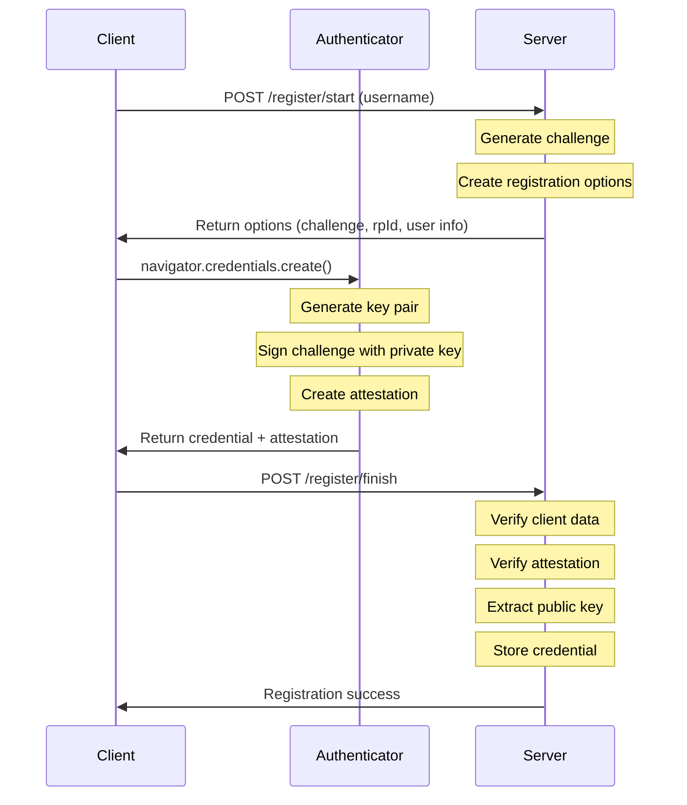
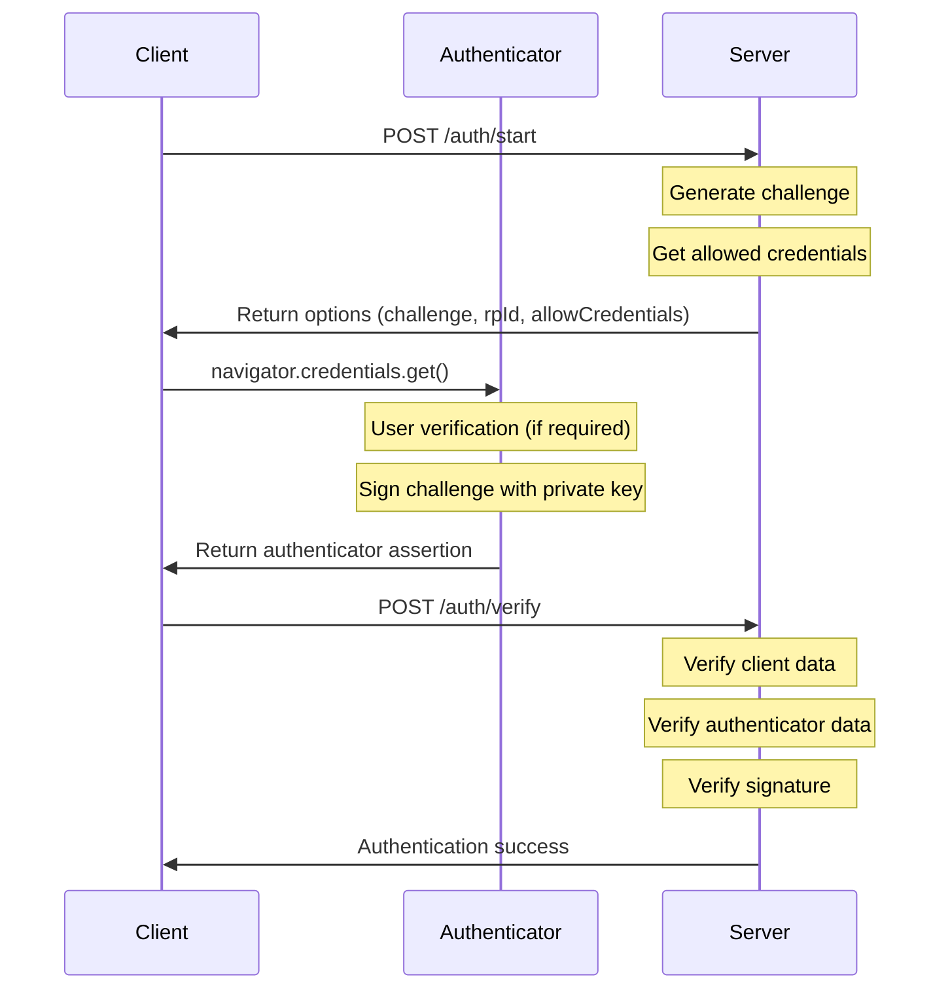

# Implementing WebAuthn Passkeys in Rust with Axum: A Learning Journey

As a developer learning web programming and authentication in Rust, I recently undertook the challenge of implementing WebAuthn Passkeys using the Axum web framework. In this post, I'll share my experience building a basic Passkey authentication system from scratch, without relying on full-featured WebAuthn library crates.

## What are Passkeys?

Passkeys are a modern authentication standard based on WebAuthn that replaces traditional passwords with public key cryptography. They offer several advantages:

- **No passwords to remember**: Users authenticate using their device's biometrics or PIN
- **Phishing-resistant**: Credentials are bound to specific origins
- **Better security**: Uses public key cryptography instead of shared secrets
- **Cross-platform**: Works across devices through platform authenticators (e.g., Google Password Manager or Apple key chain)

WebAuthn is the underlying web standard that enables passwordless authentication, while Passkeys are a consumer-friendly implementation of WebAuthn. Think of WebAuthn as the technical standard (like HTTP) and Passkeys as the user-friendly product built on top of it (like the web browser). Major platforms like Google, Apple, and Microsoft have collaborated to make Passkeys interoperable across their ecosystems.

## General Concept

WebAuthn Passkey authentication consists of two main phases: registration and authentication. Let's look at how each phase works at a high level.

### Registration Phase

During registration:

1. Server generates a challenge and options and returns them to the client
2. The client creates a new key pair in the authenticator
3. Sends the public key to the server with attestation information
4. Server verifies the attestation and stores the public key



### Authentication Phase

During authentication:

1. Server generates and sends a challenge to the client
2. Authenticator signs the challenge using the private key
3. Server verifies the signature using the stored public key



## Client-Side Implementation

Client-side behavior is controlled by the JavaScript on the client browser provided by the server.

### JavaScript for Registration

First, let's look at how to interact with the WebAuthn API for registration:

1. Start registration: fetch options (including challenge) from the server

```javascript
// 1. Start registration
const response = await fetch('/register/start', {
    method: 'POST',
    headers: { 'Content-Type': 'application/json' },
    body: JSON.stringify(username)
});
const options = await response.json();
```

The server provides registration options in this format:

```json
{
    "challenge": "base64url-encoded-random-bytes",
    "rp_id": "example.com",
    "rp": {
        "name": "Example Service",
        "id": "example.com"
    },
    "user": {
        "id": "user-uuid",
        "name": "username",
        "displayName": "display name"
    },
    "pubKeyCredParams": [
        { "type": "public-key", "alg": -7 },  // ES256
        { "type": "public-key", "alg": -257 } // RS256
    ],
    "authenticatorSelection": {
        "authenticatorAttachment": "platform",
        "residentKey": "required",
        "userVerification": "discouraged"
    },
    "timeout": 60000
}
```

Key components of the registration options:

- **Challenge**: A cryptographically random value generated for each registration attempt. It prevents replay attacks by ensuring the authenticator's response is fresh and was generated specifically for this registration.

- **rp_id**: The Relying Party ID (usually the domain name) is crucial for security. It binds the credential to your domain, preventing phishing attacks - the credential can only be used on the specified domain.

- **user.id**: A unique identifier for the user that remains constant across registrations. Unlike username, which might change, this ID provides a stable way to link credentials to users. It's particularly important for discoverable credentials (resident keys).

- **authenticatorSelection**: Controls the behavior of the authenticator:
  - `authenticatorAttachment`: Specifies whether to use platform authenticators (like TouchID) or cross-platform ones (like security keys)
  - `residentKey`: Determines if the credential should be discoverable without the server providing the credential ID
  - `userVerification`: Controls whether the user must verify their identity (via biometrics/PIN) when using the credential

Create credentials using the options in the authenticator:
- Creates a new key pair and receives public key as credential
- Secret key never leaves authenticator

```javascript
// 2. Create credentials using the options
const credential = await navigator.credentials.create({
    publicKey: {
        challenge: base64URLToBuffer(options.challenge),
        rp: {
            name: options.rp.name,
            id: options.rp_id
        },
        user: {
            id: base64URLToBuffer(options.user.id),
            name: options.user.name,
            displayName: options.user.displayName
        },
        pubKeyCredParams: options.pub_key_cred_params,
        authenticatorSelection: options.authenticator_selection,
        timeout: options.timeout
    }
});
```

Send the public key to the server with attestation information:

```javascript
// 3. Send credential to server
await fetch('/register/finish', {
    method: 'POST',
    headers: { 'Content-Type': 'application/json' },
    body: JSON.stringify({
        id: credential.id,
        rawId: bufferToBase64URL(credential.rawId),
        response: {
            clientDataJSON: bufferToBase64URL(credential.response.clientDataJSON),
            attestationObject: bufferToBase64URL(credential.response.attestationObject)
        },
        type: credential.type,
        user_handle: options.user.id,
    })
});
```

The user_handle is included explicitly because the attestation doesn't inherently contain user identification. While the credential itself is linked to the authenticator, the user_handle provides the necessary connection between the credential and the user account in your system.

### JavaScript for Authentication

The authentication process uses similar WebAuthn APIs. Let's look at each step:

Start authentication by fetching options (including challenge) from the server:

```javascript
// 1. Start authentication
const response = await fetch('/auth/start', {
    method: 'POST'
});
const options = await response.json();
```

The server returns authentication options in this format:

```json
{
    "challenge": "base64url-encoded-random-bytes",
    "timeout": 60000,
    "rp_id": "example.com",
    "allow_credentials": [
        {
            "type": "public-key",
            "id": "base64url-encoded-credential-id"
        }
    ],
    "user_verification": "discouraged",
    "auth_id": "unique-auth-session-id"
}
```

Get assertion from authenticator by letting it sign the challenge using the private key:

```javascript
// 2. Get assertion from authenticator
const assertion = await navigator.credentials.get({
    publicKey: {
        challenge: base64URLToBuffer(options.challenge),
        rpId: options.rp_id,
        allowCredentials: options.allow_credentials.map(cred => ({
            id: base64URLToBuffer(cred.id),
            type: cred.type
        })),
        userVerification: options.user_verification,
        timeout: options.timeout
    }
});
```

Send assertion to the server for verification:

```javascript
// 3. Send assertion to server
await fetch('/auth/verify', {
    method: 'POST',
    headers: { 'Content-Type': 'application/json' },
    body: JSON.stringify({
        id: assertion.id,
        rawId: bufferToBase64URL(assertion.rawId),
        response: {
            authenticatorData: bufferToBase64URL(assertion.response.authenticatorData),
            clientDataJSON: bufferToBase64URL(assertion.response.clientDataJSON),
            signature: bufferToBase64URL(assertion.response.signature),
            userHandle: bufferToBase64URL(assertion.response.userHandle)
        },
        type: assertion.type
    })
});
```

## Server Implementation

The server-side is implemented in Rust with the Axum web framework.

### Project Structure

The project is organized into several modules:

```
src/
├── main.rs              # Server setup and routing
├── passkey.rs           # Module definitions in the passkey directory 
└── passkey/
    ├── attestation.rs   # Attestation verification
    ├── auth.rs          # Authentication handling
    └── register.rs      # Registration handling
```

### State Management

In this implementation, I chose to use HashMap for storing temporary data like challenges, as well as user credentials (public keys and user names) which are permanent.
For production, key-value storages and SQL databases should be used for these respectively.

The AppState is the structure shared across the functions in this Axum application.
For HashMaps, the AuthStore, which is a member of AppState, is prepared.
So is the AppConfig, which includes parameters referenced throughout this application.

```rust
#[derive(Clone)]
pub(crate) struct AppState {
    store: Arc<Mutex<AuthStore>>,
    rng: Arc<rand::SystemRandom>,
    config: AppConfig,
}

#[derive(Default)]
struct AuthStore {
    challenges: HashMap<String, StoredChallenge>,
    credentials: HashMap<String, StoredCredential>,
}

#[derive(Clone)]
struct AppConfig {
    origin: String,
    rp_id: String,
    authenticator_selection: AuthenticatorSelection,
}
```

### Registration Implementation

The registration process consists of two main functions: start_registration and finish_registration.

The start_registration function generates UUID for user and challenge, and then stores them in AuthStore:

```rust
async fn start_registration(
    State(state): State<AppState>,
    Json(username): Json<String>,
) -> Json<RegistrationOptions> {
    // Generate challenge and create user info
    let mut challenge = vec![0u8; 32];
    state.rng.fill(&mut challenge).unwrap();

    let user_info = PublicKeyCredentialUserEntity {
        id: Uuid::new_v4().to_string(),
        name: username.clone(),
        display_name: username.clone(),
    };

    // Store challenge for verification
    let stored_challenge = StoredChallenge {
        challenge: challenge.clone(),
        user: user_info.clone(),
        timestamp: SystemTime::now()...
    };
    
    let mut store = state.store.lock().await;
    store
        .challenges
        .insert(user_info.id.clone(), stored_challenge);

    // Return registration options to client
    let options = RegistrationOptions {
        challenge: URL_SAFE.encode(&challenge),
        rp_id: state.config.rp_id.clone(),
        // ...other options
    };

    Json(options)
}
```

The finish_registration function verifies the attestation from the authenticator and stores the credential. Here are the key steps:

1. Verify that the client data matches what we expect:
   - Challenge matches the one we generated
   - Origin matches our service
   - Operation type is "webauthn.create"

2. Extract and verify the public key:
   - Parse the attestation object
   - Verify the attestation format and signature
   - Extract the public key coordinates

3. Store the credential with user information:
   - Use the credential ID as a lookup key
   - Store both the public key and user information
   - Remove the used challenge to prevent replay attacks

```rust
async fn finish_registration(
    State(state): State<AppState>,
    Json(reg_data): Json<RegisterCredential>,
) -> Result<&'static str, (StatusCode, String)> {
    let mut store = state.store.lock().await;

    // 1. Verify the challenge and other client data
    verify_client_data(&state, &reg_data, &store).await?;

    // 2. Extract the public key from attestation
    let public_key = extract_credential_public_key(&reg_data, &state)?;

    // 3. Decode credential ID and store with user info
    let credential_id = base64url_decode(&reg_data.raw_id)?;
    let stored_user = store.challenges.get(&reg_data.user_handle)?.user.clone();

    // 4. Store using credential ID as the key
    store.credentials.insert(
        reg_data.raw_id.clone(),
        StoredCredential {
            credential_id,
            public_key,
            counter: 0,
            user: stored_user,
        },
    );

    // 5. Remove used challenge
    store.challenges.remove(&reg_data.user_handle);

    Ok("Registration successful")
}
```

#### Attestation Verification

The implementation supports two attestation formats:

1. **"none" Attestation Format** (Used by platform authenticators)
   - Verifies empty attestation statement
   - Checks RP ID hash and required flags
   - Validates credential public key format
   - Typically used by:
     - Windows Hello
     - Apple Touch ID / Face ID
     - Android biometric authenticators
     - Google Password Manager

2. **"packed" Attestation Format** (Used by security keys)
   - Verifies attestation certificate
   - Checks AAGUID matches
   - Validates certificate chain
   - Verifies attestation signature
   - Used by:
     - Physical security keys (YubiKey, etc.)
     - Some platform authenticators with hardware backing

### Authentication Implementation

The start_authentication function initiates the authentication process. The key steps are:

1. Generate a new cryptographic challenge:
   - This ensures each authentication attempt is unique
   - Prevents replay attacks

2. Create a unique authentication session:
   - Generate a UUID to track this authentication attempt
   - Useful for handling concurrent authentication requests

3. Store the challenge for later verification:
   - Keep track of active authentication sessions
   - Map challenges to specific authentication attempts

4. Return authentication options to the client:
   - Include the challenge
   - Specify which credentials are allowed (if any)
   - Set timeout and verification preferences

```rust
async fn start_authentication(
    State(state): State<AppState>
) -> Json<AuthenticationOptions> {
    // 1. Generate new challenge
    let mut challenge = vec![0u8; 32];
    state.rng.fill(&mut challenge).unwrap();

    // 2. Create auth ID for this session
    let auth_id = Uuid::new_v4().to_string();

    // 3. Store challenge for verification
    let stored_challenge = StoredChallenge {
        challenge: challenge.clone(),
        user: Default::default(), // Not needed for auth
        timestamp: SystemTime::now()...
    };

    let mut store = state.store.lock().await;
    store.challenges.insert(auth_id.clone(), stored_challenge);

    // 4. Return auth options
    Json(AuthenticationOptions {
        challenge: URL_SAFE.encode(&challenge),
        rp_id: state.config.rp_id.clone(),
        // ... other options
    })
}
```

The verify_authentication function ensures that the authentication attempt is valid. Here's what it verifies:

1. Client Data:
   - Challenge matches our stored challenge
   - Origin is correct
   - Operation type is "webauthn.get"

2. Authenticator Data:
   - RP ID hash is correct
   - User presence flag is set
   - User verification status (if required)

3. Signature:
   - Retrieve the stored credential's public key
   - Verify the signature on concatenated authenticator data and client data hash

```rust
async fn verify_authentication(
    State(state): State<AppState>,
    Json(auth_response): Json<AuthenticatorResponse>,
) -> Result<&'static str, (StatusCode, String)> {
    // Verify client data (challenge, origin, type)
    let client_data = ParsedClientData::from_base64(&auth_response.response.client_data_json)?;
    client_data.verify(&state, &stored_challenge.challenge)?;

    // Verify authenticator data
    let auth_data = AuthenticatorData::from_base64(&auth_response.response.authenticator_data)?;
    auth_data.verify(&state)?;

    // Verify signature
    let credential = store.credentials.get(&auth_response.id)?;
    let public_key = UnparsedPublicKey::new(verification_algorithm, &credential.public_key);
    public_key.verify(&signed_data, &signature)?;
}
```

## Security Considerations

The implementation includes several security-related configurations:

```rust
let authenticator_selection = AuthenticatorSelection {
    // Prefer platform authenticators (e.g., Google Password Manager)
    authenticator_attachment: Some("platform".to_string()),
    
    // Require discoverable credentials
    resident_key: "required".to_string(),
    require_resident_key: Some(true),
    
    // User verification configuration
    user_verification: "discouraged".to_string(),
};
```

Key security features:

1. Origin checking prevents phishing attacks:
   - Each credential is bound to a specific origin
   - Authenticator verifies the origin matches during authentication
   - Prevents credential use on phishing sites

2. Cryptographically random, single-use challenges:
   - Each challenge is generated using cryptographically secure random numbers
   - Challenges are single-use and time-limited
   - Prevents replay attacks

3. Comprehensive attestation verification:
   - Verifies the authenticator's identity and security level
   - Validates certificate chains for hardware authenticators
   - Ensures authenticator compliance with security requirements

4. Secure cryptographic operations:
   - Uses the `ring` crate for cryptographic operations
   - Implements standard cryptographic algorithms (ES256, RS256)
   - Proper handling of keys and sensitive data

## Future Work

The next step is to integrate with OAuth2/OIDC:

1. Use Google as the identity provider for both Passkeys and OAuth2:
   - Link Passkey credentials with Google accounts
   - Unified authentication experience
   - Single sign-on capabilities

2. Implement account linking:
   - Connect multiple authenticators to one account
   - Support cross-device authentication
   - Backup and recovery mechanisms

3. Add session management:
   - Implement proper session handling
   - Token-based authentication
   - Session expiry and renewal

4. Enhance error handling:
   - More detailed error messages
   - Better error recovery
   - User-friendly error presentation

Some potential improvements include:

1. Adding a proper database backend:
   - Replace in-memory storage with persistent storage
   - Use SQL for user credentials
   - Use Redis for temporary challenges

2. Implementing credential backup states:
   - Allow backup credentials
   - Support credential recovery
   - Implement credential rotation

3. Enhancing user verification requirements:
   - Configurable security levels
   - Context-based verification requirements
   - Progressive security enhancement

4. Adding comprehensive test coverage:
   - Unit tests for core functionality
   - Integration tests for API endpoints
   - Security testing for authentication flows

## Conclusion

While this implementation is educational rather than production-ready, it demonstrates the core concepts of WebAuthn Passkeys. The code shows how to handle registration, attestation, and authentication flows using Rust and Axum.

Building this from scratch provided valuable insights about:
1. WebAuthn protocol complexity and security considerations
2. CBOR data handling and attestation formats
3. Cryptographic operations and key management
4. Rust's type system and ownership model in a web service context

For production systems, I recommend using established WebAuthn libraries that have undergone security audits. However, building from scratch has provided valuable insights into WebAuthn internals and security considerations.

## Resources

- [WebAuthn Specification](https://www.w3.org/TR/webauthn-2/)
- [Axum Documentation](https://docs.rs/axum)
- [Ring Cryptography](https://briansmith.org/rustdoc/ring/)
- [WebAuthn Guide](https://webauthn.guide/)
- [Passkeys.dev](https://passkeys.dev/)

---

*Note: This implementation is for learning purposes and may need additional security reviews and improvements before production use.*
