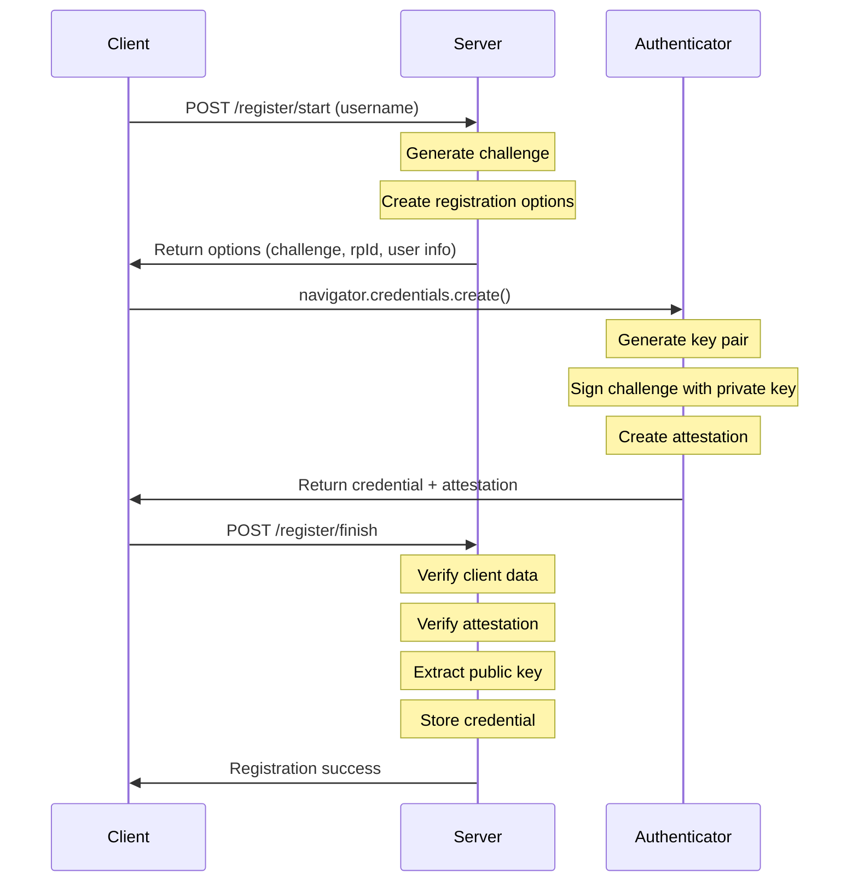
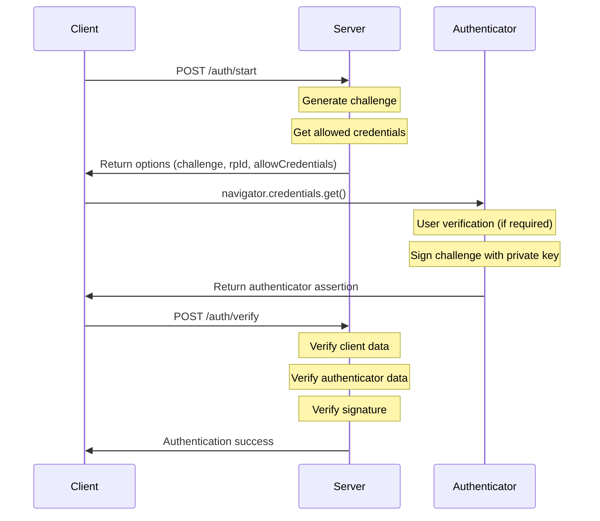

# Implementing WebAuthn Passkeys in Rust with Axum: A Learning Journey

As a developer learning web programming and authentication in Rust, I recently undertook the challenge of implementing WebAuthn Passkeys using the Axum web framework. In this post, I'll share my experience building a basic Passkey authentication system from scratch, without relying on full-featured WebAuthn library crates.

## What are Passkeys?

Passkeys are a modern authentication standard based on WebAuthn that replaces traditional passwords with public key cryptography. They offer several advantages:

- **No passwords to remember**: Users authenticate using their device's biometrics or PIN
- **Phishing-resistant**: Credentials are bound to specific origins
- **Better security**: Uses public key cryptography instead of shared secrets
- **Cross-platform**: Works across devices through platform authenticators (e.g., Google Password Manager)

## General Concept

WebAuthn Passkey authentication consists of two main phases: registration and authentication. Let's look at how each phase works at a high level.

### Registration Phase

During registration, the system:
1. Creates a new key pair in the authenticator
2. Sends the public key to the server with attestation information
3. Server verifies the attestation and stores the public key



### Authentication Phase

During authentication, the system:
1. Server sends a challenge to the client
2. Authenticator signs the challenge using the private key
3. Server verifies the signature using the stored public key



## Implementation Details

### Project Structure

The project is organized into several modules:

```
src/
├── main.rs               # Server setup and routing
├── passkey.rs           # Core types and utilities
└── passkey/
    ├── attestation.rs   # Attestation verification
    ├── auth.rs          # Authentication handling
    └── register.rs      # Registration handling
```

### Core Components

#### State Management

The application maintains state through several key structures:

```rust
#[derive(Clone)]
pub(crate) struct AppState {
    store: Arc<Mutex<AuthStore>>,
    rng: Arc<rand::SystemRandom>,
    config: AppConfig,
}

#[derive(Default)]
struct AuthStore {
    challenges: HashMap<String, StoredChallenge>,
    credentials: HashMap<String, StoredCredential>,
}

#[derive(Clone)]
struct AppConfig {
    origin: String,
    rp_id: String,
    authenticator_selection: AuthenticatorSelection,
}
```

### Registration Implementation

The registration process is implemented in `register.rs`. Here's a key example:

```rust
async fn start_registration(
    State(state): State<AppState>,
    Json(username): Json<String>,
) -> Json<RegistrationOptions> {
    // Generate challenge and create user info
    let mut challenge = vec![0u8; 32];
    state.rng.fill(&mut challenge).unwrap();

    let user_info = PublicKeyCredentialUserEntity {
        id: Uuid::new_v4().to_string(),
        name: username.clone(),
        display_name: username.clone(),
    };

    // Store challenge for verification
    let stored_challenge = StoredChallenge {
        challenge: challenge.clone(),
        user: user_info.clone(),
        timestamp: SystemTime::now()...
    };
    
    // Return registration options to client
    let options = RegistrationOptions {
        challenge: URL_SAFE.encode(&challenge),
        rp_id: state.config.rp_id.clone(),
        // ...other options
    };
}
```

#### Attestation Verification

The implementation supports two attestation formats:

1. **"none" Attestation Format** (Used by platform authenticators)
   - Verifies empty attestation statement
   - Checks RP ID hash and required flags
   - Validates credential public key format
   - Typically used by:
     - Windows Hello
     - Apple Touch ID / Face ID
     - Android biometric authenticators
     - Google Password Manager

2. **"packed" Attestation Format** (Used by security keys)
   - Verifies attestation certificate
   - Checks AAGUID matches
   - Validates certificate chain
   - Verifies attestation signature
   - Used by:
     - Physical security keys (YubiKey, etc.)
     - Some platform authenticators with hardware backing

### Authentication Implementation

The authentication process verifies the user's possession of the private key:

```rust
async fn verify_authentication(
    State(state): State<AppState>,
    Json(auth_response): Json<AuthenticatorResponse>,
) -> Result<&'static str, (StatusCode, String)> {
    // Verify client data (challenge, origin, type)
    let client_data = ParsedClientData::from_base64(&auth_response.response.client_data_json)?;
    client_data.verify(&state, &stored_challenge.challenge)?;

    // Verify authenticator data
    let auth_data = AuthenticatorData::from_base64(&auth_response.response.authenticator_data)?;
    auth_data.verify(&state)?;

    // Verify signature
    let credential = store.credentials.get(&auth_response.id)?;
    let public_key = UnparsedPublicKey::new(verification_algorithm, &credential.public_key);
    public_key.verify(&signed_data, &signature)?;
}
```

## Miscellaneous

### Configuration and Security Considerations

The implementation includes several security-related configurations:

```rust
let authenticator_selection = AuthenticatorSelection {
    // Prefer platform authenticators (e.g., Google Password Manager)
    authenticator_attachment: Some("platform".to_string()),
    
    // Require discoverable credentials
    resident_key: "required".to_string(),
    require_resident_key: Some(true),
    
    // User verification configuration
    user_verification: "discouraged".to_string(),
};
```

Key security features:

1. Origin checking prevents phishing attacks
2. Cryptographically random, single-use challenges
3. Comprehensive attestation verification
4. Secure cryptographic operations via the `ring` crate

### Lessons Learned

Building this from scratch provided valuable insights:

1. **WebAuthn Complexity**: The standard is intricate, with many moving parts
2. **CBOR Handling**: Working with CBOR data structures required careful parsing
3. **Cryptographic Operations**: Understanding challenges, signatures, and key formats was crucial

### Future Work

The next step is to integrate with OAuth2/OIDC:

1. Use Google as the identity provider for both Passkeys and OAuth2
2. Implement account linking
3. Add session management
4. Enhance error handling

## Conclusion

While this implementation is educational rather than production-ready, it demonstrates the core concepts of WebAuthn Passkeys. The code shows how to handle registration, attestation, and authentication flows using Rust and Axum.

For production systems, I recommend using established WebAuthn libraries that have undergone security audits. However, building from scratch has provided valuable insights into WebAuthn internals and security considerations.

## Resources

- [WebAuthn Specification](https://www.w3.org/TR/webauthn-2/)
- [Axum Documentation](https://docs.rs/axum)
- [Ring Cryptography](https://briansmith.org/rustdoc/ring/)

---

*Note: This implementation is for learning purposes and may need additional security reviews and improvements before production use.*