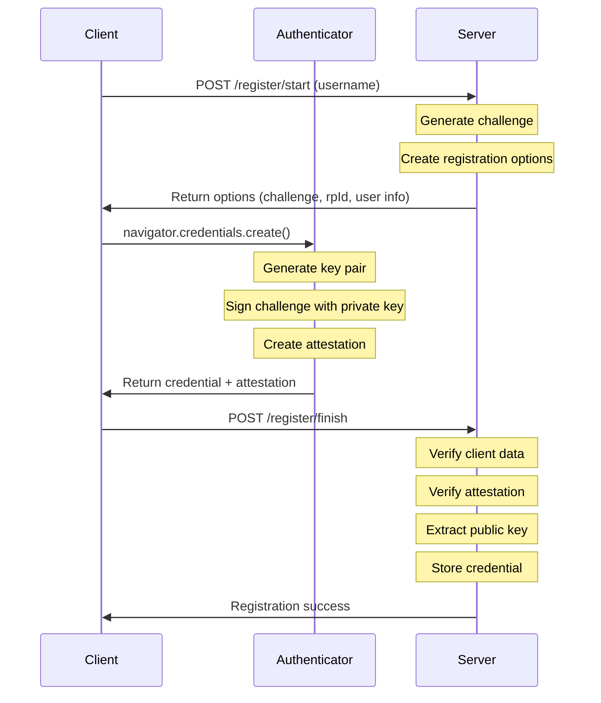
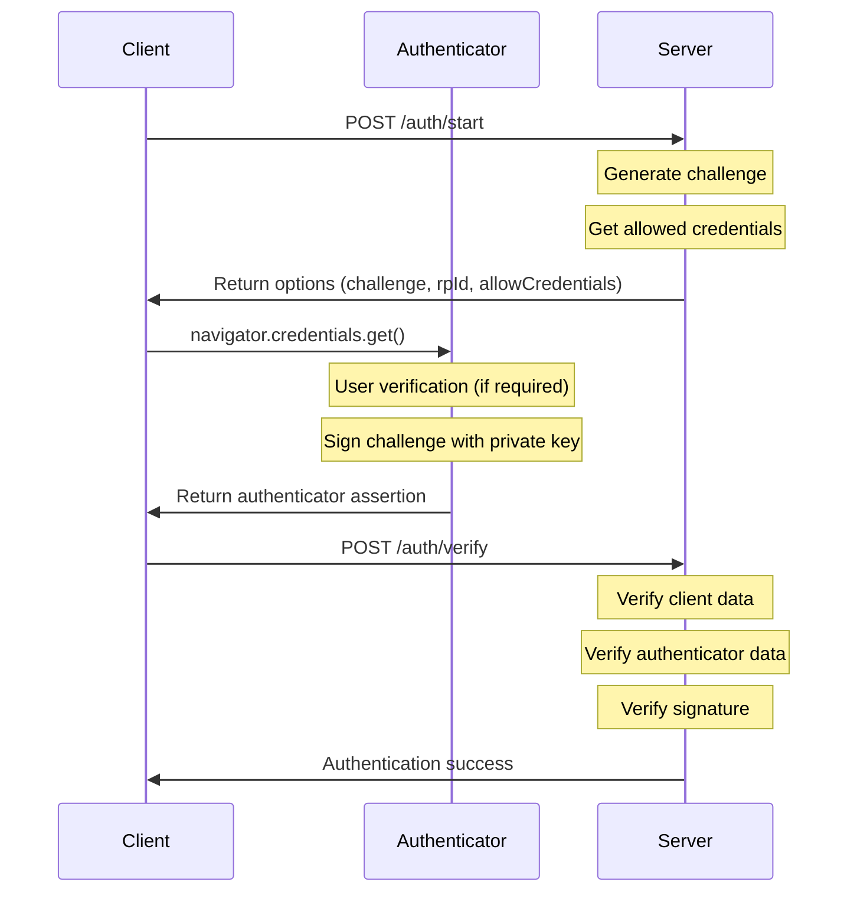

# Implementing WebAuthn Passkeys in Rust with Axum: A Learning Journey

As a developer learning web programming and authentication in Rust, I recently undertook the challenge of implementing WebAuthn Passkeys using the Axum web framework. In this post, I'll share my experience building a basic Passkey authentication system from scratch, without relying on full-featured WebAuthn library crates.

## What are Passkeys?

Passkeys are a modern authentication standard based on WebAuthn that replaces traditional passwords with public key cryptography. They offer several advantages:

- **No passwords to remember**: Users authenticate using their device's biometrics or PIN
- **Phishing-resistant**: Credentials are bound to specific origins
- **Better security**: Uses public key cryptography instead of shared secrets
- **Cross-platform**: Works across devices through platform authenticators (e.g., Google Password Manager or Apple key chain)

## General Concept

WebAuthn Passkey authentication consists of two main phases: registration and authentication. Let's look at how each phase works at a high level.

### Registration Phase

During registration, the system:

1. Server generate a challenge and options and return them to the client
1. The client creates a new key pair in the authenticator
2. Sends the public key to the server with attestation information
3. Server verifies the attestation and stores the public key



### Authentication Phase

During authentication, the system:

1. Server generates and sends a challenge to the client
2. Authenticator signs the challenge using the private key
3. Server verifies the signature using the stored public key



## Client-Side Implementation

Client side behaviour is controled by the JavaScript on the client browser provided by the server.

### JavaScript for Registration

First, let's look at how to interact with the WebAuthn API for registration:

1. Start registration: fetch options(including challenge) from the server

```javascript
// 1. Start registration
const response = await fetch('/register/start', {
    method: 'POST',
    headers: { 'Content-Type': 'application/json' },
    body: JSON.stringify(username)
});
const options = await response.json();
```

The server provides registration options in this format:

- (todo: explain what for a challenge exists)
- (todo: explain the importance of rp_id)
- (todo: explain the importance of user.id)
- (todo: briefly explain authenticatorSelection and refer it to lator section)

```json
{
    "challenge": "base64url-encoded-random-bytes",
    "rp_id": "example.com",
    "rp": {
        "name": "Example Service",
        "id": "example.com"
    },
    "user": {
        "id": "user-uuid",
        "name": "username",
        "displayName": "display name"
    },
    "pubKeyCredParams": [
        { "type": "public-key", "alg": -7 },  // ES256
        { "type": "public-key", "alg": -257 } // RS256
    ],
    "authenticatorSelection": {
        "authenticatorAttachment": "platform",
        "residentKey": "required",
        "userVerification": "discouraged"
    },
    "timeout": 60000
}
```

Create credentials using the options in the authenticator:

- creates a new key pair and receive public key as credential
- secret key never leaves authenticator

```javascript
// 2. Create credentials using the options
const credential = await navigator.credentials.create({
    publicKey: {
        challenge: base64URLToBuffer(options.challenge),
        rp: {
            name: options.rp.name,
            id: options.rp_id
        },
        user: {
            id: base64URLToBuffer(options.user.id),
            name: options.user.name,
            displayName: options.user.displayName
        },
        pubKeyCredParams: options.pub_key_cred_params,
        authenticatorSelection: options.authenticator_selection,
        timeout: options.timeout
    }
});
```

Sends the public key to the server with attestation information

- options.user.id is explicitly included as user_handle, since credential does not have any information that relates to the user who initiated the registration(todo: confirm if this is correct).

```javascript
// 3. Send credential to server
await fetch('/register/finish', {
    method: 'POST',
    headers: { 'Content-Type': 'application/json' },
    body: JSON.stringify({
        id: credential.id,
        rawId: bufferToBase64URL(credential.rawId),
        response: {
            clientDataJSON: bufferToBase64URL(credential.response.clientDataJSON),
            attestationObject: bufferToBase64URL(credential.response.attestationObject)
        },
        type: credential.type
        user_handle: options.user.id,
    })
});
```

### JavaScript for Authentication

The authentication process uses similar WebAuthn APIs:

Start authentication:

- Fetch options(including challenge) from the server

```javascript
// 1. Start authentication
const response = await fetch('/auth/start', {
    method: 'POST'
});
const options = await response.json();
```

The server returns authentication options in this format:

```json
{
    "challenge": "base64url-encoded-random-bytes",
    "timeout": 60000,
    "rp_id": "example.com",
    "allow_credentials": [
        {
            "type": "public-key",
            "id": "base64url-encoded-credential-id"
        }
    ],
    "user_verification": "discouraged",
    "auth_id": "unique-auth-session-id"
}
```

Get assertion from authenticator:

- let authenticator sign the challenge using the private key and obtain the result as assertion

```javascript
// 2. Get assertion from authenticator
const assertion = await navigator.credentials.get({
    publicKey: {
        challenge: base64URLToBuffer(options.challenge),
        rpId: options.rp_id,
        allowCredentials: options.allow_credentials.map(cred => ({
            id: base64URLToBuffer(cred.id),
            type: cred.type
        })),
        userVerification: options.user_verification,
        timeout: options.timeout
    }
});
```

Send assertion to the server:

```javascript
// 3. Send assertion to server
await fetch('/auth/verify', {
    method: 'POST',
    headers: { 'Content-Type': 'application/json' },
    body: JSON.stringify({
        id: assertion.id,
        rawId: bufferToBase64URL(assertion.rawId),
        response: {
            authenticatorData: bufferToBase64URL(assertion.response.authenticatorData),
            clientDataJSON: bufferToBase64URL(assertion.response.clientDataJSON),
            signature: bufferToBase64URL(assertion.response.signature),
            userHandle: bufferToBase64URL(assertion.response.userHandle)
        },
        type: assertion.type
    })
});
```

## Server Implementation

The server-side is implemented in Rust with Axum web framework.

### Project Structure

The project is organized into several modules:

```
src/
├── main.rs              # Server setup and routing
├── passkey.rs           # module definitions in the passkey directory 
└── passkey/
    ├── attestation.rs   # Attestation verification
    ├── auth.rs          # Authentication handling
    └── register.rs      # Registration handling
```

### State Management

In this implementation I chose to use HashMap for storing temporal data like challenges, as well as user credentials(public keys and user names) which is permanent.
For production key-value storages and SQL databases should be used for these respectively.

The AppState is the structure shared across the functions in this Axum application.
For HashMaps, the AuthStore, which is a member of AppState, is prepared.
So is the AppConfig, which include parameters referenced throughout this application.

```rust
#[derive(Clone)]
pub(crate) struct AppState {
    store: Arc<Mutex<AuthStore>>,
    rng: Arc<rand::SystemRandom>,
    config: AppConfig,
}

#[derive(Default)]
struct AuthStore {
    challenges: HashMap<String, StoredChallenge>,
    credentials: HashMap<String, StoredCredential>,
}

#[derive(Clone)]
struct AppConfig {
    origin: String,
    rp_id: String,
    authenticator_selection: AuthenticatorSelection,
}
```

### Registration Implementation

The server-side registration process is implemented in `register.rs`. Here's a key example:

The start_registration function generate uuid for user and challenge, and then store them in AuthStore(in AppState).
It will return options in Json body of HTTP response.

```rust
async fn start_registration(
    State(state): State<AppState>,
    Json(username): Json<String>,
) -> Json<RegistrationOptions> {
    // Generate challenge and create user info
    let mut challenge = vec![0u8; 32];
    state.rng.fill(&mut challenge).unwrap();

    let user_info = PublicKeyCredentialUserEntity {
        id: Uuid::new_v4().to_string(),
        name: username.clone(),
        display_name: username.clone(),
    };

    // Store challenge for verification
    let stored_challenge = StoredChallenge {
        challenge: challenge.clone(),
        user: user_info.clone(),
        timestamp: SystemTime::now()...
    };
    
    let mut store = state.store.lock().await;
    store
        .challenges
        .insert(user_info.id.clone(), stored_challenge);

    // Return registration options to client
    let options = RegistrationOptions {
        challenge: URL_SAFE.encode(&challenge),
        rp_id: state.config.rp_id.clone(),
        // ...other options
    };

    Json(options)
}
```

#### Attestation Verification

The implementation supports two attestation formats:

1. **"none" Attestation Format** (Used by platform authenticators)
   - Verifies empty attestation statement
   - Checks RP ID hash and required flags
   - Validates credential public key format
   - Typically used by:
     - Windows Hello
     - Apple Touch ID / Face ID
     - Android biometric authenticators
     - Google Password Manager

2. **"packed" Attestation Format** (Used by security keys)
   - Verifies attestation certificate
   - Checks AAGUID matches
   - Validates certificate chain
   - Verifies attestation signature
   - Used by:
     - Physical security keys (YubiKey, etc.)
     - Some platform authenticators with hardware backing

### Authentication Implementation

The server-side authentication process verifies the user's possession of the private key:

```rust
async fn verify_authentication(
    State(state): State<AppState>,
    Json(auth_response): Json<AuthenticatorResponse>,
) -> Result<&'static str, (StatusCode, String)> {
    // Verify client data (challenge, origin, type)
    let client_data = ParsedClientData::from_base64(&auth_response.response.client_data_json)?;
    client_data.verify(&state, &stored_challenge.challenge)?;

    // Verify authenticator data
    let auth_data = AuthenticatorData::from_base64(&auth_response.response.authenticator_data)?;
    auth_data.verify(&state)?;

    // Verify signature
    let credential = store.credentials.get(&auth_response.id)?;
    let public_key = UnparsedPublicKey::new(verification_algorithm, &credential.public_key);
    public_key.verify(&signed_data, &signature)?;
}
```

## Security Considerations

The implementation includes several security-related configurations:

```rust
let authenticator_selection = AuthenticatorSelection {
    // Prefer platform authenticators (e.g., Google Password Manager)
    authenticator_attachment: Some("platform".to_string()),
    
    // Require discoverable credentials
    resident_key: "required".to_string(),
    require_resident_key: Some(true),
    
    // User verification configuration
    user_verification: "discouraged".to_string(),
};
```

Key security features:

1. Origin checking prevents phishing attacks
2. Cryptographically random, single-use challenges
3. Comprehensive attestation verification
4. Secure cryptographic operations via the `ring` crate

## Future Work

The next step is to integrate with OAuth2/OIDC:

1. Use Google as the identity provider for both Passkeys and OAuth2
2. Implement account linking
3. Add session management
4. Enhance error handling

Some potential improvements include:
1. Adding a proper database backend
2. Implementing credential backup states
3. Enhancing user verification requirements
4. Adding comprehensive test coverage

## Conclusion

While this implementation is educational rather than production-ready, it demonstrates the core concepts of WebAuthn Passkeys. The code shows how to handle registration, attestation, and authentication flows using Rust and Axum.

Building this from scratch provided valuable insights about:
1. WebAuthn protocol complexity
2. CBOR data handling
3. Cryptographic operations
4. Rust's type system and ownership model

For production systems, I recommend using established WebAuthn libraries that have undergone security audits. However, building from scratch has provided valuable insights into WebAuthn internals and security considerations.

## Resources

- [WebAuthn Specification](https://www.w3.org/TR/webauthn-2/)
- [Axum Documentation](https://docs.rs/axum)
- [Ring Cryptography](https://briansmith.org/rustdoc/ring/)

---

*Note: This implementation is for learning purposes and may need additional security reviews and improvements before production use.*
