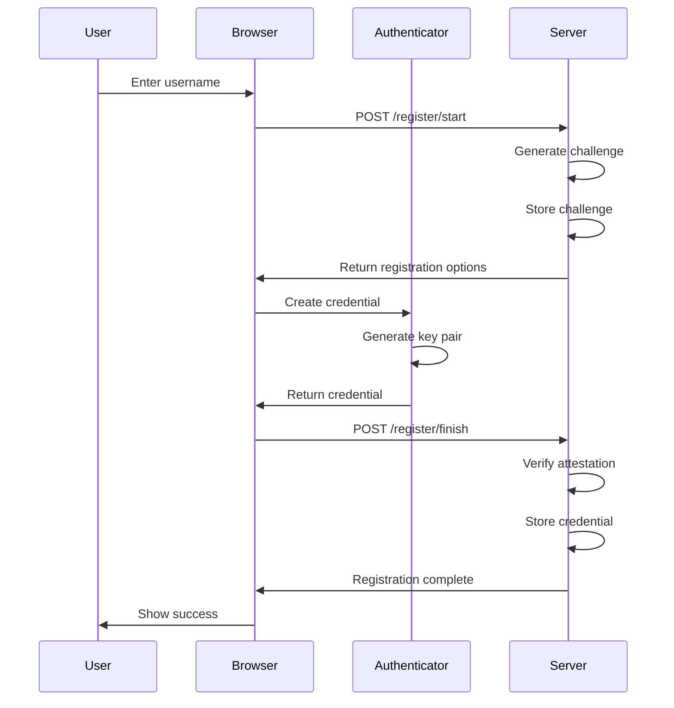
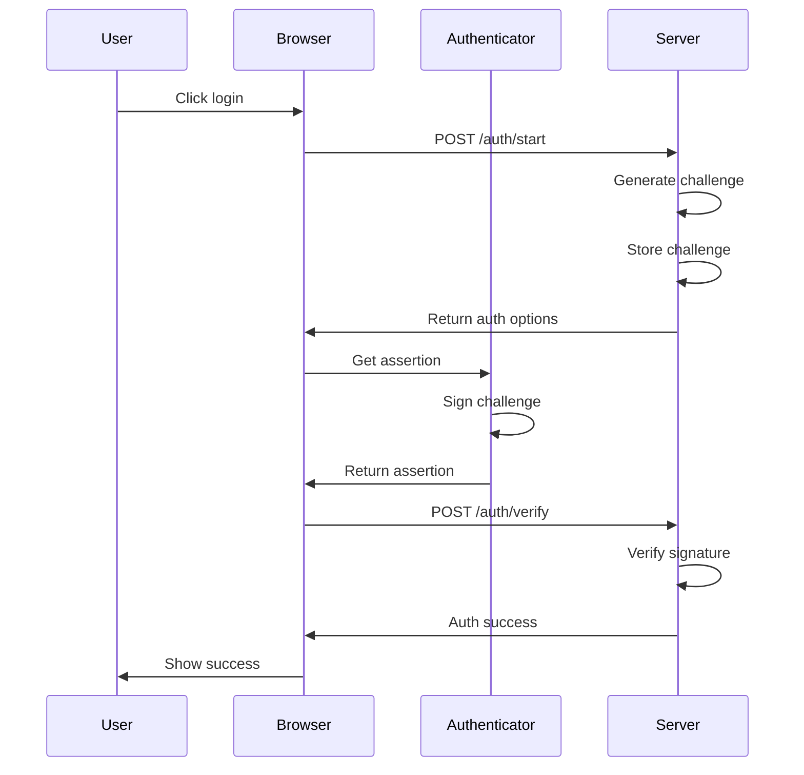

# Implementing WebAuthn Passkeys in Rust with Axum

As a developer learning web programming and authentication in Rust, I recently undertook the challenge of implementing WebAuthn Passkeys using the Axum web framework. Instead of relying on existing WebAuthn libraries, I chose to implement the core functionality from scratch to better understand the underlying mechanisms. In this post, I'll share my experience and insights from building this system.

## What are Passkeys?

Passkeys are a modern authentication standard that extends WebAuthn to provide a more secure and user-friendly alternative to traditional passwords. They leverage public-key cryptography and platform authenticators (like biometric sensors or security keys) to create a phishing-resistant authentication system.

## Project Structure

The implementation is organized into several modules:

```
src/
├── main.rs              # Server setup and routing
├── passkey.rs           # Core types and state management
├── passkey/
│   ├── attestation.rs   # Attestation verification
│   ├── auth.rs         # Authentication handling
│   └── register.rs     # Registration handling
```

## Core Components

### 1. State Management

The application maintains state using several key structures:

```rust
#[derive(Clone)]
pub(crate) struct AppState {
    store: Arc<Mutex<AuthStore>>,
    rng: Arc<rand::SystemRandom>,
    config: AppConfig,
}

#[derive(Default)]
struct AuthStore {
    challenges: HashMap<String, StoredChallenge>,
    credentials: HashMap<String, StoredCredential>,
}

#[derive(Clone)]
struct AppConfig {
    origin: String,
    rp_id: String,
    authenticator_selection: AuthenticatorSelection,
}
```

The `AuthStore` manages two critical pieces of data:
- `challenges`: Stores temporary challenges during registration/authentication
- `credentials`: Stores user credentials including public keys and metadata

The `AppConfig` contains configuration parameters:
- `origin`: The application's origin (e.g., "https://example.com")
- `rp_id`: The Relying Party ID (typically the domain name)
- `authenticator_selection`: Preferences for authenticator behavior including:
  - Platform vs. cross-platform authenticator preference
  - Resident key requirements
  - User verification preferences

This design allows for thread-safe access to the authentication store and configuration while maintaining clean separation of concerns.

### 2. Registration Flow

The registration process involves two main steps:



a) Starting registration:
- Generate a cryptographic challenge
- Create registration options including RP ID, user info, and authenticator selection criteria
- Store the challenge for later verification

b) Finishing registration:
- Verify the client data and attestation
- Extract and store the credential public key
- Handle different attestation formats (none, packed)

### 3. Authentication Flow

The authentication process mirrors the registration flow:



a) Starting authentication:
- Generate a new challenge
- Create authentication options with available credentials
- Store the challenge

b) Verifying authentication:
- Verify the client data and challenge
- Validate the authenticator response flags
- Verify the cryptographic signature using the stored public key

### 4. Attestation Verification

One of the more complex parts of the implementation is the attestation verification in `attestation.rs`. The system supports two main attestation formats:

#### "none" Attestation Format
Typically used by platform authenticators (like Google Password Manager, Apple Keychain, or Windows Hello), this format focuses on basic security checks:
- Verify the attestation statement is empty
- Validate the RP ID hash
- Check required flags (user presence, user verification if required)
- Verify the credential public key format
- Validate the AAGUID (Authenticator Attestation GUID)

#### "packed" Attestation Format
Used by security keys and some platform authenticators, this format provides additional security through attestation certificates:
- Verify the attestation certificate chain
- Validate certificate attributes (non-CA, validity period)
- Check AAGUID matches between certificate and authenticator data
- Verify the attestation signature
- Support for self-attestation when no certificate is provided

#### Platform Authenticators
Platform authenticators are built into the user's device or operating system:
- **Google Password Manager**: Integrated into Chrome and Android devices
- **Apple Keychain**: Available on macOS and iOS devices
- **Windows Hello**: Built into Windows 10+ systems
- **Android's BiometricPrompt**: Used on Android devices

These authenticators typically use the "none" attestation format but provide strong security through:
- Hardware-backed key storage
- Biometric verification (fingerprint, face recognition)
- Integration with the platform's security features

The trust in platform authenticators comes from the platform itself rather than attestation certificates, which is why they commonly use the "none" format. When integrating with OAuth2/OIDC (planned future work), the trust anchor (e.g., Google account) provides additional validation of the authenticator's legitimacy.

## Key Technical Decisions

1. **Raw Implementation vs. Libraries**
   Instead of using existing WebAuthn libraries, I implemented the core functionality using lower-level cryptographic primitives from the `ring` crate. This approach provided valuable insights into the WebAuthn protocol's internals.

2. **State Management**
   The implementation uses `Arc<Mutex<>>` for thread-safe state management, allowing multiple concurrent requests while maintaining data consistency.

3. **Error Handling**
   A custom error handling system using `thiserror` provides clear and specific error messages for different failure scenarios.

4. **Cryptographic Operations**
   The implementation relies on the `ring` crate for cryptographic operations and `webpki` for certificate validation, providing a solid foundation for security-critical operations.

## Future Improvements

1. **OAuth2/OIDC Integration**
   A natural extension would be integrating this Passkey implementation with OAuth2/OIDC. Since many users already have Google accounts set up with their platform authenticators, this integration would provide a seamless authentication experience.

2. **Persistence Layer**
   The current implementation uses in-memory storage. Adding a proper database backend would make it production-ready.

3. **Enhanced Security Features**
   Additional security features could include:
   - Credential backup states
   - User verification requirement configuration
   - Authenticator attachment enforcement

4. **Compliance and Testing**
   - Adding comprehensive test coverage
   - Ensuring FIDO2 compliance
   - Implementing security best practices

## Challenges and Learnings

1. **WebAuthn Complexity**
   The WebAuthn specification is extensive and complex. Implementing it from scratch revealed many nuances in the protocol, particularly around attestation verification and signature validation.

2. **Rust Type System**
   Rust's type system proved invaluable in handling complex data structures and ensuring thread safety, but required careful consideration of ownership and borrowing patterns.

3. **Error Handling**
   Proper error handling in a security-critical application requires careful consideration. The implementation uses custom error types to provide clear feedback while maintaining security.

## Conclusion

Building a WebAuthn Passkey implementation from scratch was an enlightening experience that provided deep insights into both the protocol and Rust web development. While the current implementation has room for improvement, it serves as a solid foundation for understanding WebAuthn and building more sophisticated authentication systems.

For developers interested in learning about WebAuthn or Rust web development, implementing core functionality from scratch can be an invaluable learning experience. However, for production systems, using well-tested WebAuthn libraries would be more appropriate.

The code is structured to facilitate future integration with OAuth2/OIDC systems, particularly focusing on Google accounts as a trust anchor. This alignment between Passkey and OAuth2 trust anchors could provide a seamless and secure authentication experience for users.
