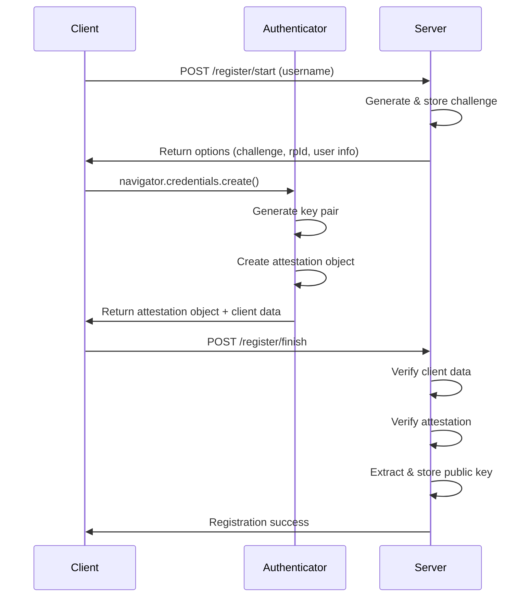
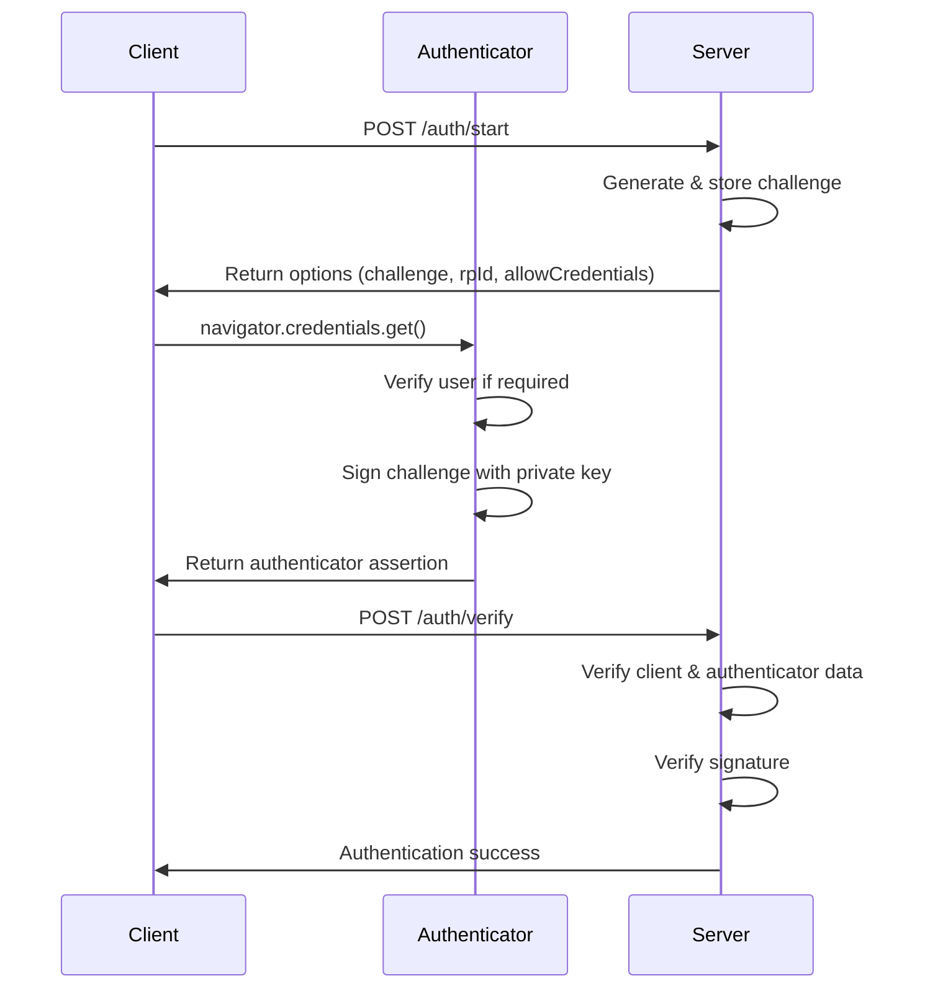

<!-- # Implementing Passkeys Authentication in Rust with Axum -->

- [Introduction](#introduction)
- [Understanding WebAuthn and Passkeys](#understanding-webauthn-and-passkeys)
- [The WebAuthn Flow](#the-webauthn-flow)
  - [Registration Flow](#registration-flow)
  - [Authentication Flow](#authentication-flow)
- [Client-Side Implementation](#client-side-implementation)
  - [Registration Implementation](#registration-implementation)
  - [Authentication Implementation](#authentication-implementation)
- [Server Implementation in Rust](#server-implementation-in-rust)
  - [State Management](#state-management)
  - [Registration Handler Implementation](#registration-handler-implementation)
  - [Authentication Handler Implementation](#authentication-handler-implementation)
- [What's Next](#whats-next)
  - [Session management](#session-management)
  - [OAuth2/OIDC integration](#oauth2oidc-integration)
  - [Storage](#storage)
- [Conclusion](#conclusion)
  - [Resources](#resources)

# Introduction

As a developer learning web programming and authentication in Rust, I recently undertook the challenge of implementing WebAuthn Passkeys using the Axum web framework. In this post, I'll share my experience building a basic Passkey authentication system from scratch, without relying on full-featured WebAuthn library crates.

To keep things concise, I’ve included simplified code snippets for key components. The full implementation is available in my [GitHub repository](https://github.com/ktaka-ccmp/axum-passkey).

# Understanding WebAuthn and Passkeys

WebAuthn is a W3C standard for passwordless authentication that uses public-key cryptography. The private keys are stored securely on user devices while public keys remain on servers. WebAuthn supports both platform authenticators (like Windows Hello or Touch ID) and roaming authenticators (like security keys).

Passkeys extend WebAuthn by adding seamless account recovery through cloud-synced credentials. They integrate with platform authenticators like Google Password Manager or Apple Keychain, enabling users to authenticate using biometrics or PINs across their devices. This implementation is built on the FIDO2 protocol, which standardizes the authentication flow and user interface.

# The WebAuthn Flow

WebAuthn authentication involves two main phases: registration and authentication. Let's examine how each phase works and then implement them.

## Registration Flow

During registration, the server first generates a cryptographic challenge and sends it to the client along with registration options. The client then requests its authenticator to create a new key pair and generate an attestation object containing the public key. This attestation object is sent back to the server, which verifies it and stores the public key for future authentication.



The attestation object returned by the authenticator contains authenticator data (including the new public key) and an attestation statement that provides information about the authenticator itself. This allows the server to verify the authenticator's authenticity and securely obtain the user's public key.

## Authentication Flow

The authentication process begins with the server generating a new challenge. The authenticator then signs this challenge using the user's private key, and the server verifies the signature using the stored public key.



# Client-Side Implementation

The client-side implementation handles both registration and authentication flows using the WebAuthn browser APIs. Let's walk through each process step by step.

## Registration Implementation

The registration process begins by requesting options from the server. This establishes the parameters for creating a new credential:

```javascript
const response = await fetch('/register/start', {
    method: 'POST',
    headers: { 'Content-Type': 'application/json' },
    body: JSON.stringify(username)
});
const options = await response.json();
```

The server responds with registration options that specify how the credential should be created. Here are the key parameters:

```json
{
    "challenge": "base64url-encoded-random-bytes",
    "rp_id": "example.com",
    "user": {
        "id": "user-uuid",
        "name": "username"
    },
    "authenticatorSelection": {
        "authenticatorAttachment": "platform",
        "residentKey": "required"
    }
}
```

The challenge is a one-time cryptographic value that prevents replay attacks. The rp_id binds the credential to our domain for phishing protection, while the user.id provides a stable identifier for the credential. The authenticatorSelection parameters determine how the credential will be stored and used.

With these options, we can create the credential using the WebAuthn API:

```javascript
const credential = await navigator.credentials.create({
    publicKey: {
        challenge: base64URLToBuffer(options.challenge),
        rp: { id: options.rp_id },
        user: {
            id: base64URLToBuffer(options.user.id),
            name: options.user.name
        }
    }
});
```

This code triggers the authenticator to generate a new key pair. In principle, the private key never leaves the authenticator, while the public key is included in the response. We then send this response back to the server:

```javascript
await fetch('/register/finish', {
    method: 'POST',
    headers: { 'Content-Type': 'application/json' },
    body: JSON.stringify({
        id: credential.id,
        rawId: bufferToBase64URL(credential.rawId),
        response: {
            attestationObject: bufferToBase64URL(credential.response.attestationObject),
            client_data_json: bufferToBase64URL(credential.response.clientDataJSON)
        },
        user_handle: options.user.id
    })
});
```

The server will verify this response and store the public key for future authentications.

## Authentication Implementation

The authentication flow follows a similar pattern but focuses on proving possession of an existing credential. We start by requesting authentication options:

```javascript
const response = await fetch('/auth/start', { method: 'POST' });
const options = await response.json();
```

The server provides a challenge and information about accepted credentials:

```json
{
    "challenge": "base64url-encoded-random-bytes",
    "rp_id": "example.com",
    // Sending "allow_credentials" is optional for discoverable credentials. 
    "allow_credentials": [
        {
            "type": "public-key",
            "id": "credential-id"
        }
    ]
}
```

Using these options, we ask the authenticator to sign the challenge with the private key:

```javascript
const assertion = await navigator.credentials.get({
    publicKey: {
        challenge: base64URLToBuffer(options.challenge),
        rpId: options.rp_id,
        allowCredentials: options.allow_credentials.map(cred => ({
            id: base64URLToBuffer(cred.id),
            type: cred.type
        }))
    }
});
```

The authenticator will prompt the user for consent (and potentially biometric verification) before signing. We then send the signed assertion to the server:

```javascript
await fetch('/auth/verify', {
    method: 'POST',
    headers: { 'Content-Type': 'application/json' },
    body: JSON.stringify({
        id: assertion.id,
        response: {
            signature: bufferToBase64URL(credential.response.signature),
            authenticator_data: bufferToBase64URL(credential.response.authenticatorData),
            client_data_json: bufferToBase64URL(credential.response.clientDataJSON),
            user_handle: bufferToBase64URL(credential.response.userHandle)
        }
    })
});
```

# Server Implementation in Rust

The server side of our WebAuthn implementation handles credential storage, challenge generation, and cryptographic verification. Our Axum-based implementation is organized into focused modules that handle different aspects of the authentication process:

```bash
src/
├── main.rs              # Server setup and routing
├── passkey.rs           # Module definitions
└── passkey/
    ├── attestation.rs   # Attestation verification
    ├── auth.rs          # Authentication handling
    └── register.rs      # Registration handling
```

The attestation module verifies new credentials during registration, the auth module handles login attempts, and the register module manages the credential creation process.

## State Management

Before diving into the handlers, let's look at how we manage server-side state:

```rust
#[derive(Clone)]
pub(crate) struct AppState {
    store: Arc<Mutex<AuthStore>>,
    config: AppConfig,
}
```

This structure provides thread-safe access to our storage and configuration. The AuthStore handles both temporary challenges and permanent credentials:

```rust
#[derive(Default)]
struct AuthStore {
    challenges: HashMap<String, StoredChallenge>,
    credentials: HashMap<String, StoredCredential>,
}
```

For a production environment, you'd replace these HashMaps with proper databases - perhaps Redis for challenges and PostgreSQL for credentials.

## Registration Handler Implementation

The registration process consists of two main functions. The start_registration function creates a new user identity and challenge, preparing the server side for credential creation:

```rust
async fn start_registration(
    State(state): State<AppState>,
    Json(username): Json<String>,
) -> Json<RegistrationOptions> {
    // Generate challenge and create user info
    let challenge = generate_challenge();

    let user_info = PublicKeyCredentialUserEntity {
        id: Uuid::new_v4().to_string(),
        name: username.clone(),
        display_name: username.clone(),
    };

    // Store challenge for verification
    let stored_challenge = StoredChallenge {
        challenge: challenge.clone(),
        user: user_info.clone(),
        timestamp: SystemTime::now()...
    };
    
    let mut store = state.store.lock().await;
    store
        .challenges
        .insert(user_info.id.clone(), stored_challenge);

    // Return registration options
    Json(RegistrationOptions {
        challenge: URL_SAFE.encode(&challenge),
        rp_id: state.config.rp_id.clone(),
        // ...other options
    })
}
```

The finish_registration function processes the authenticator's response, verifying the attestation and storing the new credential:

```rust
async fn finish_registration(
    State(state): State<AppState>,
    Json(reg_data): Json<RegisterCredential>,
) -> Result<&'static str, (StatusCode, String)> {
    let mut store = state.store.lock().await;

    // Verify the challenge and client data
    verify_client_data(&state, &reg_data, &store).await?;

    // Extract the public key from attestation
    let public_key = extract_credential_public_key(&reg_data, &state)?;

    // Store credential with user info
    let credential_id = base64url_decode(&reg_data.raw_id)?;
    let stored_user = store.challenges.get(&reg_data.user_handle)?.user.clone();

    store.credentials.insert(
        reg_data.raw_id.clone(),
        StoredCredential {
            credential_id,
            public_key,
            counter: 0,
            user: stored_user,
        },
    );

    // Remove used challenge
    store.challenges.remove(&reg_data.user_handle);

    Ok("Registration successful")
}
```

This function performs several critical security checks:

1. Verifies that the client data matches expectations (challenge, origin, operation type)
2. Extracts and verifies the public key from the attestation object
3. Stores the credential with associated user information
4. Removes the used challenge to prevent replay attacks

## Authentication Handler Implementation

The authentication process also uses two main functions. The start_authentication function generates a new challenge for an authentication attempt:

```rust
async fn start_authentication(
    State(state): State<AppState>
) -> Json<AuthenticationOptions> {
    // Generate new challenge
    let challenge = generate_challenge();

    // Create auth ID for this session
    let auth_id = Uuid::new_v4().to_string();

    // Store challenge for verification
    let stored_challenge = StoredChallenge {
        challenge: challenge.clone(),
        user: Default::default(),
        timestamp: SystemTime::now()...
    };

    let mut store = state.store.lock().await;
    store.challenges.insert(auth_id.clone(), stored_challenge);

    // Return auth options
    Json(AuthenticationOptions {
        challenge: URL_SAFE.encode(&challenge),
        rp_id: state.config.rp_id.clone(),
        // ... other options
    })
}
```

The verify_authentication function processes the authenticator's signed assertion, verifying the signature and associated data:

```rust
async fn verify_authentication(
    State(state): State<AppState>,
    Json(auth_response): Json<AuthenticatorResponse>,
) -> Result<&'static str, (StatusCode, String)> {
    // Verify client data
    let client_data = ParsedClientData::from_base64(&auth_response.response.client_data_json)?;
    client_data.verify(&state, &stored_challenge.challenge)?;

    // Verify authenticator data
    let auth_data = AuthenticatorData::from_base64(&auth_response.response.authenticator_data)?;
    auth_data.verify(&state)?;

    // Verify signature
    let credential = store.credentials.get(&auth_response.id)?;
    let public_key = UnparsedPublicKey::new(verification_algorithm, &credential.public_key);
    public_key.verify(&signed_data, &signature)?;

    Ok("Authentication successful")
}
```

This function performs three main security checks:

1. Verifies the client data (challenge, origin, operation type)
2. Validates the authenticator data (RP ID hash, user presence, verification status)
3. Verifies the signature using the stored public key

If these verifications are successful, a session can be created and the user is regarded as logged in.

# What's Next

While this basic implementation demonstrates the core concepts of WebAuthn Passkeys, several enhancements would make it production-ready:

## Session management

In production session management using session cookie or "Authentication: bearer token" header. This will enable us to identify access from authenticated users.

## OAuth2/OIDC integration

The system could integrate with OAuth2/OIDC providers like Google or Apple, enabling single sign-on and unified account management. This would allow users to seamlessly link their Passkey credentials with existing accounts.

## Storage

The current in-memory storage would need to be replaced with proper databases - SQL for user credentials and Redis for temporary challenge states. This would provide the scalability and persistence needed for production use.

# Conclusion

Building a WebAuthn Passkey implementation from scratch was an enlightening experience that provided deep insights into both modern authentication and Rust web development. The experience showed how standards like WebAuthn and tools like Rust can make secure authentication more accessible to developers, while still demanding careful attention to security considerations.

While implementing core functionality from scratch proved to be an invaluable learning experience, production systems should rely on established, well-tested WebAuthn libraries that have undergone security audits. The insights gained from this exercise, however, will prove valuable when working with these production libraries, as understanding WebAuthn's internals helps make better architectural decisions.

## Resources

[WebAuthn Guide](https://webauthn.guide/) - A practical guide to implementing WebAuthn authentication
[Passkeys.dev](https://passkeys.dev/) - Resources and best practices for Passkey authentication
