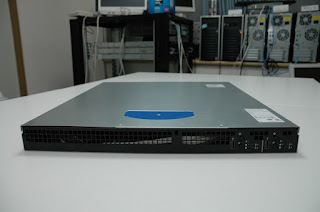
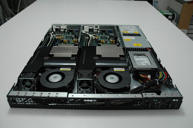

+++
title = "Intel 2in1 サーバーはコストパフォーマンスが高い"
date = 2008-11-02
description = "Intel SR1520ML 2in1ベアボーンサーバのコストパフォーマンスの紹介。"
path = "2008/11/intel-2in1.html"
+++

[IntelのベアボーンSR1520MLを使ったローコストサーバ。](http://www.clustcom.com/content/view/153/34/)
同等スペックの1Uサーバ二台分のよりも、10万円以上安価です。

Quad Core プロセッサ対応のマザーボード、X38MLが二枚搭載されています。

X38MLは一枚で、Gigabit Ether 2ポート, IPMIオンボード搭載、メモリスロット4つ(最大容量8GByte)、高速なQuadCoreプロセッサを搭載可能等といった特徴があります。

電源共通のためメンテナンス性は若干落ちますが、省スペースで高性能。

HPCクラスタの計算ノードや、大規模WEBクラスタのノードにいかがでしょうか。
