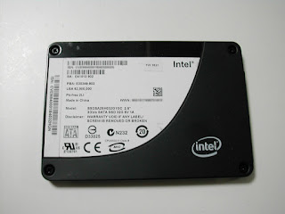

+++
title = "Intelの爆速SSD"
date = 2009-01-13
description = "Intel SSD X25-Eの爆速性能の評価レポート紹介。"
path = "2009/01/intelssd.html"
+++

Intelの爆速SSD、X25-Eを評価中です。

公称性能 シーケンシャルリード250MB/s、シーケンシャルライト170MB/s
結果は、やはり爆速でした。
詳しくは、[評価レポート](http://www.clustcom.com/content/view/159/32/)をご参照ください。

評価をしてくれたのは、アルバイトの須永くんです。
須永くんはSFCの3年生です。
須永くん、ありがとう。

これだけ速いと、RAIDで8本束ねれば、1GB/s越えが狙えるかもしれませんね。
楽しみです。
