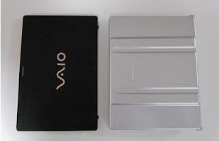
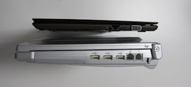

+++
title = "VAIO X 購入しました"
date = 2009-10-31
description = "軽量薄型ネットブックVAIO Xを購入しDebianを導入した話。"
path = "2009/10/vaio-x.html"
+++

薄くて、軽くて、電池が長持ち、SonyのネットブックVAIO Xを購入しました。

- CPU Intel Atom Z540 (1.86GHz)
- メモリー2GByte
- SSD 64GByte
- Lバッテリで約10時間駆動
- 重量　0.765kg
- 厚み　13.9mm
- 無線 IEEE802.11b/g/n
- ＬＡＮ 1000Base-T

スペックは必要にして十分。CPUが64ビット対応でないのだけが残念。(仕事で必要なので。)

写真は、Let’ｓ note T7と、大きさを比較したもの。Let's noteも1.2kgで電池の持ちも良かったんですが、VAIO Xはそれよりも上を(下を？)行く大きさと、軽さです。

本当にノートを持ち歩く感覚です。

ソニーの宣伝文句は「余分はいらない。十分がほしい。」ということみたいなので、
早速、Windows 7を消して、Debianを入れました。
