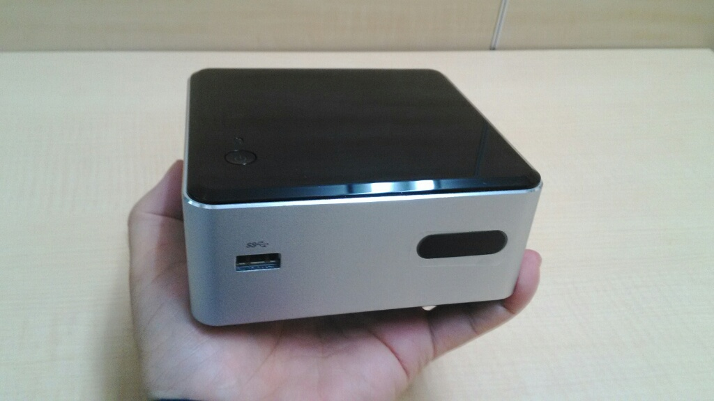
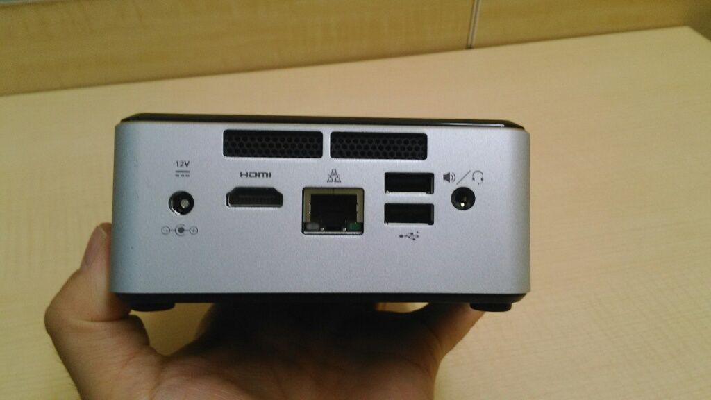

+++
title = "デスクトップパソコン新調"
date = 2015-10-03
path = "2015/10/blog-post.html"
+++

みなさん、こんにちは。そろそろブログを書かなきゃなと思いつつ10ヶ月以上もブログ更新していないことに気づきました。もう何でもいいから書いてみようと思います(笑)

先日、会社で使っているデスクトップパソコンを新しくしました。パソコンのモデルは、Intelの[NUC BOXDN2820FYKH0](http://www.intel.co.jp/content/www/jp/ja/nuc/nuc-kit-dn2820fykh.html)というやつで、[Celeron N2820](http://ark.intel.com/ja/products/79052/Intel-Celeron-Processor-N2820-1M-Cache-up-to-2_39-GHz)というデュアルコアHTなCPUが乗っています。このCPUはTDPがわずか7.5Wととても低消費電力で、電気代が安く済むので、各拠点のルーターとしても重宝しています。今回はルータ用に買ったあまりをデスクトップ用に転用しました。

主なインターフェースは、HDMI、1G LAN(Realtek)、usb 2.0 x2 、usb 3.0 x 1などです。他にwifi/bluetooth用のチップも内蔵しています。

OSはもちろんLinux。今回はDebian jessieをインストールしました。

最近のLinuxはインストールするだけで、特に苦労もせずXや日本語入力環境が使えるので、非常に助かります。(Macイラねんじゃね？とはいえMacbook Air愛用しておりますが…)

備忘録 chrome音が出ない件。

以下のコマンドで見ると、HDA Intel PCHというデバイスが搭載されており、ALC283とHDMIの２つの出力デバイスがある。

> ktaka@jessie:~$ aplay -l
>
> **** List of PLAYBACK Hardware Devices ****
>
> card 0: PCH [HDA Intel PCH], device 0: ALC283 Analog [ALC283 Analog]
>
>   Subdevices: 1/1
>
>   Subdevice #0: subdevice #0
>
> card 0: PCH [HDA Intel PCH], device 3: HDMI 0 [HDMI 0]
>
>   Subdevices: 1/1
>
>   Subdevice #0: subdevice #0

次のコマンドで、音が出るかどうか試してみるとちゃんと出る。

> aplay -D plughw:0,3 /usr/share/sounds/alsa/Front_Center.wav 

次のファイルを書き換えXを再起動したところ、chromeでyoutubeなどの音声が聞こえるようになりました。

> /etc/asound.conf
>
> pcm.!default { type hw; card 0 ; device 3; }
>
> ctl.!default { type hw; card 0 ; device 3; }

以上、オチもまとめもないんですけど、

最近のLinuxはデスクトップとしても簡単に使えるので、皆さん使ってみましょう！
