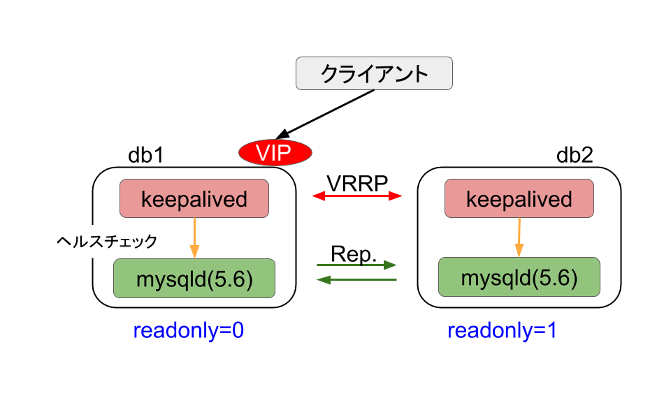

+++
title = "Keepalivedで作るMySQLフェイルオーバーシステム"
date = 2015-12-22
description = "KeepalivedのVRRP機能とMySQLの双方向レプリケーションを組み合わせた、約4秒以内にフェイルオーバーするMySQLの冗長化構成の解説。"
path = "2015/12/keepalivedmysql.html"
+++

## 1. はじめに

この記事は[MySQL Casual Advent Calendar 2015](http://qiita.com/advent-calendar/2015/mysql-casual)の22日目のエントリです。

先日、[MySQL Casual Talks](http://mysql-casual.connpass.com/event/22334/)という勉強会で登壇してきました。その時の内容をまとめておきたいと思います。

MySQLデータベースサーバに障害が起きた時、サービスを続けるには幾つかの方法があります。障害発生時にSlaveサーバーを手作業でMasterに昇格させる方法、[MySQL Utilities](http://dev.mysql.com/downloads/utilities/)に含まれるmysqlfailoverというユーティリティーを利用する方法などです。

今回、Keepalivedというソフトウェアと、MySQLの双方向レプリケーションを使って、ほぼ無停止でフェイルオーバーする構成を試してみたので、それについてまとめておきたいと思います。

## 2. システム構成



db1、db2という二つのサーバで、それぞれmysqldとkeepalivedを動かします。mysqldはお互いがMasterとなる双方向レプリケーションを行います。keepalivedはそれぞれのサーバで[mysqldのヘルスチェック](https://github.com/ktaka-ccmp/mysql-casual-20151220/blob/mysql56/files/etc/keepalived/vrrp/mysqlchk.sh)を行い、どちらかがVRRPのMasterもう一方がBackupの状態となり、MasterにVirtual IP(VIP)を付与します。上の図ではdb1が現在のVRRP Masterということになります。双方向レプリケーションを行う場合に同時に両方のサーバへの書き込みを許可すると、データの不整合や、レプリケーションの停止を引き起こしてしまうことが知られています。今回VRRPスレーブに誤って書き込みが行われないようにスレーブにreadonly=1のフラグを立てておきます。


もしdb1のmysqldが停止ししkeepalivedのヘルスチェックに失敗した場合、db1のkeepalivedはFAULTステートに移行します。一方db2のkeepalivedはVRRP Masterステートに移行しVIPが付与され、クライアントからのアクセスはdb2に向かうようになります。db2のkeepalivedがMasterに昇格する際には、[スクリプトによりreadonly=0となり書き込みが可能になるようにしています](https://github.com/ktaka-ccmp/mysql-casual-20151220/blob/mysql56/files/etc/keepalived/vrrp/master.sh#L15)。

この構成では、Keepalivedを使うことで迅速かつ安定的にフェイルオーバーが実行できること、あらかじめ双方向レプリケーションが行われているので障害発生時にCHANGE MASTER をする必要がなくシンプルであることがメリットだと考えられます。

## 3. VRRPってなに？

VRRP(Virtual Router Redundancy Protocol)は、もともと2台のルーターの冗長化のために作られたプロトコルで、RFCで規定されています。。下の図は、今回利用したKeepalived v1.2.13 が準拠している[VRRP version 2](https://tools.ietf.org/rfc/rfc3768.txt)の動きを説明するものです。


VRRP v2では、プライオリティに基づいてMasterとBackupサーバーが決定され、MasterのみがVRRPアドバタイズパケットを予め定められた間隔、例えば１秒間隔で送信します。Masterからのアドバタイズパケットが一定期間途切れると、BackupサーバがMasterサーバに状態遷移します。

#### ヘルスチェック

KeepalivedのVRRPデーモンには、RFCで規定されたVRRPプロコルの機能に加え、おまけとしてヘルスチェック機能があります。これによりスクリプトでmysqldの死活を監視し、監視が失敗するとKeepalivedのステータスをFAULTに遷移させることができます。この場合プライオリティ=0のVRRPアドバタイズパケットが送信され、直ちにBackupサーバがMasterに昇格します。

以下の設定は、[keepalivedの設定ファイル](https://github.com/ktaka-ccmp/mysql-casual-20151220/blob/mysql56/files/etc/keepalived/vrrp/vrrp.conf)の一部ですが１秒に一回ヘルスチェックスクリプト"/etc/keepalived/vrrp/mysqlchk.sh"を実行し、二回失敗したらFAULTステートにし、２回成功するとBACKUPかMASTERに戻しています。

```
 vrrp_script mysqlchk {
     script "/etc/keepalived/vrrp/mysqlchk.sh"
     interval 1                    ← 1秒ごとにチェック
     fall 2                          ← 2回失敗したらFAULT
     rise 2                         ← 2回成功でBACKUP or MASTER
 }
```

ヘルスチェックファイル"mysqlchk.sh"の内容は、今回は次のようになっていて、ソケット経由で、"show variables like 'server_id';"に応答できるかどうかを確認しています。

```
 mysql -S $SOCK --connect-timeout=$TIMEOUT -e "show variables like 'server_id';"
```

#### VRRPのフェイルオーバー時間

障害時にVRRPのフェイルオーバーにかかる時間は、大まかに以下のふた通りに分けることができます。

- mysqldのみ死んだ場合

- keepalivedがFAULTステートになりpriority=0のVRRP Advertパケットを送信します。

- これを受信したBACKUPステートにいるkeepalivedは直ちにMASTERに昇格します。

- フェイルオーバーにかかる時間は、FAULTステート遷移に必要な2秒程度です。

- サーバごと死んだ場合

- 元のサーバからのVRRPパケットが途絶え、BACKUPステートにいるkeepalivedがMASTERステートに昇格します。

- BACKUPステートにいるkeepalivedが状態遷移を開始する時間はVRRPプロトコルで決まっており、(3 * Advertisement_Interval) + ( (256 - Priority) / 256 )になります。

- VRRPアドバタイズパケットの間隔、すなわちAdvertisement_Intervalが1秒の場合は４秒程度でフェイルオーバーが完了します。

以上により、この仕組みを利用する場合、2秒または4秒程度でフェイルオーバーが完了することになり、かなり速いと言って良いのではないでしょうか。

## 4. 双方向レプリケーションの注意点

今回のシステム構成では、db1とdb2の間で双方向のレプリケーション構成にしています。この構成には落とし穴があるので、まず簡単にレプリケーションの仕組みをおさらいしておきたいと思います。

次の図で、db1でコミットされたトランザクションはbinlogに記録されます。binlogに記録されたトランザクションは、ネットワークを介してdb2に送られIOスレッドによりrelaylogに書き込まれ、SQLスレッドによりテーブルスペースに順次コミッされていきます。

[](https://blogger.googleusercontent.com/img/b/R29vZ2xl/AVvXsEhIkc-k6nMbEhTcZNQZEuw-j-eZ_4ST3qYbFahEqvMQdT49_-XFPJ9X_U-IpGIhBKlOyj2ppBYfKI4UNGKHXz7WERAqiJyZfbx3LdIM0suSZRcuac4PaCPy7Onh22d7YDDcMEvQzT81v3Y/s1600/Fig4.png)[](https://blogger.googleusercontent.com/img/b/R29vZ2xl/AVvXsEhWdasRPYsn7I1WjYeuFJ6RIKnE5U2-E2joHNPDysaxhCjRTTyDBhHbcV5yRNwfy_7PwER8Ap04VePBCFgRwHFZdEQNydHKOuwhYy3uHeyKexGgBZM6C1QjoMkBnXv3_ajX1qqokdQ6ai0/s1600/Fig11.png)


したがって、db1で完了したコミットはすぐにSlaveのテーブルスペースに書き込まれるわけではなく、有限時間の遅延が発生します。特にレプリケーションのSQLスレッドは、mysqld-5.6までは1スキーマに対して1スレッドでしか実行できないので、SQLスレッドによるテーブルスペースへのコミットが追いつかずrelaylogにデータが溜まっていく場合が、時々見られます。

レプリケーションが遅延している時に、VRRPのフェイルオーバーが起こると以下の図のような状態になります。relaylogに溜まっているデータはSQLスレッドにより順次コミットされていきますが、同時にクライアントからの書き込みが行われると、データに不整合が起こりレプリケーションが停止する場合があります。

[](https://blogger.googleusercontent.com/img/b/R29vZ2xl/AVvXsEjZUtMebWAzyXRO15xuHfnTpyH3aIpSTsng-k6BDcm1XYK8rikPNGhFWrjXS76N15i00Y9BSo2DUC20LcK6FHNPnAttqse6RofWTkqNDHI_uGDc-nmbrpVHzyRf5ohoYHu5sG7UxdhuCXQ/s1600/Fig6.png)


今回の構成ではこれを防ぐために、フェイルオーバー時にVIPがdb2に移った時、すぐに書き込み可能な状態にするのではなく、レプリケーションの遅延がなくなるのを待っててreadonly=0をセットするようにしています。

```
 #!/bin/bash
 SOCK=/var/run/mysqld/mysqld.sock
 while true ; do
 mysql -S $SOCK -e "show slave status\G;"|egrep "Seconds_Behind_Master: 0|Seconds_Behind_Master: NULL"
 if [ "$?" = "0" ] ; then
      break
 else
      echo Waiting until sql thread finish.
 fi
 sleep 1
 done
 mysql -S $SOCK -e "set @@global.read_only=0;"
```

## 5. まとめ

今回、keepalivedのVRRP機能と、MySQLの双方向レプリケーションを組み合わせた、MySQLサーバの冗長化について試してみました。

良いところ

- およそ4秒以内、ほぼ瞬時にフェイルオーバーする。

- フェイルオーバー時にレプリケーション関連のオペレーションが入らないので、シンプルである。

課題

- マルチマスターなので不整合に気をつける

- repが遅いとなかなか昇格できない。MySQL5.7に期待。
