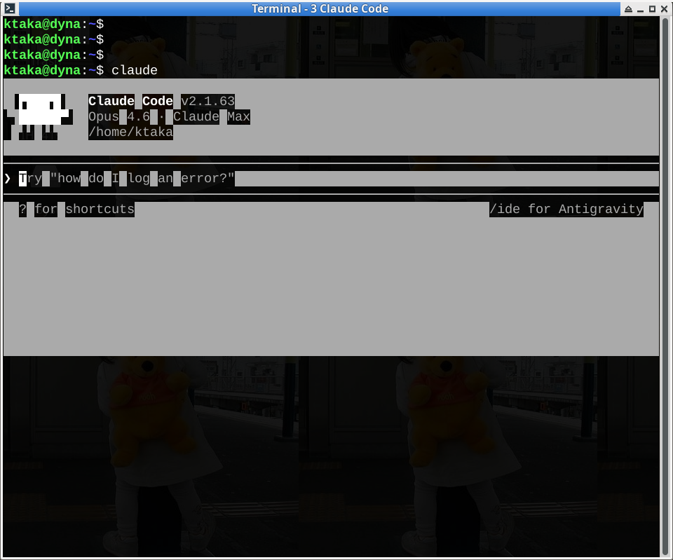
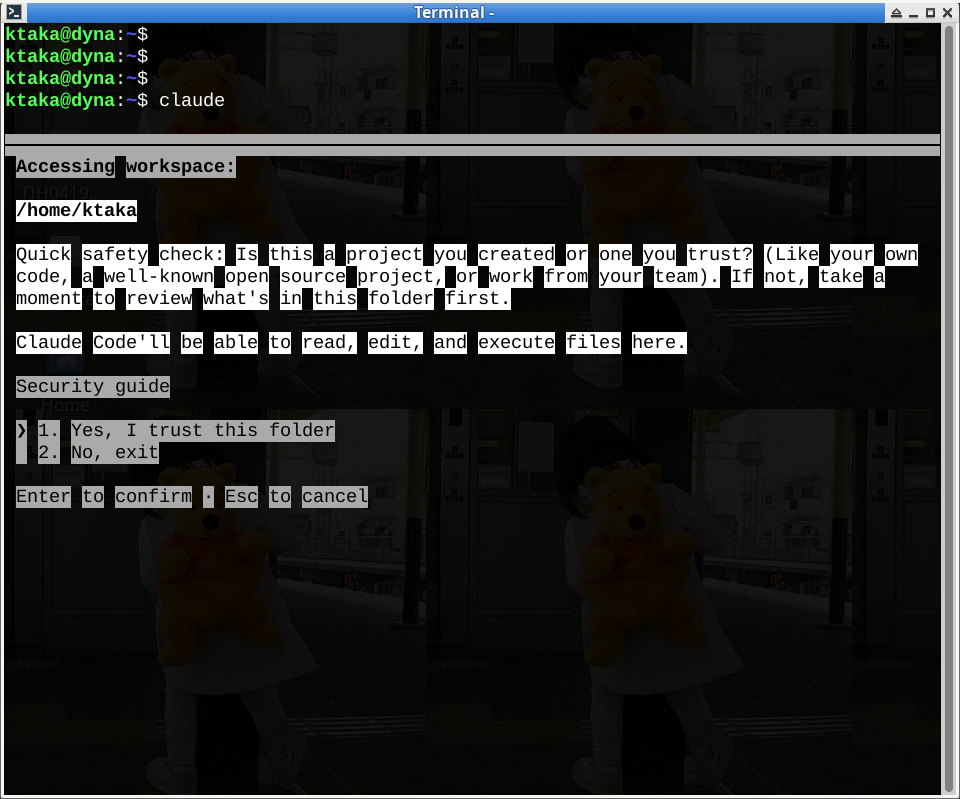

+++
title = "GNU Screen ユーザーのための tmux カスタマイズ"
date = 2026-03-01
path = "2026/TmuxForScreenUsers"
[extra]
lang = "ja"
+++

*長年 GNU Screen を使ってきたユーザーが tmux に移行する際に、違和感を減らすためのカスタマイズ記録です。*

---

## はじめに

20 年近く GNU Screen を使ってきました。ターミナルマルチプレクサとしては不満もなく、乗り換える理由はありませんでした。

きっかけは Claude Code です。Claude Code はターミナル上で動作する AI コーディングアシスタントですが、Screen 上で使うと表示が崩れる問題がありました。具体的には、テキストの各単語に不正な背景色ブロックが付いて短冊状に表示されたり、起動時の ASCII アートロゴが白いブロックノイズに化けたりします。Screen が Claude Code の TUI が使用するカラーエスケープシーケンスを正しく処理できていないようです。





tmux ではこの問題は起きませんでした。Claude Code を快適に使うために、tmux への移行を決めました。

---

## Screen ユーザーが戸惑うポイント

tmux に移行してまず戸惑ったのが、画面分割まわりの操作体系の違いです。

### プレフィックスキー

Screen のデフォルトプレフィックスは `Ctrl+a`、tmux は `Ctrl+b` です。これは `~/.tmux.conf` で簡単に変更できるので、すぐに解決しました。

### 画面分割の考え方が違う

Screen では「リージョン」と「ウィンドウ」が別の概念です。`Ctrl+a` → `S` で画面をリージョン分割し、各リージョンに既存のウィンドウを割り当てます。リージョンを閉じてもウィンドウ（シェル）は残ります。`Ctrl+a` → `Q` でリージョンを全解除して元の 1 画面に戻す、というのがよくある使い方でした。

tmux では「ペイン」がこれに相当しますが、ペインを作ると新しいシェルが自動起動します。Screen のように「画面を分割してから既存のウィンドウを割り当てる」という手順ではなく、「分割と同時に新しいシェルが生まれる」という動作です。

また、Screen の `Ctrl+a` → `Q`（リージョン全解除）に直接対応するキーがありません。tmux では `Ctrl+a` → `z` でペインをズーム（全画面化）するのが近い感覚ですが、他のペインを閉じるわけではないので挙動が異なります。

ペインを独立したウィンドウに戻したい場合は `Ctrl+a` → `!`（break-pane）で 1 つずつ分離する必要があります。複数ペインを一括で分離するコマンドはデフォルトにはありません。

こういった違いに馴染めず、Screen ユーザーが直感的に使えるキーバインドをカスタマイズしました。

---

## ~/.tmux.conf

以下がカスタマイズした設定です。カスタムキーバインドに加えて、デフォルトのよく使うキーバインドもコメントでチートシートとして埋め込んでいます。設定ファイル自体がリファレンスになるようにしています。

```bash
# =============================================
# Custom keybindings
# =============================================

# Use Ctrl+a as prefix (same as GNU Screen)
unbind C-b
set -g prefix C-a
# Ctrl+a -> a: Send literal Ctrl+a to the terminal
bind a send-prefix

# Enable mouse for pane resizing, selection, and scrolling
set -g mouse on

# Ctrl+a -> -: Split pane horizontally (top/bottom)
bind - split-window -v
# Ctrl+a -> |: Split pane vertically (left/right)
bind | split-window -h

# Ctrl+a -> @: Pull a pane from another window/session (interactive)
bind @ choose-tree "join-pane -s '%%'"
# Ctrl+a -> S: Send current pane to another window/session (interactive)
bind S choose-tree "join-pane -t '%%'"

# Ctrl+a -> Q: Break all panes into separate windows
bind Q run-shell 'while [ $(tmux list-panes | wc -l) -gt 1 ]; do tmux break-pane -d; done'

# =============================================
# Cheat sheet (default keybindings)
# =============================================

# --- Pane navigation ---
# Ctrl+a -> Arrow keys: Move between panes
# Ctrl+a -> o: Move to next pane
# Ctrl+a -> q: Display pane numbers (press number to jump)
# Ctrl+a -> z: Toggle pane zoom (fullscreen)

# --- Pane resizing ---
# Ctrl+a -> Ctrl+Arrow keys: Resize pane by 1 cell
# Ctrl+a -> Alt+Arrow keys: Resize pane by 5 cells
# Mouse drag on pane border: Resize interactively

# --- Pane arrangement ---
# Ctrl+a -> {: Swap pane forward (up/left)
# Ctrl+a -> }: Swap pane backward (down/right)
# Ctrl+a -> Space: Cycle through layouts

# --- Pane/window management ---
# Ctrl+a -> !: Break current pane into a separate window

# --- Window navigation ---
# Ctrl+a -> c: Create new window
# Ctrl+a -> n: Next window
# Ctrl+a -> p: Previous window
# Ctrl+a -> 0-9: Jump to window by number
# Ctrl+a -> w: List all windows/sessions (interactive tree)

# --- Session navigation ---
# Ctrl+a -> s: List sessions (interactive selection)
# Ctrl+a -> (: Previous session
# Ctrl+a -> ): Next session

# --- Cross-session window management (via command mode: Ctrl+a -> :) ---
# move-window -t session_name:        Move current window to another session
# link-window -s session_name:N       Share a window across sessions (same window, multiple sessions)
# unlink-window                       Remove shared window from current session
```

---

## カスタムキーバインドの解説

### プレフィックスの変更（`Ctrl+a`）

Screen と同じ `Ctrl+a` をプレフィックスにしています。`bind a send-prefix` で、`Ctrl+a` → `a` と押せば端末に素の `Ctrl+a`（行頭移動など）を送れます。これも Screen と同じ挙動です。

### ペイン分割（`-` と `|`）

tmux のデフォルトでは `"` で横分割、`%` で縦分割ですが、直感的ではありません。`-`（横線）で横分割、`|`（縦線）で縦分割にしています。

### ペインの取り込みと送り出し（`@` と `S`）

`@` は別のウィンドウやセッションからペインを現在のウィンドウに取り込みます。`S` は現在のペインを別のウィンドウやセッションに送ります。いずれもインタラクティブなツリー表示から選択できます。

### 全ペイン分離（`Q`）

Screen の `Ctrl+a` → `Q`（リージョン全解除）に近い操作です。現在のウィンドウにある全ペインをそれぞれ独立したウィンドウに分離します。「分割して作業した後、元の 1 ペイン 1 ウィンドウの状態に戻したい」という Screen 的な使い方ができます。

---

## キーバインド一覧

### カスタム設定

| キー | 操作 |
|---|---|
| `Ctrl+a` | プレフィックス（Screen と同じ） |
| `Ctrl+a` → `a` | 端末に素の Ctrl+a を送る |
| `Ctrl+a` → `-` | 横分割（上下） |
| `Ctrl+a` → `\|` | 縦分割（左右） |
| `Ctrl+a` → `@` | 別ウィンドウ/セッションからペインを取り込む |
| `Ctrl+a` → `S` | 現在のペインを別ウィンドウ/セッションに送る |
| `Ctrl+a` → `!` | 現在のペインを独立ウィンドウにする（デフォルト） |
| `Ctrl+a` → `Q` | 全ペインを独立ウィンドウにバラす |
| マウス | ペイン境界ドラッグでリサイズ、選択、スクロール |

### デフォルトキーバインド（よく使うもの）

**ペイン操作**

| キー | 操作 |
|---|---|
| `Ctrl+a` → 矢印キー | ペイン間移動 |
| `Ctrl+a` → `o` | 次のペインに移動 |
| `Ctrl+a` → `q` | ペイン番号表示（番号押下でジャンプ） |
| `Ctrl+a` → `z` | ペインのズーム切替（全画面） |
| `Ctrl+a` → `Space` | レイアウト順次切替 |

**ウィンドウ操作**

| キー | 操作 |
|---|---|
| `Ctrl+a` → `c` | 新規ウィンドウ |
| `Ctrl+a` → `n` / `p` | 次/前のウィンドウ |
| `Ctrl+a` → `0-9` | ウィンドウ番号でジャンプ |
| `Ctrl+a` → `w` | ウィンドウ/セッション一覧（ツリー表示） |

**セッション操作**

| キー | 操作 |
|---|---|
| `Ctrl+a` → `s` | セッション一覧 |
| `Ctrl+a` → `(` / `)` | 前/次のセッション |

---

## Screen との概念の対応

| Screen | tmux | 備考 |
|---|---|---|
| リージョン | ペイン | tmux はペイン作成時にシェルが自動起動する |
| ウィンドウ | ウィンドウ | ほぼ同じ概念 |
| （なし） | セッション | Screen にもセッション概念はあるが、tmux の方がセッション管理が強力 |
| `Ctrl+a` → `Q` (リージョン全解除) | `Ctrl+a` → `z` (ズーム) | ズームは一時的な全画面化。ペインは残る |
| `Ctrl+a` → `S` (横分割) | `Ctrl+a` → `-` (カスタム) | デフォルトは `"` |

tmux 固有の便利な機能として、`link-window` で同じウィンドウを複数セッションから共有できます。これは Screen にはない機能です。

---

## コピー＆ペーストと OS クリップボード連携

tmux のコピーバッファと OS のクリップボードはデフォルトでは別物です。tmux 内でコピーしても OS 側に反映されません。また、`mouse on` にしていると tmux がマウスイベントを横取りするため、右クリックメニューからのコピペも効きません。

### OSC 52 による解決

OSC 52 はターミナルのエスケープシーケンスを使ってクリップボードにアクセスする仕組みです。xclip などの外部ツールは不要で、SSH 越しでも動作します。

ターミナルエミュレータ側（Alacritty の例）:

```toml
[terminal]
osc52 = "CopyPaste"
```

tmux 側（`~/.tmux.conf`）:

```bash
set -g set-clipboard on
set -g mode-keys vi
```

これだけで tmux のコピーが OS クリップボードに反映されます。

### コピー操作

1. `Ctrl+a` → `[` — コピーモードに入る
2. `Space` — 選択開始
3. `Enter` — コピー（OS クリップボードにも入る）
4. 通常の `Ctrl+v` や中クリックで貼り付け

tmux 内で貼り付ける場合は `Ctrl+a` → `]` です。

### Shift キーで tmux をバイパス

`Shift` を押しながら操作すると tmux をバイパスしてターミナルエミュレータ側の操作になります。

- `Shift` + ドラッグ: ターミナル側の選択
- `Shift` + 右クリック: ターミナルのコンテキストメニュー
- `Shift` + 中クリック / `Shift+Ctrl+V`: 貼り付け

### Screen との比較

| 操作 | Screen | tmux (この設定) |
|---|---|---|
| コピーモード開始 | `Ctrl+a` → `[` | `Ctrl+a` → `[` |
| 選択開始 | `Enter` | `Space` |
| コピー | `Enter` | `Enter` |
| 貼り付け | `Ctrl+a` → `]` | `Ctrl+a` → `]` |
| OS クリップボード連携 | なし | OSC 52 で自動連携 |

コピーモードの基本操作は Screen とほぼ同じです。大きな違いは OS クリップボードとの連携で、Screen にはこの機能がありませんでした。tmux + OSC 52 対応ターミナルの組み合わせでは、コピーした内容がそのまま OS のクリップボードに入るため、ブラウザや他のアプリケーションにそのまま貼り付けられます。

なお、OSC 52 対応はターミナルエミュレータに依存します。Alacritty、Ghostty、WezTerm、iTerm2、Windows Terminal などは対応していますが、xfce4-terminal は未対応です。

---

## まとめ

Screen から tmux への移行で最も戸惑ったのは、ペイン分割まわりの操作体系の違いでした。Screen の「リージョンを分割・解除する」という考え方と、tmux の「ペインを作る・ズームする」という考え方はアプローチが異なります。

今回のカスタマイズでは、プレフィックスの変更に加えて、`Q`（全ペイン分離）や `@`/`S`（ペインの取り込み・送り出し）を追加することで、Screen 的なワークフローを tmux 上で再現できるようにしました。

移行のきっかけは Claude Code の表示崩れという消極的な理由でしたが、使ってみると tmux のセッション管理やペインの柔軟さは Screen より優れていると感じます。Screen に慣れている方は、まずプレフィックスを `Ctrl+a` に変えるだけでも移行のハードルはかなり下がると思います。
